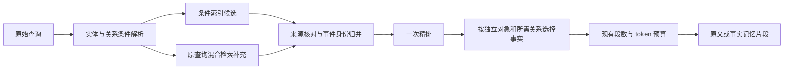

# Add/Search 证据改进方案

> 最后核对：2026-10-05，依据当前实现与 PRD §2.1、§6.3、§7.2、§11.3。
> **状态：已实施（2026-10-05）。** 用户允许调整 Add/Search 内部的存储、检索和打包模块；
> 外部接口、答案模型、答案提示词和裁判保持不变；允许返回原文或抽取的事实记忆。
> ⚠ 最终采用的形态**与本文提案不逐条相同**（统一成一条共同取证路径，且未采用
> `document_metadata` 与语义抽取等条目）——**本文按提出时原貌保留，作为方案与取舍的底稿**；
> 实施结果、未采用方案的保留记录与偏离声明见
> [共同取证整理](../eval/reports/unified-evidence-refactor-20261005.md) 与
> [decisions.md](decisions.md) 的 D33 补充。

建议保留现有 SQLite 原文真源、Qdrant 派生索引及最终双预算打包，在它们之间加入
**有来源的事实表示、条件检索和按对象／事件选择证据**。先从可识别的邮件、邀请、
议程和纪要做起，普通对话沿用原路径。

实施效果尚未验证。依据是 [来源覆盖审计](../eval/reports/corporatebench-aggregate-analysis-20261004.md)
与 [仅替换记忆的诊断](../eval/reports/corporatebench-oracle-context-20261004.md)；
诊断中的理想事实含 KB 专用关系，不能直接当成 Add 抽取结果或实际检索收益。

## 当前代码中的具体缺口

| 位置 | 现在的行为 | 对列表／计数的影响 |
| --- | --- | --- |
| [AddPipeline.apply](../src/tianximem/service/pipeline.py) | 原文块落入 `qa_pairs`，渲染后索引 | 索引没有独立的任职、参会、事件时间等关系 |
| [schema.sql](../src/tianximem/store/schema.sql) | 原文及批次幂等信息；时间只有块级 `event_time` | 文档日期、召开日期和任职日期没有结构化区分 |
| [HybridRetriever.search](../src/tianximem/retrieve/fusion.py) | 原查询进入混合检索，排序后按请求的 `top_k` 截断 | 后续关系筛选、事件去重还没开始，候选已被限制 |
| [dedup_candidates](../src/tianximem/retrieve/fusion.py) | 只按 `memory_id` 去重 | 同一事件的多封邮件仍是不同候选 |
| [SearchPipeline._search](../src/tianximem/service/pipeline.py) | 去重、Checker、整块精排、合并、打包 | 没有按实体、关系、日期和频率组织证据的步骤 |
| [EvidenceChecker](../src/tianximem/retrieve/checker.py) | 当前调用不传两路排名，恒返回充足 | 不能用它证明人员或事件范围已经完整 |
| [CorporateBench 加载器](../eval/datasets/corporatebench.py) | 将文档 `Date` 编成消息时间戳 | 该数据下 `event_time` 实际是文档日期，不是业务事件日期 |

这些观察不要求重写 RRF、替换向量数据库或改变邻接链。当前实际配置的邻接半径已为
零；本方案不通过扩大半径来获取更多材料。存储、幂等和响应约束仍以
[契约](contract.md)及对应模块的 `CLAUDE.md` 为准。

## Add：保留原文，生成可查证的独立事实

保留 `qa_pairs` 的现有正文、位置 ID 与邻接语义，在 SQLite 增加文档元数据及事实表。
Qdrant 可索引原文和事实两种记录，正文仍从 SQLite 读取。原文用于溯源、未知字段
补证及抽取失败时的回退；事实不是对原文的破坏性替换。

拟议存储内容如下，具体 DDL 随实施再冻结：

| 记录 | 主要内容 | 作用 |
| --- | --- | --- |
| `document_metadata` | 原文 ID、文档类型、Message-ID／日历 UID、Subject、From／To、文档日期、解析状态和版本 | 精确定位来源与已处理范围 |
| `memory_facts` | 用户、事实类型、主体、关系、客体、事件身份、时间语义、来源原文 ID、支持引文／跨度、抽取版本、固定事实正文 | 保存真正进入索引和响应的记忆片段 |

优先采用确定性字段解析；仅在原文关系无法直接解析时，评估受约束的语义抽取。
语义抽取是新增的 Add 成本，先验证忠实性和调用成本，再决定启用范围。
候选事实不仅要能找到引文，还要由引文支持该关系；单纯“名字出现”不能作为通过条件。

初期只支持有限的事实类型：

- **任职观察与任职开始。** 人、公司、原文确认已任职的日期；原文明确时再记录开始日期。
  “某日已经任职”支持开始日期不晚于该日的边界，不等于精确入职日。首封往来邮件、
  orientation 日期、公司邮箱域名及语料最早日期，都不能直接填成入职日期。
  这类边界限于同一段任职关系，有离职／重新入职记录时不能跨时段推导。
- **独立会议记录。** 系列／标题、事件身份、明确的时间与记录状态。区分计划召开、
  已发生和状态未知；邀请、议程及重复通知不能直接改写成已发生事实。
- **参与关系。** 区分组织者、受邀者、收件人和原文确认的实际参加者。
- **主题、项目和频率关系。** 区分会议讨论某主题、提及某项目及属于某项目的会议。
  频率取自原文，不通过相邻日期自行推断，也不据频率补齐未记录的会议。

事实格式保持稳定；每条或每个单事件片段可以有多个相关字段，但不能跨事件生成题目
所需的总数、最后名单或否定答案。可采用下列记忆表示；具体排版需要对照验证：

```text
Record type: Calendar invitation
Meeting title: <原文标题>
Scheduled date: <原文明确支持的日期>
Invited participant: <邀请中列出的人员>
Source memory: <原文 ID>
Supporting text: <原文支持片段>
```

### 保持现有写入和索引修复语义

原始 payload 指纹仍由原请求决定，不能把模型生成的事实文本加入重试指纹。
`pairing/apply.py` 继续拥有原文、派生事实和批次记录的事务边界；`service/pipeline.py`
只编排。需要网络的抽取放在写事务之前，事务内再核对幂等守卫。
同一请求的并发重试只采用已提交的那份事实，索引使用从 SQLite 读出的记录。

事实 ID 建议由 `user_id + source_memory_id + extractor_version + fact_slot` 派生，
同一版本首次提交后固定；原文 ID 不改，`request_id` 仍为不透明字符串。
同一事实在不同来源的记录保留各自出处，在 Search 时核对是否描述同一事件。

SQLite 提交后，原文和已提交事实都同步完成索引才返回成功。Qdrant 失败时，重放修复
同时覆盖这两类记录。抽取无法形成可靠事实时，原文保留，解析状态明确记录；不能将
抽取失败算作“已穷尽且不存在事实”。旧库需要版本化回填及索引重建，不能在一半文档
尚未处理时声称某个范围完整。

事实采用共享渲染函数：索引、精排和响应读取同一份持久化事实正文。可以按用途保存
几种固定的事实类型／视图，再由 Search 选择；先避免查询时随意重写正文造成渲染漂移。

## Search：先核对条件，再选择独立对象的证据

增加一个查询条件表示，由自然语言题目生成，服务不读取评测的金标变量或答案类型。
主要字段是：目标对象、关系、绑定实体／系列、日期条件、主题、频率、否定／全集要求，
以及解析置信状态。

先用原文中实际观测到的实体名称、别名及确定性日期解析；不能可靠绑定时沿用原始
混合检索，未知条件不作为硬过滤器。初期保留现有原查询与单次 query embedding，
条件表示用于索引过滤和证据选择，避免同时改变向量查询口径。

建议新增文档检索分支，普通对话仍进入现有路径：



### 条件候选与返回名额分开

对明确的系列／实体范围，优先从 SQLite 条件索引读取候选；语义检索补充别名及原文
证据。完整性需求强的查询，在相关范围内分页核对，而不是把全库正文交给模型。
候选读取的页数、耗时及记录量设预算，达到预算则记录未完成状态。

从 `HybridRetriever.search` 解耦内部候选预算与请求的返回 `top_k`，使条件核对和
对象去重发生在最终名额截断之前。取更多内部候选只用于识别独立对象，最终仍按请求
的 `top_k` 和真实 token 预算打包；不通过提高原文返回量来代替条件核对。

确定不匹配的记录可排除；缺日期、身份或关系依据的候选放入有限的待核对路径，
不能假装它们已经被证明不匹配。补证针对具体缺失的属性和来源，不按邻接位置扩窗。

### 去重必须跟随题目中的对象和关系

| 任务 | 选择单位 | 要保留的事实 |
| --- | --- | --- |
| 员工列表／人数 | 已核对身份的人员及其任职关系 | 人、公司、有效时间与出处；重复署名不占新对象位置 |
| 会议次数 | 独立发生记录 | 事件身份、标题、正确时间语义及发生依据 |
| 会议标题列表 | 匹配条件的事件及标题 | 支撑条件的事实；同标题的不同事件可保留必要日期依据 |
| 参会人列表 | 人与事件的参与关系 | 同一事件的所有目标参与关系，不能仅留一个参会人 |
| 缺席／否定集合 | 有依据的候选范围与逐事件关系 | 完整关系及明确的排除材料；不预先计算缺席者名单 |

事件有 UID 时结合 recurrence identity；没有 UID 时，根据系列、明确时间、地点及
变更信息核对。不同 Message-ID 不代表不同会议；同日同标题也不能无条件归并。
频率字段不会被用来制造尚无记录的发生次数。

新的证据选择器优先保留新增独立对象或必需关系，并为冲突、未知状态保留必要原文。
同一事件的多份无新增信息的通知降低优先级；有新增参会关系或更强发生依据的来源
仍有价值。不能只做通用“文本相似就删掉”，也不能用无差别多样性排名丢掉关系证据。

最终返回固定的独立事实片段。会议计数保留每次发生的身份／日期，人员列表突出
人物及任职关系，会议列表突出标题及条件关系；展示方式只选择已有事实，不生成
“共多少次”、跨事件汇总名单或按题目构造的“没有匹配项”记忆。

## 空集合和精确总数：先承认现有证据边界

在 SQLite 记录已接收原文的版本、解析状态、未知字段及范围扫描是否完成，仅用于
内部诊断与检索决策。穷尽某个索引不等于穷尽业务世界，候选范围、关系抽取和时间
语义也必须有依据。

Search 只返回原文或事实，完整范围需要原文中的全集声明、明确否定关系或其他支持
材料。没有命中不能写成否定事实；记录数量饱和也不能写成完整覆盖声明。
如果原文缺少这些信息，在接口与答案流水线固定的边界内，不保证能消除空集题拒答。
当前 Checker 的名次一致性也不能作为范围完备性的证明。

计数在理想事实下仍会错，因此本方案提高事实可用性和条件筛选可靠性，**不承诺解决
所有算术或拒答错误**。也不在 Add/Search 内预先算答案来补偿模型。

## 实施顺序与决定条件

| 阶段 | 做什么 | 继续投入的条件 |
| --- | --- | --- |
| 条件与身份 | 文档头元数据、时间语义、自然语言条件表示、内部候选预算、事件／对象核对；返回原文证据 | 实际条件匹配及独立对象覆盖改善，单值查询保持原表现 |
| 确定性事实 | 将原文明示的字段及关系持久化为短事实，接通原文／事实取回、共享渲染及索引修复 | 自动生成的记忆忠实，固定答案流水线上的列表或计数确有改善 |
| 受约束语义抽取 | 针对确定性解析的已知缺口抽取任职、实际参与、主题及项目关系 | 支持引文成立、关系正确，收益足以支持新增 Add 成本 |
| 范围与否定 | 审计未知字段、候选范围和明确排除证据 | 原文确有范围支持，能区分无匹配与证据不全 |

先改善关系明确的非空列表及非零事件计数，再评估否定集合；不先建设全功能 agent
或通用知识图谱。新增参数按 [配置所有权](config-reference.md) 登记，具体预算由
对照决定，不把计划中的阈值写成默认事实。

## 验证：每组只改变一件事

先冻结当前实际使用的答案模板、模型、输出参数、裁判、精排配置和数据；记录其指纹。
历史 `base-cb` 与现在的类型化模板不相同，不能直接用其旧答案充当新服务的公平基线。
原模板 oracle 诊断保留作瓶颈分析，主要回归用固定的当前 pipeline 重新建立基线。

在相同的 Zenith `kb_qa` 全量问题上，依次比较原服务、条件与身份选择、确定性事实、
必要的语义抽取；每次独立索引／数据版本，先固定返回证据预算。另做同口径的全量
理想事实诊断，核对自动证据与理想证据的差距，仍不称其为模型的数学上限。
所有结果和参数指纹写入 [结果台账](../eval/reports/ledger.md)，不预设准确率目标。

验证同时检查：

- 原文支持的关系、日期语义和事件身份是否被保留，额外实体和漏掉的实体分别记录。
- 模型实际回答、列表 set-F1、计数 exact-match、拒答、返回片段及 token 规模；固定
  自动判分，解析误判单列人工复核，不能通过改变裁判获得“记忆优化收益”。
- 同日不同事件、重复邀请、取消／改期、组织者与受邀者、观测任职与精确入职等真实
  易混淆条件；尽量使用会让错误方案失败的用例。
- 重复 Add、并发重放、事实索引失败后的修复、用户隔离、段数及 token 契约。
- 普通对话数据的既有代表性回归，避免文档事实路径改变对话原文的组合与时间注解。

## 改动落点

| 模块 | 预期改动 |
| --- | --- |
| `service/pipeline.py`、`service/app.py` | 编排抽取／落库／索引与条件检索分支，注入内部组件 |
| 新的事实解析模块 | 文档识别、字段解析、事实验证；不依赖评测目录或金标图 |
| `pairing/apply.py`、`store/schema.sql`、`store/sqlite_store.py` | 保持原始指纹与位置模型，事务内写元数据及事实，按用户和版本查询／修复 |
| `store/qdrant_store.py` | 两类记录的派生索引、元数据过滤及按记录 ID 取回 |
| `retrieve/fusion.py`、新的查询条件模块 | 候选预算与返回名额分离，实体／关系／时间条件及回退 |
| `rank/` 中新的证据选择器 | 依据对象／事件／参与关系选择证据，再交给现有预算打包 |
| `common/render.py`、`common/config.py` | 固定事实渲染及版本、参数唯一入口；API 响应保持原契约 |

这是一份按用户新约束提出的设计扩展；**实施结果与本文提案不逐条相同**——最终形态、
未采用的取舍与偏离声明见 [共同取证整理](../eval/reports/unified-evidence-refactor-20261005.md)
与 [decisions.md](decisions.md) 的 D33 补充。原 v1 的“不抽事实”及 D33 的暂缓状态
是历史设计背景，已被 2026-10-05 的授权与实施取代。
