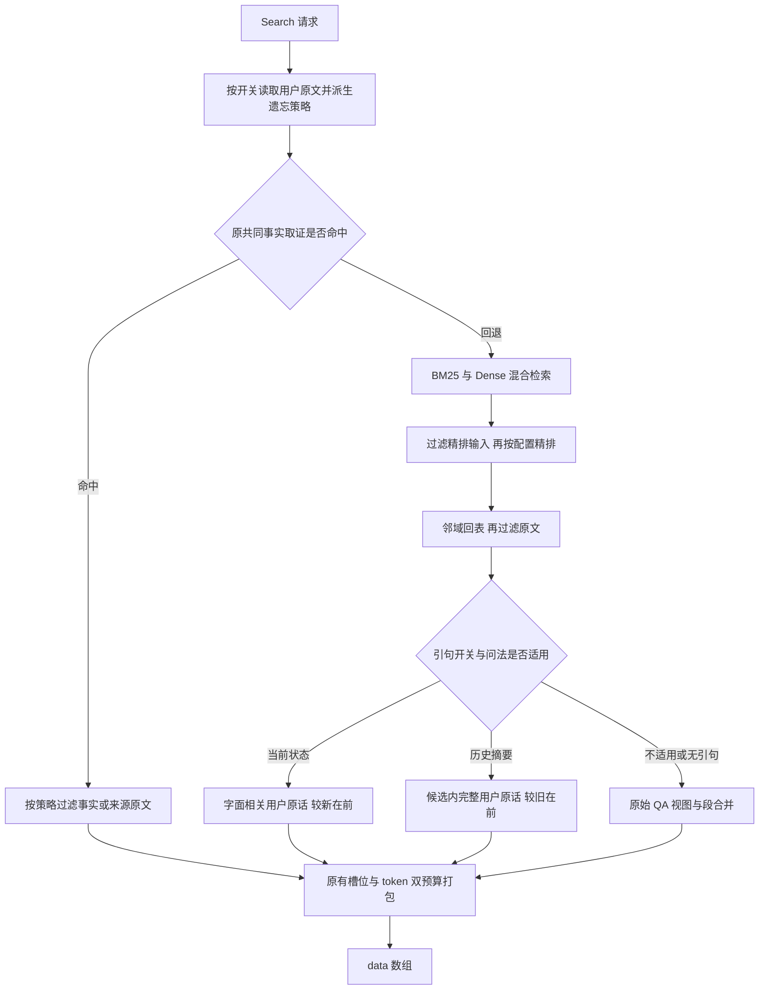

# 记忆治理实验：当前状态 / 遗忘 / 摘要（2026-10-09）

> **旧实验归档（2026-10-10）**：本页旧 `runs/` / `configs/runs/` 路径及命令仅作历史出处。
> 当前脚本、快照和原始产物已归档；恢复方式见 [归档说明](runs/README.md)。结论与成绩保留。

> **合并说明**：本文由原 `memory-governance-research-20261009.md` / `memory-governance-methods-20261009.md` / `memory-governance-background-results-20261009.md` / `memory-governance-analysis-20261009.md` / `memory-governance-implementation-20261009.md` 5 份专题报告合并而成（2026-10-10），内容逐字保留、仅标题降一级，未改写。

## 目录

- [当前状态、撤回抑制与长历史综合：论文及测试集选择（2026-10-09）](#当前状态撤回抑制与长历史综合论文及测试集选择2026-10-09)
- [摘要、当前状态与遗忘：本轮方法总结（2026-10-09）](#摘要当前状态与遗忘本轮方法总结2026-10-09)
- [三项能力后台对照结果（2026-10-09）](#三项能力后台对照结果2026-10-09)
- [当前状态、遗忘与摘要：完整对照分析（2026-10-09）](#当前状态遗忘与摘要完整对照分析2026-10-09)
- [当前状态、遗忘与长历史综合：实施验证（2026-10-09）](#当前状态遗忘与长历史综合实施验证2026-10-09)

---

## 当前状态、撤回抑制与长历史综合：论文及测试集选择（2026-10-09）

**建议分三轮推进：当前状态 → 撤回与抑制 → 长历史综合。** 前两轮共用事实生命周期机制，
但分别验收；第三轮单独验证证据覆盖和压缩，便于区分收益与退化。
本报告的实证来自现有题库的离线覆盖审计；下述产品改进均为待验证候选。

平台基线取自用户提供的 V1.0 Full 报告，原始口径保留在
[平台基线及优化路线](datasets-20261006.md)：

| 能力 | 用户提供的平台分 / 100 | 本次判断 |
| --- | ---: | --- |
| D3 删除、遗忘与抑制 | 10.00 | 需要明确的撤回/忘记行为验证，冲突题和拒答题只能补充 |
| F1 摘要、压缩与长历史全局综合 | 22.58 | 先验证全局证据覆盖，再验证抽取式压缩 |
| D1 新值覆盖与当前状态 | 24.78 | 有多个现成专项题池，适合先建立同输入对照 |

这些是历史平台分，不是当前 spaCy 候选的成绩。公开数据没有逐题 D1/D3/F1 标签及平台聚合权重，
以下对应关系用于选择实验，不将本地分类分数换算成平台维度分。

### 论文中哪些方法适合本项目

以下均核对论文原文或作者发布的来源。表中“本项目用法”是设计建议，不是论文已验证的 AML 结论。

| 论文 | 核心方法 | 本项目用法与边界 |
| --- | --- | --- |
| [Zep: A Temporal Knowledge Graph Architecture for Agent Memory](https://arxiv.org/abs/2501.13956)（2025） | 同时记录事实生效时间与系统处理时间；新事实可结束旧事实的有效区间；保留原始来源 | 借鉴版本链、有效区间和来源回溯，区分当前问题与历史问题。原方法用 LLM 抽取、判断矛盾，不能直接照搬到当前确定性 Add 路径 |
| [Mem0: Building Production-Ready AI Agents with Scalable Long-Term Memory](https://arxiv.org/abs/2504.19413)（2025） | 将记忆管理分为 ADD / UPDATE / DELETE / NOOP，而非持续追加 | 借鉴显式操作和去重语义；对可靠更正、撤回建立派生状态。论文的 DELETE 包含矛盾记忆移除，不等同于用户主动要求忘记，也不能据此永久抹掉有效历史 |
| [From Recall to Forgetting: Benchmarking Long-Term Memory for Personalized Agents](https://arxiv.org/abs/2604.20006)（Memora，2026） | FAMA 同时奖励有效记忆的使用并惩罚过时记忆的误用 | 借鉴“该保留的有没有、该失效的还出现没有”的双向验收。它主要评估过时/失效信息误用，不能证明物理擦除；暂不需要引入新题库 |
| [RAPTOR: Recursive Abstractive Processing for Tree-Organized Retrieval](https://arxiv.org/abs/2401.18059)（2024） | 将文本聚类、递归摘要，建立不同粒度的检索层级 | 借鉴跨片段、跨主题的组织方式。当前优先选择可回溯的原文片段；直接生成并返回递归摘要需要调整现有 Add/原文边界，作为后续方案 |
| [The Use of MMR, Diversity-Based Reranking for Reordering Documents and Producing Summaries](https://www.cs.cmu.edu/afs/cs/Web/People/jgc/publication/MMR_DiversityBased_Reranking_SIGIR_1998.pdf)（1998） | 结合问题相关性与相对已选文本的新颖性，减少重复 | 最适合先做小改动：固定候选池，选择互补来源，避免相似复述占满返回预算。不同时间、否定或不同数值不能仅因相似而合并 |
| [Beyond a Million Tokens: Benchmarking and Enhancing Long-Term Memory in LLMs](https://arxiv.org/abs/2510.27246)（BEAM / LIGHT，2025） | BEAM 单列摘要等任务；LIGHT 结合长期情景记忆、工作记忆与事实 scratchpad | 用 BEAM 的专门摘要题检验跨会话综合。借鉴不同粒度证据的组织；LIGHT 的模型生成、更新和过滤 scratchpad 不是现有服务的直接替换件 |
| [LongMemEval: Benchmarking Chat Assistants on Long-Term Interactive Memory](https://arxiv.org/abs/2410.10813)（2024；ICLR 2025） | 专测知识更新、时间推理和拒答；研究粒度、事实扩展及时间范围检索 | 用 knowledge-update 判断新旧值取舍，用时间题与拒答题检查误覆盖。论文中的 LLM 查询扩展与 reader 提示词改动不能直接计为本项目的 Add/Search 收益 |
| [HaluMem: Evaluating Hallucinations in Memory Systems of Agents](https://arxiv.org/abs/2511.03506)（2025） | 分开记忆抽取、更新与 QA，区分正确、幻觉和遗漏 | 用现有 Dynamic Update / Memory Conflict QA 验证动态状态及冲突误用。当前仓库适配只测 QA，不宣称覆盖上游独立记忆更新指标 |

设计边界以 PRD §2.1、§7.2、§11.3 及 [D33 后续授权](../../docs/decisions.md) 为准：
输出原文或有逐字来源的独立事实；答案由 AML 生成。当前 Add 不调用生成式 LLM。
因此第一版适合确定性的状态管理和原文证据选择，论文中的生成式摘要作为单独架构候选讨论。

### 当前题库实际覆盖

复现脚本：audit.py（历史路径：`runs/memory-governance-research-20261009/audit.py`）。
从仓库根目录执行：

```bash
.venv/bin/python eval/reports/runs/memory-governance-research-20261009/audit.py
```

数据路径复用 `eval.datasets.registry.benchmark_dir()`，遵循 `TIANXIMEM_BENCHMARK_DIR`。
脚本离线复用现有 native 加载器，记录源码、数据与历史记录指纹，并验证各冻结配方题数；
生成 audit.json（历史路径：`runs/memory-governance-research-20261009/audit.json`） 与
pools.json（历史路径：`runs/memory-governance-research-20261009/pools.json`）。后者只有题号、用户、类别及拒答标记，
用于登记候选题池，不是已经运行的评分结果，也不是通用 runner 可直接接收的筛题参数。

| 现有数据集与目标类别 | 当前完整题池 | 当前冻结配方中的目标题 | 用途 |
| --- | ---: | ---: | --- |
| LongMemEval `knowledge-update` | 78：72 可答 + 6 拒答 | 16：15 可答 + 1 拒答 | D1 主验证：跨会话更正、最新值；拒答保持独立统计 |
| HaluMem `Dynamic Update` | 180 | **1** | D1 长历史补充验证，需要另冻结专项题池 |
| MedMemoryBench `state_update` | 195 | 39 | D1 中文状态更新及时间检查点验证 |
| MQuAKE-Remastered | 本次审计冻结配方，未统计完整档 | 768 题 / 256 原始 case，覆盖四档 | 明确替换及多跳链更新的开发验证；同 case 的三种问法不是三个独立场景 |
| HaluMem `Memory Conflict` | 769 | 60 | 失效/矛盾信息误用的补充验证，不等同于主动忘记 |
| HaluMem `Memory Boundary` | 828 | 56 | 检查证据不足时是否幻觉，不等同于删除专项 |
| MemTrapBench `task_boundary` / `cognitive_bias` | 各 350 | 各 83 | D3 中历史误用、任务惯性的回归；不验收永久删除 |
| BEAM `summarization` | **40**，来自 20 段对话 | 40 | F1 主验证：跨会话概括与全局证据组织 |
| BEAM `knowledge_update` / `contradiction_resolution` | 各 40 | 各 40 | 更新与冲突的第二种契约下验证 |

**HaluMem 是本次最重要的选题修正。** 全量 QA 有 3,467 题，但旧冻结配方按用户/检查点抽样，
203 道 QA 中只有 1 道 Dynamic Update。旧 A13 记录（历史路径：`runs/optimization-12h-20261007-a13-full-halumem.json`）
该类的 1/1 不能说明动态更新已解决。新专项应保留原会话前缀和原裁判，按目标类别选题，
重新登记题池与基线，不把不同选题的分数直接相减。

旧 LongMemEval A13 记录（历史路径：`runs/optimization-12h-20261007-a13-full-longmemeval-s.json`） 的知识更新为 12/15，
MedMemoryBench A13 记录（历史路径：`runs/optimization-12h-20261007-a13-full-medmemorybench.json`） 的状态更新为 26/39。
LongMemEval 原类别中的拒答题被汇总到 `abstention`，所以加载统计的 16 与 breakdown 的 15 不矛盾。
这些是开发模型、旧配置的历史参照，不能作为当前工作树候选的同轮基线。

**BEAM 需要建立摘要基线。** 当前材料为 100K 档，不能证明百万 token 以上表现。
旧网关限制见 [台账](ledger.md)；但新的
10-09 冒烟记录（历史路径：`runs/smoke-beam-pub4-20261009.json`） 已有两道完成作答及判分的题，
两道都是 `abstention`，得分均为零，并非摘要实验或技术失败。
因此不能将历史“本机拿不到基线”直接当作当前所有请求都不可运行的结论；
下一轮应先验证少量目标摘要题的连通、耗时与可重复性，再扩到全部目标题。

**2026-10-09 修正**：此前按 loader category 盘点漏查 PersonaMem-v2 源 CSV 的
`pref_type`。其 `ask_to_forget` 有 1,048 题，是真正的遗忘后偏好抑制测试，
已建立独立全量题池；官方采集亦匹配到 26 条请求。应将它作为 D3 主要本地
QA 验证，18 项合成 HTTP 行为集继续补充重放、授权与隔离等边界。
核查与完整验证状态见 [PersonaMem 遗忘专项](personamem-20261009.md)。
不能直接拿 PersonaMem 全数据集总分验收 D3。
HaluMem 的 Memory Boundary 测未提供的信息；MemTrapBench 测历史误用；
BEAM 的冲突解决测不一致事实，三者与“用户要求忘记某条已存信息”有区别。

### 第一轮：当前有效状态

**主测 LongMemEval knowledge-update；补测 HaluMem Dynamic Update；中文验证用 MedMemoryBench state_update。**
MQuAKE 适合快速开发验证，尤其是明确替换对多跳路径的影响。

候选方案借鉴 Zep 的时间状态、Mem0 的操作语义，并保留确定性逐字来源：

1. 将声明按同一用户、声明主体、属性及作用范围关联，保留每次原始观察。
   明确更正产生替换关系，补充事实继续保留；多值关系不能默认变成单值属性。
2. 区分“当前有效值”“某时点历史值”“未解决冲突”。事实生效时间来自明确原文；
   消息时间只作为来源锚点，系统接收时间用于审计。乱序输入不能以最后到达覆盖事实。
3. 当前问题优先返回新值来源；需要说明变化的题同时返回有用的更正来源。
   历史问题仍取相应时间有效的旧来源；缺乏顺序依据时保留冲突，不猜当前值。
4. 将同一状态选择约束用于共同取证、混合检索回表和最终打包，防止旧值从回退或原文中重新出现。
   无法解释的相关声明仍按既有完整性规则回退。

现有 `retrieve/evidence.py::_current` 已处理有限的 `replaces_earlier`，属于可扩展的起点；
它不是全属性状态系统。`facts/query.py` 的 `QueryPlan("current")` 表示“当前输入已齐、无须历史”，
不能复用成“取最新状态”的语义。

验收同时看目标 QA、历史问题及拒答的逐题赢/输，检查替换、追加、多值、同刻冲突、
乱序、幂等与来源身份。MedMemoryBench 必须只投喂到提问检查点，避免读到未来。
native MQuAKE 只问更新后答案，且使用人为明确替换文本；不能由它证明完整的更新前后事件行为。
现有 `aml-v1` MQuAKE 可作为后续 JSON UPDATE/交错事件专项，但需要独立基线，不能与 native 混比。

### 第二轮：撤回、忘记与抑制

**与第一轮共用状态表示，增加独立的撤回/禁止使用标记；主动忘记用小型 HTTP 行为集验收。**
HaluMem Memory Conflict 和 MemTrapBench task_boundary/cognitive_bias 用作负迁移检查。

明确撤回使相关声明失效；明确要求忘记则约束后续输出及使用范围。二者应保留独立语义：
旧值在历史时点可能仍有用，已禁止披露的信息不能因问题改成历史问法而重新出现。
候选标记记录目标与控制指令来源，重试不能重复生效；重新授权必须有新的明确来源。

抑制应覆盖最终输出中的原文、事实投影及邻域内容，仅在向量候选上降权不够。
若“忘记指令”本身重复了被禁止的信息，其逐字引句也不能原样返回泄漏目标。
来源粒度不足时需要保守处理，并用无关事实保留测试检查误伤。
先验证可观察的逻辑抑制；若要声称物理擦除，还需另验 SQLite、向量、事实、缓存及重建路径，
不能将输出过滤等同于存储删除。

行为集至少包含下列场景，使用人工构造的信息，不依赖比赛 gold：

| 场景 | 验收行为 |
| --- | --- |
| Add 信息 → Search → Add 明确忘记指令 → Search | 忘记前有来源，忘记后目标不再返回 |
| 对同一目标直接问、改写问、历史问 | 抑制语义一致，不靠关键词恰好匹配 |
| 同一记忆块含目标与无关信息 | 控制目标泄漏，同时检查无关事实误伤 |
| 忘记后重试旧 Add、重建派生索引、重启 | 目标不会复活 |
| 新的明确授权/新值 | 按授权范围恢复新的有效来源 |
| 他人引文、“不要忘记”或非控制语境 | 不误执行忘记 |
| 另一用户有同名事实 | 只作用于正确用户与目标范围 |

验收并列报告“禁止信息出现率”和“允许信息保留率”；不靠一律空返回获得假进展。
这是借鉴 Memora 双向记忆验收思想的自定义行为指标，不称为原版 FAMA 或 AML D3 分数。

### 第三轮：长历史综合与压缩

**主测 BEAM summarization 的全部目标题；LoCoMo multi-hop、LongMemEval multi-session、
CorporateBench 集合题作覆盖回归。** 后三者用于检查跨来源选择，不充当专门摘要成绩。

最小候选先做 MMR 风格的互补证据选择，再单独测试抽取式压缩：

1. 固定当前候选池、模型和预算，基于问题相关性及已选证据的重复度选择互补来源。
   对概括题检查不同话题及事件阶段的覆盖；不同时间、数字、否定与更正不能当重复内容删除。
2. 选择可逐字回溯的原文片段，保留说话人、日期、实体、关系与必要限定条件。
   先改变选择，不同时扩大候选池、换 reader 或改裁判。
3. 若必要来源根本没进入候选池，另做跨会话/主题候选覆盖实验；MMR 无法补回未召回来源。
   若正确来源已经充分给出但仍答错，用独立 oracle 诊断读者综合上限，结果不计产品收益。
4. 选择稳定后再测试压缩，记录原预算下的答案效果、实际输入 token 及证据遗漏。
   最终仍由 AML 生成摘要；服务输出有来源的证据，维持 PRD §2.2 的段数和 token 契约。

BEAM 保留原逐条 rubric 三点制及 `llm_judge_score` 均分，同时报告完全满足率。
仅看二值全对会隐藏部分要点改善。数值、时间、新旧状态、遗漏与幻觉需分别检查，
不能只凭上下文缩短或语义相似就认定摘要能力改善。

### 实施和采纳次序

每轮先选固定失败案例和正确对照做开发验证，再跑未参与调参的留出样本，最后跑关联冻结子集。
新增专项题池必须登记新口径；筛 Search 不裁该题原始历史，不注入标注。
HaluMem/MedMemoryBench 按原 persona 与检查点组织；MQuAKE 按原始 case 分组，避免不同问法跨开发/留出。

建立当前工作树同轮基线，固定 Add 形态、输入契约、模型、prompt、裁判及预算，候选使用独立存储和新 run-id。
各阶段一次只改变一项策略；成本较高的回答/判分继续串行。
若候选改变已锁定的状态、排序或渲染语义，同步登记设计决定及配置；抽取表示改变时升级派生索引版本。
保留遗漏、ANSWER_ERROR/JUDGE_ERROR 与原始分母，比较逐题收益及退化。
最终用提交模型配置复核；本地开发模型收益只能说明相同评测口径内的相对改善。

**本次完成的验证**：离线加载全部相关公开题池与六份 native 冻结配方，冻结题数均与
`FROZEN_RECIPES` 一致；审计脚本通过 Ruff 检查。
本报告选择了测试入口并登记候选方法，效果需要上述 A/B 实验确认。

---

## 摘要、当前状态与遗忘：本轮方法总结（2026-10-09）

> 2026-10-10：用户要求回退，本报告描述的三项产品候选实现和配置开关已撤销。
> 本文保留实验方法与结果，不代表当前服务实现；范围见 [回退记录](memory-governance-rollback-20261010.md)。

本轮方法作用于 **Search 的证据选择、排序和使用控制**，Add 仍保留原始记录。
产品路径采用确定性规则与逐字原文，最终回答和摘要由评测侧的答案模型生成。
以下为已实现并实际验证的方法，不把后续计划中的状态版本链、MMR 或递归摘要写作已完成。

| 能力 | 本轮方法 | 验证结果 |
| --- | --- | --- |
| 当前状态 | 选择相关用户原话，带来源日期，较新在前，保留新旧观察 | 更新类可答 12/15 → 13/15；全部 101 题正确数持平 |
| 遗忘 | 从明确控制指令派生检索抑制，覆盖各证据路径；可信后续明确授权只放行授权值 | 实际 HTTP 行为检查 4/18 → 18/18 |
| 摘要 | 从固定检索池保留完整用户发言，按可信时间从旧到新组织，按相同预算打包 | BEAM 摘要 40 题均分 42.00% → 40.71%，候选未通过 |

### 当前状态：让答案模型更容易看到相关新值

开关：`packaging.excerpt_evidence`。

1. 保守识别需要历史记忆的个人当前状态问法；历史、比较及复杂归属问法不进入本候选。
2. 沿用原混合检索、精排和邻域得到的候选池，不新增搜索。
3. 按问题与用户原话的字面词匹配，选择相关的完整发言，保留否定、计划、代码和限定条件。
4. 每段附来源日期与来源侧，按可信来源时间由新到旧排列；同刻或未知时间维持原检索次序。
5. 保留所有匹配的新旧观察，不自动断言旧值失效；无匹配时回到原始 QA 打包。

例如，旧旅行地点为 Hawaii、新旅行地点为 Paris，清晰的日期与原话呈现帮助答案模型
在“最近一次家庭旅行”题中选中 Paris。本轮提高的是证据呈现与选择，尚未完成通用状态更新系统。

代码：[问法与逐字来源](../../src/tianximem/facts/excerpts.py)、
[观察选择和排序](../../src/tianximem/retrieve/excerpts.py)。

### 遗忘：控制记忆能否进入后续证据

开关：`retrieval.memory_controls`。

1. 每次 Search 从该用户全部原始记录读取控制来源，识别明确的遗忘/删除和重新授权语句。
   不要求遗忘指令恰好进入本次检索候选。
2. 排除引文、故事、条件句和“不要忘记”等非控制表达；目前覆盖有限的显式句式。
3. 将被禁止的属性及从用户原话中识别出的字面值用于抑制，数字支持有限的分隔符变体。
4. 对精排输入、邻域原文、原文引句及共同事实证据共同执行规则。
   按句移除命中目标的内容，其他独立句中的允许信息可继续返回。
5. 原始记录不删除；每次重建检索视图，因此旧 Add 重试不能绕过已有遗忘指令。
6. 恢复要求新的明确授权，且能证明晚于相关遗忘指令：同一 Add 比较记录位置，
   跨 Add 比较可信来源时间，不使用接收顺序或 request_id 字符串排序。
   只放行新授权来源中明确给出的值，普通新陈述不能自动恢复被禁止的属性。

实际 HTTP 例子：先 Add “我的电话号码是某号码，我住在南京”，再 Add 明确忘记电话号码的指令。
基线 Search 同时返回旧号码和遗忘指令；候选 Search 只保留南京，旧号码不再进入证据。
历史问法、改写问法和旧 Add 重放也受到同一控制。

**4/18 → 18/18 是候选启用时的本地服务真实行为改善。**
测试内容为人工构造，Add/Search、远端 embedding 与 Qdrant 路径实际运行；
直接检查禁止信息是否消失、允许信息是否保留，无答案生成或 LLM 裁判参与这组计数。
18 项中还包含跨用户、非命令和授权边界检查，因此它是行为检查通过数。
已验证逻辑抑制；物理擦除、完整语义别名覆盖及长历史扫描成本不在本轮结论中。

代码：[控制规则](../../src/tianximem/facts/controls.py)、
[可见原文视图](../../src/tianximem/retrieve/controls.py)、
实际 HTTP 对照（历史路径：`runs/memory-governance-research-20261009/controls_validation.py`）。

### 摘要：用用户发言构建较短的历史输入

开关：`packaging.history_excerpts`。

1. 识别回顾个人长期对话历史的摘要问法。
2. 沿用同一 Search 候选池，保留其中完整用户发言，省去助手回复。
3. 保留用户原文中的代码、否定与限定条件，附来源日期与来源侧。
4. 按可信时间由旧到新组织；同刻或未知时间维持检索次序。
5. 按相同返回槽位和 token 预算打包，交给答案模型生成最终摘要。

假设是用户发言集中记录了需求与进展，省去重复助手回复可以减少干扰。
40 题平均输入减少 81.15%，但助手回复也包含已讨论或被采纳的方案、具体步骤和解释。
例如招聘流程题，用户说“试点想法不错”，详细的工具配置与评估步骤却在助手回复中，
省去这些内容后无法完整总结。该候选整体未通过，暂不采纳。

代码：[历史发言选择与排序](../../src/tianximem/retrieve/excerpts.py)、
[Search 打包接入](../../src/tianximem/service/pipeline.py)。

三个新开关目前均默认关闭。数值、逐题原因和评测恢复口径以
[完整对照分析](memory-governance-20261009.md)为准。
本轮使用 1024 维向量；答案与裁判使用 memory2 上的 Qwen/Qwen3.5-9B。
本地结果不能直接换算 AML 能力分，多跳优化不在本轮范围。

### 技术细节：规则、数据结构与返回格式

以下按本轮实际实现说明。当前七个核心实现文件与已评测快照 hash 一致；
共享工作树中的其他并行改动不纳入这三项方法的归因。

#### 规则与模型分别做什么

| 环节 | 执行方式 | 本轮角色 |
| --- | --- | --- |
| 当前状态/摘要问法识别 | 正则匹配 | 决定是否进入引句投影 |
| 当前状态的原话选择 | 英文词/中文双字片段的集合交集 | 判断字面相关，不做语义推断 |
| 发言抽取、日期排序 | 确定性代码 | 保留来源，组织顺序 |
| 遗忘、授权识别及过滤 | 正则、字面值匹配、可信先后比较 | 派生只读控制策略 |
| 原有语义检索 | embedding 模型，1024 维 | 与 BM25 共同产生候选 |
| 可选精排 | reranker 的评分模型 | 按配置重排，本轮对照中关闭 |
| 本地回答与 rubric 判分 | memory2 上的 Qwen/Qwen3.5-9B | 在 eval 侧运行，不在这三项产品策略中 |
| 遗忘的 18 项 HTTP 行为计数 | 对实际返回正文做确定性检查 | 检查禁止值不存在、允许值存在，无 LLM 裁判 |

#### 存储沿用原结构，新增的是请求期间的内存对象

`QaPair` 仍包含 `id/user_id/session_id/request_id/local_index`、
`question/answer/event_time/status` 和 Add 内的前后邻接指针。
本轮未为这三项策略新增 SQL 表或列，未改 `QaPair` 字段。
`qa_pairs` 与 `applied_batches` 保持原始记录和幂等真源，
已有 `memory_facts/evidence_coverage` 仍属于共同事实链。

新增对象的字段如下；均为 Search 期间使用的 Python 对象，不落数据库：

```text
SourceExcerpt:
    parent: QaPair               # 原来源记录
    quote: str                   # 选中的用户原话
    position: int                # 该来源抽取出的用户发言序号
    source_rank: int             # 原候选名次，用于同刻/未知时间稳定排序

Control:
    source: ControlSource        # 来源对象接口，现有 QaPair 可提供这些字段
    target: str                  # 规范化后的属性名，"*" 表示全部
    value: str                   # 明确重新授权时给出的值

ForgetPolicy:
    controls: tuple[Control, ...]
    grants: tuple[Control, ...]
    values: tuple[tuple[str, str], ...]  # 从明确属性陈述识别出的属性-值
```

`visible_pair()` 通过 `dataclasses.replace()` 生成只读视图，
只将视图中的 `question/answer` 换成过滤后的文本，其他字段沿用原来源。
没有执行 SQL UPDATE/DELETE；旧向量仍可召回，回表后再执行控制。

存储层仅新增 `fetch_control_context()` 读取方法：

```sql
SELECT <QaPair 原有列>
FROM qa_pairs
WHERE user_id = ?
ORDER BY session_id, request_id, local_index;
```

这里的 ORDER BY 只为结果稳定，不能证明跨 Add 先后。
遗忘策略每次重新派生，当前没有策略缓存或控制表；这保证后续请求读到已提交的控制指令，
代价是每次 Search 都要读取该用户全部来源。

#### Add 和 Search 的接入位置

Add 仍完成原有配对、SQLite 写入、事实派生和向量索引。
“忘记”命令本身也是原始用户消息，进入原有 Add 路径；Add 不立即擦除旧记录。
当前状态和摘要的引句只在 Search 返回时生成，不作为新的向量记录写入。

Search 的实际分支为：



引句投影接在混合链的精排、扩窗之后。
共同事实取证提前命中时保持它原有的事实/原文出口，不再进入这两种引句选择。
遗忘策略则同时传入共同事实出口和混合链，防止被禁止值从另一条路径重新出现。

#### 当前状态的匹配规则

`current_observation_query()` 要求个人指示词，如 `I/my/our/we/我`，
同时出现 `current/now/latest/most recent/目前/最新`，
或 `how often do I/what time do I/how long have I` 等有限习惯问法。
显式历史、比较用词和多层所有格会使该问法不进入本候选。
这是字面边界，不是通用语义分类器。

`literal_terms()` 对英文小写、去停用词、去纯数字，做简单末尾 s 归一；
中文先去有限的停用短语，再取连续双字片段。匹配条件为：

```text
共享词数 >= min(packaging.excerpt_min_terms, 问题有效词数)
```

`excerpt_min_terms` 默认 2。比如 `What is my current home city?`，
有效词包含 `home/city`，可匹配 `My home city is Nanjing.`。
它没有做 embedding 二次匹配、实体指代解析或语义别名扩展。

`user_quotations()` 在 question 侧按发言标签切分，排除 assistant/system 标签，
通用 user 标签可剥去，具名发言人的标签保留。保留整条发言，
不把否定、计划或代码删掉；在当前状态路径，
`(user_id, quote, event_time)` 相同的观察去重，不同日期的同值观察仍保留。

来源日期只决定呈现顺序，不代表事实有效期。时间来自来源记录 `event_time`，
不从 Add 到达时间或 request_id 字符串猜先后。因此当前实现没有
`valid_from/valid_to`、`superseded_by` 或通用属性当前值表。

#### 遗忘的匹配规则与授权条件

命令按句匹配，覆盖例如：

```text
Please forget my phone number.
Forget everything about me.
请忘记我的电话号码。
Remember my phone number again: 010-5550-0199.
请重新记住我的电话号码：010-5550-0199。
```

目标值从有限属性陈述识别，如 `My phone number is ...`、
`My phone number was ...`、`我的电话号码是...`，加上明确授权中的值。
过滤时检查规范化后的属性名或已识别值是否出现在文本中；
数字额外支持有限的空格、括号、连字符变体。
它没有通用的“phone number = 联系方式”等语义别名解析。

命令识别会跳过含引号、`if/fictional/example/said` 等引文或假设标记的句子。
非直接命令如 `Do not forget...` 不匹配命令模式。
具名发言标签保留后，也可能使直接第一人称命令无法匹配；当前覆盖仍有限。

`redact()` 在目标命中后按句移除，保留其他独立句。
若秘密和无关信息在同一句，可能一起被移除；它不是任意文本的细粒度实体编辑器。
规则也作用于遗忘命令本身，避免命令重复秘密而泄漏。
共同事实出口同时检查 `source_quote` 和 `content`，不能靠省略来源引句绕过控制。

重新授权必须晚于所有相关遗忘命令：

```python
if grant.request_id == forget.request_id:
    later = grant.local_index > forget.local_index
else:
    later = (
        grant.event_time is not None
        and forget.event_time is not None
        and grant.event_time > forget.event_time
    )
```

只有授权来源中明确给出的值被放行，不恢复整段旧历史。
普通“我的新号码是...”仍会受到该属性的遗忘约束；未知或同刻时间不视为可信后续授权。

#### Search 的 JSON 外层不变，content 和引句 id 会变化

响应仍为：

```json
{
  "data": [
    {
      "id": "stable-id",
      "content": "evidence text",
      "created_at": "2025-09-02",
      "score": 1.0
    }
  ]
}
```

没有新增 `summary/current_value/deleted/forget_policy` 等响应字段。
来源日期、来源侧和引句都写进 `content`。内部的 `source_memory_ids` 不出现在 JSON 中。

当前状态与摘要路径使用同一个渲染函数，下面是合成例子的实际格式：

```text
Memory excerpt
Source record date: 2025-09-02
Source side: user
Source quotation: My home city is Shanghai.
```

当前状态把新来源排在前面，旧的 Nanjing 原话仍可随后返回；
摘要则把旧来源排在前面。没有在 content 中额外生成“当前城市就是 Shanghai”等答案。

每条引句构造成一个既有 `ContextSegment`，其中
`source_memory_ids=(parent.id,)`、日期沿用 parent、排序位置作为 `best_rank`。
引句响应 id 的生成式为：

```text
sha256(f"{parent.id}:user-excerpt:{position}:{quote}".encode())
```

因此它是由来源和原话确定的投影 id，不是新插入的数据库主键。
`created_at` 使用 UTC 日粒度，未知日期为空串。
`score=1/(最终输出位置+1)`，只是顺序占位值，不是语义置信度或 AML 能力分。
最终仍复用原 `package()`：最多请求的 top_k 项、原 token 预算；超预算在完整段边界停止。

遗忘的实际 HTTP 例子如下，id 仅为显示而简写，content 保留实测值：

```json
{
  "data": [
    {
      "id": "original-record",
      "content": "[2025-09-01] Q: My home city is Nanjing.",
      "created_at": "2025-09-01",
      "score": 1.0
    },
    {
      "id": "forget-command",
      "content": "",
      "created_at": "2025-09-02",
      "score": 0.5
    }
  ]
}
```

数据库里的 original-record 仍含号码，返回视图只剩城市。
当前混合链对完全过滤掉的记录可能保留空 content 条目，仍占一个返回槽位；
已确认禁止值消失，但尚未统一清理这种空条目，不能把所有遗忘情况描述成 `data=[]`。

#### 文件层面的改动

| 文件 | 这三项方法涉及的改动 |
| --- | --- |
| `facts/excerpts.py`，新增 | 当前状态/历史摘要问法、字面词、用户发言切分 |
| `retrieve/excerpts.py`，新增 | SourceExcerpt、当前观察选择、历史发言排序 |
| `facts/controls.py`，新增 | 控制命令、属性值、ForgetPolicy、授权与过滤判据 |
| `retrieve/controls.py`，新增 | 对 QaPair 生成过滤后的只读视图 |
| `common/render.py` | 增加统一的 render_excerpt |
| `store/sqlite_store.py` | 增加读取该用户全部原始控制来源的方法 |
| `service/pipeline.py` | 派生策略、传递策略、引句选择及打包出口 |
| `service/app.py` | 把四个配置项注入 SearchPipeline |
| `common/config.py`、配置与配置文档 | 三个默认关闭的开关与 excerpt_min_terms 校验 |
| `tests/test_excerpts.py`、`tests/test_memory_controls.py` | 引句、控制、时间、幂等和各证据路径检查 |

本轮方法的配置为：

```yaml
retrieval:
  memory_controls: false
packaging:
  excerpt_evidence: false
  excerpt_min_terms: 2
  history_excerpts: false
```

本轮分开消融三项策略。统一到 1024 维的评测索引准备属于向量配置和实验准备，
不代表为引句、摘要或遗忘创建了新的向量数据结构。
仅切换这三个 Search 开关无需改变原始 QA 的 embedding 输入。

---

## 三项能力后台对照结果（2026-10-09）

完成时间：2026-10-09T16:19:38+08:00。全部向量为 1024 维，使用固定源码快照与独立存储；
生成与裁判为开发模型，同一时间仅运行一条答案/裁判链。
这是本地原生输入对照，不能换算 AML 平台分。

逐题解释与采纳判断见[完整对照分析](memory-governance-20261009.md)。
BEAM 两臂裁判输出预算统一为 4096，答案输出预算与向量维度仍各为 1024；
候选两道书籍题使用完整数字分的格式恢复，原始返回及操作均保留。

| 项目与范围 | 基线 | 候选 |
| --- | ---: | ---: |
| LongMemEval 冻结全部 101 题（含其他类别回归） | 0.554455 | 0.554455 |
| 更新类可答题，n=15 | 0.800000 | 0.866667 |
| 遗忘合成 HTTP 行为用例，n=18 | 4/18 | 18/18 |
| BEAM 100K 全部摘要题，n=40，官方 rubric 均分 | 0.420030 | 0.407083 |
| BEAM 摘要完全正确题 | 4/40 | 5/40 |

LongMemEval 逐题赢 1、输 1；证据输入发生变化 11/101。
两臂均重新生成与裁判，输入未变化题的翻转需要与模型波动区分。
更新类另有一道拒答题，保留在 101 题原始分母中。BEAM 保留 20 段全部原始历史；
遗忘数字是行为检查通过数，不是答案准确率。多跳优化未纳入本轮。

三个开关继续默认关闭，等待逐题结果审核后决定采纳。
手工门槛、逻辑抑制边界、测试与 MRL 来源见
[实施报告](memory-governance-20261009.md)。
详细汇总：background-results.json（历史路径：`runs/memory-governance-research-20261009/background-results.json`）。
状态：background-status.json（历史路径：`runs/memory-governance-research-20261009/background-status.json`）。

---

## 当前状态、遗忘与摘要：完整对照分析（2026-10-09）

**当前状态有一个明确收益；遗忘的合成行为验证通过；摘要压缩候选暂不采纳。**
本轮两臂的 LongMemEval 各 101 题、遗忘行为各 18 项、BEAM 摘要各 40 题均已完成。
这是本地开发模型结果，AML 平台尚未重测，不能换算用户提供的 D1/D3/F1 平台分。

| 能力与测法 | 基线 | 候选 | 判断 |
| --- | ---: | ---: | --- |
| D1：LongMemEval 更新类可答题 | 12/15，80.00% | 13/15，86.67% | 多正确一题，仍未解决普遍的新旧值选择 |
| LongMemEval 冻结回归全集 | 56/101，55.45% | 56/101，55.45% | 逐题归因比总分更有信息 |
| D3：实际 Add/Search 合成行为检查 | 4/18 | 18/18 | 支持已覆盖命令的检索抑制，非物理删除或 AML 得分 |
| F1：BEAM 100K 全部摘要题，rubric 均分 | 42.002976% | 40.708333% | 本轮下降 1.294643 个百分点 |
| BEAM 摘要完全正确题 | 4/40 | 5/40 | 全对数增加，但其他题的要点遗漏抵消了收益 |

生成和裁判均为 `Qwen/Qwen3.5-9B`，只使用 memory2；向量统一为 **1024 维**。
保持原始历史、题目、官方答案 prompt、rubric、输入预算和各实验的固定索引，
各候选只切换本能力的开关；同一时间只运行一条答案/裁判链，多跳优化未纳入。

### D1：呈现更清楚，但尚未形成可靠的状态选择

证据输入仅在 11/101 题发生变化，其中正确数 7/11 → 8/11，没有输入变化题从正确变错误。
这 11 题平均上下文为 37,891 → 350 token；压缩本身不作为准确率改善证据。

明确收益为 `9ea5eabc`：最近一次家庭旅行原来回答 Hawaii，候选改答 Paris。
新旧来源都已进入检索池，候选将日期与逐字用户原话放在一起、较新来源优先，帮助 reader 选中新值。

总分持平的另一处翻转为 `8a2466db`（视频剪辑学习资源）：
**两臂输入完全相同，生成答案也完全相同，裁判从 CORRECT 改判 WRONG。**
这是本次已确认的裁判差异，不能归因于产品候选；也不据此改写官方汇总分。

剩余错误揭示两种不同缺口：

- `2698e78f`：新记录已经明确“每周看治疗师”，两臂仍回答“每两周”。
  证据并未缺失，仅排序和短引句还不足以可靠组织同一属性的版本。
- `15745da0_abs` 与 `2133c1b5_abs`：面对证据不足的指定实体，仍借用相近实体的记录作答。
  当前状态选择还需要主体、属性和范围约束，不能把“更近、更相似”直接当作正确状态。

下一轮应先在这些实际 Search 池中手工组织带来源的状态版本，同时检查历史问法、同刻冲突、
未知日期、多值关系和拒答；通过后才实现。扩大验证时使用 LongMemEval 全部更新类
78 题（72 可答、6 拒答），再登记 HaluMem Dynamic Update 180 题的新专项池；
原冻结 HaluMem 只有一道动态更新题，不够验收。中文补测选 MedMemoryBench 状态更新类。

### D3：收益清楚，验收范围仍有限

实际 HTTP 服务配合远端 embedding 与 Qdrant，18 项检查全部完成。
候选处理明确遗忘后，直接问、改写问、历史问及旧 Add 重试均遵守已覆盖的抑制规则，
并保留无关城市信息；跨用户、引用故事、条件句、“不要忘记”、未知/同刻时间、
普通新陈述与明确重新授权等对照也通过。

这是从该用户原始记录派生控制状态，再过滤后续检索证据。
SQLite 和向量仍保留，因此验收的是**逻辑抑制**，不声称物理擦除。
当前只覆盖确定性可识别的直接命令和值，尚未验证完整的间接表达、语义别名及控制范围。
每次 Search 扫描该用户全部控制来源的长历史成本也未专项测量。

下一轮主验收继续使用连续 Add/Search 行为池，增加命令变体、目标别名、长历史与无关事实保留；
用现有 MemTrapBench 边界/惯性题检查误伤。HaluMem 的冲突和拒答题不能替代主动遗忘验收。
这些结果回应 Memory governance 与 Epistemic safety and privacy 的部分行为，
没有官方七维得分或聚合权重。

### F1：删掉对话的一侧，会丢掉总结需要的内容

候选将固定检索池中的完整 QA 改为完整用户原话，36/40 题实际触发。
40 题平均上下文从 **77,362 → 14,582 token，减少 81.15%**，
逐题为 12 赢、16 输、12 平。省 token 不等于保住了摘要要点。

| 代表题 | 基线 → 候选 rubric 分 | 观察 |
| --- | ---: | --- |
| `3-summarization-1` 网页项目问题解决过程 | 0 → 1.0 | 减少大段重复技术回复后，用户进展更集中 |
| `9-summarization-0` 留学准备 | 0 → 0.8 | 用户计划与进展更易综合 |
| `7-summarization-1` 与 Greg 的合作进展 | 1.0 → 0 | 沟通方式、职责、工具使用、并行期限和协作安排遗漏 |
| `11-summarization-0` AI 招聘流程推进 | 0.8333 → 0 | 试点具体步骤、评估安排、团队意见与工具细节遗漏 |
| `12-summarization-1` 职业选择与哲学反思 | 0.75 → 0 | 权衡、焦虑与伦理动机遗漏，事件罗列不足以回答综合题 |

招聘题给出直接的丢证据实例：基线包含助手回复里的试点岗位选择、AI 工具配置、
培训与监控方案，以及 MBTI/DISC 等评估建议；候选用户原话只保留
“试点想法不错”和“推荐哪些心理测评”等表达，未保留方案内容。
这些回复与用户的采纳/讨论共同构成题目要求总结的过程，不能一律当作冗余删除。

也不能把所有失败归为助手内容被删除。部分姓名、日期和决策仍在候选中，
reader 却未综合成 rubric 要求的关联过程，说明还存在阶段组织和阅读问题。
另外，`15-summarization-1` 与 `18-summarization-0` 的两臂证据完全相同，
但重新生成的答案不同，分数分别下降 0.2、0.1；这部分差异不来自证据策略。
单轮的整体小幅下降不能全部当成产品的确定性净影响，
上述大幅退步及可定位的信息丢失已经足以阻止默认启用。

此前三道手工探针均分 0.8000 → 0.9333，说明部分场景的呈现可以改善；
探针来自原始历史，并非后续实际 Search 的固定候选池，且案例覆盖有限，
没有暴露完整验证中的合作/招聘/职业反思损失。
下一轮手工门槛应直接固定实际 Search 输出，包含已有赢题、输题和正确对照；
先保住相关用户与助手原文、采纳关系和不同事件阶段，再用互补来源选择减少重复。
MMR 等论文方法的选取理由见[研究报告](memory-governance-20261009.md)。
通过手工门槛后再改代码，正式验收仍用这 20 段完整历史的全部 40 道 BEAM 摘要题。

### 技术恢复和结果边界

首次后台运行在摘要基线判到 37/40 时停止：裁判输出预算 1024 token 截断了 JSON。
同一个 prompt 的快速复查证实，将**裁判输出**预算提高到 4096 后能完整返回；
随后两臂统一采用 4096，答案输出仍为 1024，向量维度始终为 1024。
旧失败文件保留，复用旧答案前逐题断言保存的 Search 输入完全一致。

候选两道书籍题 `13-summarization-0/1` 又遇到 JSON 模式的格式失败，
使用相同模型、prompt 和预算的普通文本返回恢复判分。
仅接受索引齐全且每项数字分已显式给出的返回，转义 reason 中的引号后交官方解析器验证；
没有填补缺失索引或推断分数。原始返回与恢复操作逐题归档。
这是本地格式适配，不能称为未经修改的 AML 平台重测。

冻结验证源码的 47 个文件 hash 均未变化，全测试 **1311 passed**，mypy 47 文件通过。
本次修改的恢复/分析脚本通过 Ruff；完整逐题分析断言两臂输入、答案、裁判各覆盖全部 40 个题号。
当前共享工作树另有 `common/config.py`、`embed/base.py`、`service/app.py` 的并行改动，
上述测试与评测结论对应冻结快照，不作为这些后续改动的验证。

本轮的三个新产品开关仍默认关闭。
后续优先补 D3 的泛化和长历史成本，再做 D1 的状态版本组织；F1 调整证据覆盖方案后重过手工门槛。

原始证据：

- 完整后台汇总（历史路径：`runs/memory-governance-research-20261009/background-results.json`）
- D1 逐题归因（历史路径：`runs/memory-governance-research-20261009/state-paired-analysis.json`）
- D3 行为结果（历史路径：`runs/memory-governance-research-20261009/controls-http/results.json`）
- F1 完整逐题与 rubric 对照（历史路径：`runs/memory-governance-research-20261009/summary-paired-analysis.json`）
- 测试日志（历史路径：`runs/memory-governance-research-20261009/final-three-unit-tests.log`）
- [实施与手工门槛记录](memory-governance-20261009.md)

复核 F1 对照不调用模型：

```bash
uv run python eval/reports/runs/memory-governance-research-20261009/analyze_validation.py
```

---

## 当前状态、遗忘与长历史综合：实施验证（2026-10-09）

> 2026-10-10：用户要求回退，本报告描述的三项产品候选实现和配置开关已撤销。
> 本文保留实验方法与结果，不代表当前服务实现；范围见 [回退记录](memory-governance-rollback-20261010.md)。

用户要求各项先手工给改进片段做快速验证，再改代码跑完整验证；多跳与多轮
agent search 留待单独路线。本轮遵循该门槛，论文与数据集审计见
[研究报告](memory-governance-20261009.md)。所有结果是本地开发模型实验，
不换算 AML 平台维度分。工作树中同时有其他实验修改，本轮使用独立源码、配置与存储快照。

**最终状态：两臂 D1 各 101 题、D3 各 18 项、F1 各 40 题均完成。**
完整成绩、逐题原因和技术恢复边界见[完整对照分析](memory-governance-20261009.md)。

### D1 手工门槛

固定历史 A13 LongMemEval 的六个 Search 结果，保持题目、金标、答案 prompt、
官方裁判及 Qwen/Qwen3.5-9B 不变，手工挑出相关完整用户原话并核对逐字来源。
开发题与历史/拒答对照一起跑，不把人工挑选记作产品检索能力。

| 片段方案 | 正确 / 总数 | 决定 |
| --- | ---: | --- |
| 原始 Search 输入 | 2 / 6 | 手工对照 |
| 完整用户原话、按时间排列 | 4 / 6 | 说明证据呈现值得继续验证 |
| 仅按时间重排完整 QA | 1 / 6 | 拒绝实现；伤害历史对照 |
| 带日期与来源的原文引句、较新在前 | 4 / 6 | 进入保守投影候选 |

排球最新战绩和乐器店查找得到改善；治疗频率与拒答题仍失败。
乐器店题属于历史查找，生产候选刻意不覆盖它，因此 **4/6 不等于生产候选成绩**。
引句投影只作用于保守的个人当前状态问法，保留新旧、同刻冲突、未知日期、
否定和计划原文；不宣告旧值失效、不生成答案或摘要。历史、比较及无匹配回原链。

复现入口：state_probe.py（历史路径：`runs/memory-governance-research-20261009/state_probe.py`）。
日志：state-probe.log（历史路径：`runs/memory-governance-research-20261009/state-probe.log`）、
state-quotes.log（历史路径：`runs/memory-governance-research-20261009/state-quotes.log`）。

### D1 完整验证条件

采用原生 LongMemEval 冻结配方：101 题，其中原始 knowledge-update 16 题
（15 可答、1 拒答）。保持各题完整原始历史、HTTP Search、同一生成/裁判链、
配置、输入预算与固定索引；只切换 `packaging.excerpt_evidence`。这是冻结配方完整验证，
不是 LongMemEval 全部 500 题或更新类全部 78 题。

首次复用旧 4096 维索引时，当前 embedding 端点实际返回 1024 维，首个 Search 失败，
零题评分，该次不计基线。按用户指定统一使用 1024 维，新独立集合完整重建冻结历史的
27,003 条来源记录。先生成的新 1024 维缓存保留；另有 18,158 条缺失向量，按
[Qwen 官方 MRL 实现](https://github.com/QwenLM/Qwen3-Embedding/blob/main/evaluation/qwen3_embedding_model.py)
从已有同模型缓存取前 1024 维再 L2 归一化后补齐，并非全部重新调用 API。
抽查 101 条与新 API 向量比较，最小余弦 0.99982357，平均 0.99995597；
来源见 缓存清单（历史路径：`runs/memory-governance-research-20261009/mrl-cache-manifest.json`） 与
比较记录（历史路径：`runs/memory-governance-research-20261009/embedding-mrl1024-check.json`）。
两臂共享同一 1024 维索引、各用独立 SQLite 快照，旧缓存与集合保留。
同轮新基线不能直接减历史 A13 分数。

两臂均完成全部 101 题：更新类可答 12/15 → 13/15，整体均为 56/101。
记录：基线 run（历史路径：`runs/memory-governance-20261009-state-1024-baseline.json`）、
候选 run（历史路径：`runs/memory-governance-20261009-state-1024-candidate.json`）。
所有三个产品开关保留默认关闭；收益与剩余错误见完整对照分析。
最终三项合并全测试 1311 项通过，mypy 检查 47 个源码文件通过，Ruff 通过。
证据：测试日志（历史路径：`runs/memory-governance-research-20261009/final-three-unit-tests.log`）、
类型检查（历史路径：`runs/memory-governance-research-20261009/final-mypy.log`）。

### D3 手工门槛与实现边界

四个合成场景：直接问号码、改写问号码、保留居住城市、故事引用遗忘命令。
只把明确要求遗忘的句子从证据中抑制，城市仍为原文，故事引用保持原记录。
原始片段含待忘号码的三个相关场景有 3/3 暴露；手工片段为 0/3，居住城市保留，
引用对照不误触发。原 reader/judge 为 2/4 → 4/4；裁判对“已被忘记”的答法曾判错，
保留原始裁判记录，行为性泄漏计数独立报告。

复现入口：forget_probe.py（历史路径：`runs/memory-governance-research-20261009/forget_probe.py`），
日志：forget-probe.log（历史路径：`runs/memory-governance-research-20261009/forget-probe.log`）。

候选 `retrieval.memory_controls` 从该用户全部原始记录读取直接第一人称命令，
不依赖控制语句被召回，对精排输入、邻域原文、引句、共同事实投影共同生效。
它保留 SQLite 与向量，是检索抑制，不是物理擦除，也不覆盖全部语义别名。
恢复只准许可信后续明确授权语句中的值；不能由普通新陈述、到达顺序或旧 Add 重试解除。
每次 Search 全用户原文扫描的成本尚需专项测量，默认关闭。

新增合成 HTTP 验证覆盖跨用户、关闭开关、旧 Add 重试、重启、事实索引重建、
直接/改写/历史/当前问法、其他属性保留、未知与同刻时间、同 Add 重新授权、
数字分隔符、中文命令、全部遗忘、共同事实投影、精排输入与扩窗。
这些用例已纳入最终全测试。另用实际 HTTP 服务、远端 embedding 和 Qdrant 完成
18 个行为对照，基线 4/18、候选 18/18，旧 Add 重试和重新授权均保留原分母。
这些是行为检查通过数，不是 AML 分数或答案准确率。
结果：行为汇总（历史路径：`runs/memory-governance-research-20261009/controls-http/summary.json`），
复现：controls_validation.py（历史路径：`runs/memory-governance-research-20261009/controls_validation.py`）。

### F1

先在 BEAM 三段原始对话的摘要题上手工验证，保持问题、官方逐条 rubric、生成与
裁判不变。最初原文探针超过上下文预算，未计为能力失败；随后双方统一为
100 个原子来源块、117,760 token 前缀预算再验证。原始 QA 均分 0.8000，
完整用户原话均分 0.9333（三题分别 1.0、0.8、1.0），达到实现门槛。
只取代码围栏前文本也得到相同分数，但生产实现选完整用户原话，保留代码与后续限定。
这只是来源呈现探针，不代表实际 Search 得分。

候选 `packaging.history_excerpts` 从同一检索池取全部完整用户原话，按可信日期由旧到新，
保持原子块与同一预算；不额外搜索、不生成摘要、不使用金标选段。
当前使用 BEAM 冻结父配方全部 20 段完整历史，单独登记其中全部 40 道摘要题，
与父配方 400 题的总分区分。两臂入库、答案与裁判均完成；
最终 rubric 均分 0.42002976 → 0.40708333，摘要候选暂不采纳。
裁判输出预算恢复与两道格式适配的具体口径见完整对照分析。
手工复现：summary_probe.py（历史路径：`runs/memory-governance-research-20261009/summary_probe.py`），
正式复现：summary_validation.py（历史路径：`runs/memory-governance-research-20261009/summary_validation.py`）。

### 后台执行

用户要求转后台。续跑脚本按顺序完成当前状态候选、等待摘要基线入库、重放摘要候选
Add、摘要基线评分、摘要候选评分、汇总；一条评分链内 `judge-workers=4`，
不同时运行两条答案/裁判链。进度与失败阶段会持续落盘，完成后生成独立结果报告。
脚本不自动启用生产开关、提交代码或调用 AML 平台。

入口：background_validation.py（历史路径：`runs/memory-governance-research-20261009/background_validation.py`），
状态：background-status.json（历史路径：`runs/memory-governance-research-20261009/background-status.json`），
日志：background.log（历史路径：`runs/memory-governance-research-20261009/background.log`）。
完成时输出 `eval/reports/memory-governance-20261009.md` 和
`runs/memory-governance-research-20261009/background-results.json`。

### 测试集选择

- D1：LongMemEval 更新类主测，MedMemoryBench 状态更新类补充中文；
  HaluMem Dynamic Update 全部 180 题需新登记专项池，旧冻结配方只有一题不够用。
- D3：新增合成连续 Add/Search 行为池主验收；MemTrapBench 边界/惯性作为回归，
  HaluMem 拒答或冲突不能替代主动忘记，也不能证明物理擦除。
- F1：BEAM 100K 档全部 40 道 summarization，来自 20 段原始对话；
  该范围不证明百万 token 表现。
