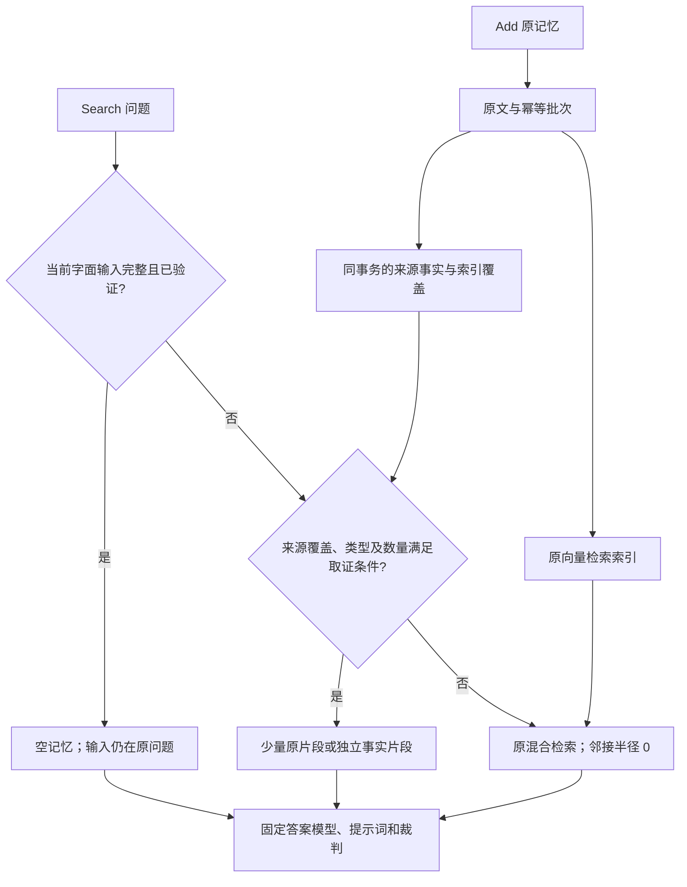

# 检索与共同事实取证：四项改进与验证（2026-10-05）

> **旧实验归档（2026-10-10）**：本页旧 `runs/` / `configs/runs/` 路径及命令仅作历史出处。
> 当前脚本、快照和原始产物已归档；恢复方式见 [归档说明](runs/README.md)。结论与成绩保留。

> **合并说明**：本文由原 `chinese-evidence-20261005.md` / `generic-evidence-improvement-20261005.md` / `unified-evidence-refactor-20261005.md` / `generalization-validation-20261005.md` / `targeted-improvement-20261005.md` / `facts-benchmark-20261005.md` 6 份专题报告合并而成（2026-10-10）。**内容逐字保留，仅标题降一级，未改写、未删减。**

## 目录

- [中文显式事实与 LLM 兜底预检（2026-10-05）](#中文显式事实与-llm-兜底预检2026-10-05)
- [共用关系与物品取证改进（2026-10-05）](#共用关系与物品取证改进2026-10-05)
- [Add/Search 共同取证结构整理（2026-10-05）](#addsearch-共同取证结构整理2026-10-05)
- [跨领域、换问法的取证验证（2026-10-05）](#跨领域换问法的取证验证2026-10-05)
- [Add/Search 六小时小样本改进记录](#addsearch-六小时小样本改进记录)
- [facts-benchmark-20261005](#facts-benchmark-20261005)

---

## 中文显式事实与 LLM 兜底预检（2026-10-05）

从 `cc496be` 出发，仅修改 Add/Search 的内部事实解析、条件编译、取证和存储排序。
HTTP 契约、答案模型、答案 prompt、裁判和原文渲染均不变；邻接半径为零。
本轮没有运行完整基准，没有接入自动 LLM 抽取。

### 扫描版本和模型边界

`evidence_coverage(parent_memory_id,user_id,version)` 记录某条原文已经被某一版
抽取器扫描，即使抽取为空也记录。它只解决重复扫描和旧版本失效问题，不能证明
全部语义已理解。例子：v2 扫描“张岚：我是北辰学校的学生。”时产生空事实；
v3 的覆盖独立于 v2，会用新规则重新处理原文，不改写 `qa_pairs`。

当前版本升到 `memory-facts-v3`。Add、重放和旧数据补索引仍使用同一个规则入口，
没有调用 LLM。原文 embedding、配置的 reranker 以及 AML 答案阶段依旧使用模型，
不能把“事实抽取不用 LLM”说成“整个系统不用模型”。

### 中文改动

人名、全角冒号、中文句末和引用续行接入共同发言解析器。角色归属支持“我是某处
的某角色”“我在某处工作/就读/做志愿者”等显式表达；少量同义词绑定到共同关系。
任意明确角色名仍可作为关系字段，不需要新增业务表或 Search 分支。

容器支持“我的某容器里有……”及确切汉字/阿拉伯整数、单项量词。单项数量和单位
一起保留，不求和。“两三”“十几”“一百二”“一些”等不确定表达拒绝数值抽取；
任一项目未解析时，不保存该句的部分数量清单。不同单位的同名物品不能静默去重。

`qualifiers.item_quote` 保存逐字物品定位引句，用于区分“笔记本”里的“笔”和真正的
下一项“笔”；该元数据不参与逻辑同义去重，也不额外进入返回正文。写库核验它
确实在来源引句中。英语组织名中的弯撇号不当作引文，中文单引号续行另行追踪。

名单/计数问法均编译成共同 `filter` 计划。例如“北辰学校有哪些学生”和“北辰学校
的学生一共有多少人”选择同一组独立事实；容器问法同样选择各项物品事实。来源
审查支持中文否定和计划，相关未知正向陈述、已选人物的否定更新或冲突回到原文。

这是部分中英文显式句法支持，不是全中文理解能力。自由叙事、隐含归属、中文
时间推理等尚未覆盖的表达继续走原文检索。扫描标记与范围语义审查仍是两回事。

### 先手工片段，再实现和验证

冻结六个合成领域：公司、学校、诊所、志愿者、背包、带容量的箱子；每组名单/
计数原问法及改述各一题，共 24 题。只有原文进入 Add，手工事实仅用于独立预检。
全部使用现有 CorporateBench 作答格式和集合/标量判分，开发模型为 qwen3.5-9b。

| 阶段 | 结果 | 处理 |
| --- | --- | --- |
| 手工 v1：数量写“有 2 本笔记本” | 22/24 | 两个名单含数量前缀；保留失败记录 |
| 手工 v2：写“包含笔记本，数量为 2 本” | 数量组 8/8 | 人员组沿用已通过的 16 题；通过后才修改产品 |
| 旧代码真实 HTTP Add/Search 重答 | 11/24 | 名单 7/12，计数 4/12 |
| 中文实现真实 HTTP 重答 | 24/24 | 名单 12/12，计数 12/12 |
| 修正重叠物品名的原文排序后 | 数量组重新作答 8/8 | 另 16 题正文 hash 与上一轮一致，核验后沿用答案 |

最终每题返回 3 条独立事实，六组各自的名单和计数返回同样的证据。38 条原文和
6 个批次的逐行 hash 与旧代码阶段完全相同；共同事实 30 条，v2/v3 均扫描 38 条
来源。24 个上下文的 72 次事实出现都核对父记忆、用户、来源侧和逐字引句；
`top_k=1`、不存在的用户和冻结答案链检查通过。

全量单元测试 **1043 passed**；mypy 42 个源码文件、Ruff 和格式检查通过。
8 个英文控制问题与上轮实际保留的 `candidate-repaired` 正文 hash 全部一致，没有
重跑它们的模型答案。第一次误选了整理中的 `candidate-final` 中间产物，显示
4/8 上下文不一致；该诊断保留，核对实际保留版本后为 8/8 一致，不以此修改产品。

这些数字是合成迁移诊断及有限控制，不是实际中文流量精度、完整数据集精度或
AML 榜分。用户提到的约一成中文流量没有在本轮重新统计。

### LLM 抽取兜底：可行性和失败

另冻结 10 条源记忆，包括“我受雇于某处”“某学校是我念书的地方”、叙事所有权、
未来 offer、已离职、访客、引用示例、混合人物和不明确数量。模型只收到源记忆，
不收到检索问题、金标或期望结果；输出独立 S/R/O、限定条件、逐字引句和未解析声明。

首版约定只有 **2/10** 同时满足期望字段和未解析标记；加入共同字段身份和否定/
未知数量示例后为 **9/10**，逐字引句检查 **10/10**。这衡量的是此小样本的抽取
协议符合程度，不是模型整体精度，也不是产品答案分数。

关键失败：原文“林悦：我的蓝色背包里有两本笔记本和一些笔。”被输出为一条
数量为 2 的笔记本事实和一条没有数量的笔事实，`unresolved_quotes=[]`。
每条引句都合法，但数量证据不完整。因而“引句存在”和“模型自称无未解析内容”
都不能作为完整计数的证明；不能把缺量的事实当成一个物品，也不能忽略它。
该原型未接入产品，两个提示版本的失败输出均保留。

建议后续按同一事实结构加入有界 LLM 补充：

1. 规则先抽取；零抽取和未解释的相关正向片段都能触发候选，不能只看事实条数。
2. Add 仅传原文，不传题目或 gold；模型输出独立事实和引句，不输出汇总答案。
3. 校验字段类型、主体绑定、逐字出处、否定/计划、单位和未知量。计数所需数量
   缺失时标记不完整并回到原文；不能以模型自己的完整标记替代这些检查。
4. 将“已扫描”与“抽取完整/部分/失败”分开记录，保留后端和提示版本以便审计。
5. 缓存按用户、来源内容和抽取版本组织，控制每批调用数、输入长度、超时；远程
   调用在 SQLite 写事务之外，校验通过后与原文一起事务落库。失败保留原文检索。

以上是下一步设计，当前产品没有这些 LLM 配置、状态字段或自动调用。

### 产物

脚本：`runs/chinese-evidence-20261005/{probe,llm_preview,english_controls,audit}.py`。
配置：`configs/runs/chinese-evidence-20261005/`。
原始片段、实际 HTTP 响应、模型输出、失败记录、来源审查和保留结果在同名 runs
目录，按仓库规则忽略运行时 JSON；结论和复现脚本提交。
SQLite 快照和日志在 `var/chinese-evidence-20261005/` 及同前缀日志文件。

---

## 共用关系与物品取证改进（2026-10-05）

本轮将 Add/Search 中的一部分取证能力抽象成共用事实表示与查询路径，已保留实现并默认
开启。产品提交为 **`f9548a3`**，基线为 `e63fecd`。先手工验证建议片段，再实现、通过
HTTP Add/Search 验证；接口、答案模型、提示词和裁判保持不变，邻接半径仍为 0。

固定的六领域诊断题，旧版 **19/24**、改进版 **24/24**；代码冻结后新增两个场景，
旧版 **6/8**、改进版 **8/8**。这些是合成的小样本迁移诊断，**不是完整数据集精度、
模型精度上限或 AML 榜分**，也不能说明任意表达都已支持。

### 具体改了什么

以前一些人物信息按公司、志愿活动等分别抽取，有的场景已经抽到事实，但查询没有对应
路径；背包等场景直接返回混杂原文，答案模型还需自行辨别所有者、计划、重复及物品数量。

现在共用两个原子结构：

| 结构 | 字段 | 来源例子 |
| --- | --- | --- |
| 关系事实 | 主体、关系、对象、原文引文、父记忆、来源日期、版本 | 某人是某机构的员工、学生、患者或成员 |
| 物品事实 | 上述字段，另有容器和原文单项数量 | 某人的某箱子有若干杯子 |

角色与容器名称是来源字段，不为公司、学校、诊所分别建表。抽取器处理有限的共同句法，
如 `Name: I am a <role> at <organization>.`，以及
`Name: My <container> contains <quantity> <item>, ...`。
因此新增 `patient` 或新箱子名称不需要新增领域分支。少量 `work→employee`、
`study→student`、`belong→member` 等关系同义映射集中维护；未知同义关系不自行推断。

Search 把支持的“有哪些/多少”问法归到同一关系与范围，返回同一组独立证据。它仍不
执行最终名单拼接或 SUM/COUNT。持久化与渲染在 Add/旧记忆补索引时完成，Search 筛选
已有事实；不是收到问题后把答案重新包装为记忆。已有专用取证路径保留优先级。

### Search 返回的仍是记忆事实

原始记录：

> Rosa Quinn: My 10-liter gray crate currently contains four cups, two plates, and one kettle.

真实 HTTP Search 返回三个独立片段，其中之一为：

```text
Memory fact
Subject: Rosa Quinn
Relation: contains
Object: cups
Container: 10-liter gray crate
Quantity: 4
Source record date: 2025-09-01
Source quotation: My 10-liter gray crate currently contains four cups, two plates, and one kettle.
```

另外两条是 plates / 2、kettle / 1。Quantity 仅转写原文单项数量，容量 `10-liter`
仍属于容器名称；片段中没有新增总数 `7` 或针对问题生成的最终物品数组。名单和求和由
原来的 Qwen 答案链完成。日期仅表示原始记录日期，没有推断物品购入或患者登记日期。

患者例子的实际片段使用 `Subject: Rosa Quinn`、`Relation: patient at`、
`Object: Aspen Clinic` 和对应原句，不将患者转成公司员工。

### 固定协议与实际结果

1. 从前一轮四领域验证复用原始数据、题目和金标，增加俱乐部与工具箱，固定 24 题。
   每领域 7 条原文，包含重复、未来计划、非成员/错误所有者或容器、虚构引用。
2. 人工提出每领域 3 个有来源的原子事实，复用原有答案流水线预检，**24/24 通过**后
   才修改产品代码。手工事实没有进入 Add。
3. 两个独立服务只接收相同原文，分别经 HTTP Add → HTTP Search → 原有答案链评分。
   旧版服务在修改产品前启动，固定为 `e63fecd` 的进程；两臂独立 SQLite/向量集合。
4. 修正未解释相关原文的保守回退检查后，重查 24 题，最终上下文与已评分上下文逐字一致，
   没有为了改进数字重复采样答案。
5. 冻结产品文件指纹后，新增“诊所患者”和“带容量箱子”两场景，共 8 题。先手工预检
   **8/8**，随后仅原文 HTTP Add，旧版与改进版各回答一次。产品指纹在新增检查结束后
   保持一致，没有针对这两个领域增加产品规则。

模型为 `Qwen/Qwen3.5-9B`，temperature=0，max_tokens=1024，top_k=100；列表按
原有 set-F1、整数按 exact-match 判分。本轮两臂所有部分分均为 0 或 1，均分因此恰好
等于完全正确率；一般情况下两者不能混用。答案/裁判调用串行，没有运行完整基准。

| 场景 | 手工事实预检 | 旧版真实 Add/Search | 改进版真实 Add/Search |
| --- | --- | --- | --- |
| 公司员工 | 4/4 | 4/4 | 4/4 |
| 学校学生 | 4/4 | 4/4 | 4/4 |
| 收容所志愿者 | 4/4 | 3/4 | 4/4 |
| 背包物品 | 4/4 | 3/4 | 4/4 |
| 俱乐部成员 | 4/4 | 4/4 | 4/4 |
| 工具箱物品 | 4/4 | 1/4 | 4/4 |
| 首批合计 | 24/24 | 19/24（79.2%） | 24/24（100%） |
| 新增：诊所患者 | 4/4 | 3/4 | 4/4 |
| 新增：带容量箱子 | 4/4 | 3/4 | 4/4 |
| 新增检查合计 | 8/8 | 6/8（75%） | 8/8（100%） |

每场景均有列表、计数原问法及改述，四题共享来源，不能当作四个完全独立的语料样本。
前一轮 16 题的旧成绩与本轮重新跑出的分组数字存在差异；即使 temperature=0，也不能
假定不同运行完全一致。本轮收益按本轮固定的两臂对照计算，不拼接前一轮成绩。

32 题每题实际返回 3 条独立事实。其中公司两道原问法继续使用已有任职事实路径，
其余 **30 题使用新增共用事实路径**。这次学校、患者等的成功已核对到实际抽取/取证，
不会把原文回退路径的答对误报为通用抽取成功。

| 上下文量 | 旧版 | 改进版 |
| --- | --- | --- |
| 首批 24 题平均 token | 207.8 | 140.7 |
| 新增 8 题平均 token | 205.5 | 155.0 |

这里没有扩大返回窗口或塞入更多邻接片段。原文回退在这些小语料里通常返回 7 条；
新路径每题选择 3 条事实，减少答案模型需要同时处理的干扰。

### 几个真实失败前后例子

| 问题/场景 | 旧版输出 | 改进版输出 | 相关变化 |
| --- | --- | --- | --- |
| 志愿者人数改述 | `4` | `3` | 使用同一关系下去重的人物事实 |
| 背包物品总数改述 | `5` | `6` | 明确区分物品种类与单项数量 |
| 工具箱物品种类 | `["four bolts", "two nuts", "three washers"]` | `["bolts", "nuts", "washers"]` | Item 与 Quantity 分开表示 |
| 工具箱物品总数 | `11` | `9` | 绑定 Noah 的绿色工具箱，排除他人及另一容器 |
| 患者人数 | `2` | `3` | 同一通用关系结构处理 patient |
| 带容量箱子物品种类改述 | `["four cups", "two plates", "one kettle"]` | `["cups", "plates", "kettle"]` | 容量、物品名称和件数分别保留 |

这些是取证与表示变化之后的答案链结果。没有逐一删除每个干扰项，不能断言某个干扰
就是全部错误的唯一原因，也没有用更大的模型改判。

### 边界、回退与数据核对

- 新 SQLite 索引保存父记忆、user_id、原文逐字引文与版本；写入时校验原文来源和用户。
  索引与覆盖标记在同一 Add 事务内保存，重放可补索引，不改原始记忆和批次指纹。
- 名单按同一主体/关系/对象去重。物品按所有者/容器/种类/原文数量绑定，同一种物品出现
  不同数量时保留原文处理，不自行选择一个版本、累加多次快照或猜测当前总数。
- 否定、计划和虚构引文不抽成正向事实。同范围仍有未解释的正向陈述或离开状态，
  事实分支回退；同段存在计划/引用和真实陈述的混合案例也有单元验证。
- 旧记忆补索引有 `fact_backfill_limit`，来源与事实读取有上限。未扫完或超限时回退，
  不以已知子集声称全部成员/物品已经取齐。仍受 top_k 和原来的 token 预算限制。
- 两臂 **56 条原文、56 个向量、8 个批次**核对完成；各自的原文/日期/批次指纹一致。
  改进版共存储 **41 条通用事实**，含重复来源及其他所有者的真实事实，不按金标从存储中
  删除它们。所有引文均逐字来自同用户父原文；查询再按范围筛选和去重。
- 32 个实际 HTTP 返回上下文逐条匹配持久化事实，来源用户、日期及名次分数核对通过；
  每对列表/计数返回相同正文，同题重查稳定，top_k=1 有效，未知用户返回空数组。

这套表示还不是任意语义的通用抽取器。当前支持明确具名的第一人称英语句式、有限问法
和字面机构/容器范围；未知同义词、隐含所有者、纯代词指代、跨时状态更新及多语言仍需
验证。范围审查依赖原文字面名称，不能保证捕获没有复述名称的隐含更新。
已有的否定/离开与数量冲突回退只验证了显式范围案例；**覆盖扫描完成不等于语义完整**。

### 旧案例回归与失败检查记录

从六小时改进轮选择 **24 个旧诊断查询**，涉及 CorporateBench、MQuAKE、TempReason、
LongMemEval、LoCoMo 和 MemTrapBench。使用同一旧语料、同一向量集合，分别开启/关闭
新功能：**24/24 上下文逐字一致**，且均与先前保留版本的历史上下文一致。
其中 8 个此前已修复的成功案例实际重新回答，**8/8 正确**。上下文相同与重新答对分别
记录；没有把另外 16 个未重答案例宣称为正确。

初次回归配置误选 `memories_dev`，实际历史集合是 `memories_goal_20261005`，导致
6 个上下文与历史不同，其中 5 个 LongMemEval 回退查询为空。同一错误配置下开关对照
已是 24/24 一致；改为正确历史集合后，开关对照和历史对照均 24/24 一致。
因此这次差异属于实验配置错误，未作为产品退化结论。原始失败检查、原因和修正后结果
均保留，没有覆盖初次失败产物，也没有通过改答案或金标消除差异。

本轮未出现需要 Git 回退的产品候选；已有六小时实验的失败/回退记录继续保留。
两个回归库的 **6,237 条原文和 757 个批次**与改动前快照一致。回归服务只查询旧集合，
没有对它执行 Add 或改写向量。

验证通过：全量单元测试 **1,042 passed**；Ruff 检查及格式检查通过；mypy 的 52 个产品
模块通过；本地真实 HTTP 契约预检 **14/14** 通过。单元测试增加了任意角色/容器、
说话人绑定、用户隔离、部分库存、冲突/离开回退、重放/补索引、来源校验及配置检查。
完整单元测试和本地契约预检不属于完整数据集实验，本轮没有调用 AML Smoke/Full。

### 本轮覆盖的七个维度

| 维度 | 实际覆盖与限制 |
| --- | --- |
| Explicit fact recall | 人物关系与单项物品事实；仅有限句式及小样本 |
| Relational and multi-hop reasoning | 主体/关系/对象及所有者/容器绑定；未新增多跳语义推理 |
| Temporal and event understanding | 计划排除、显式离开/数量冲突回退；未实现一般状态演变 |
| Memory governance | 原文与批次不变，来源/版本留存、幂等重放、补索引及重复事实去重 |
| Personalization and care | 所有者范围绑定；未测照护与偏好任务，不报子分 |
| Rules and process execution | 保持列表/整数规则和 HTTP 契约；未测一般流程执行 |
| Epistemic safety and privacy | 同用户逐字溯源、虚构排除、未知用户隔离与未解释来源回退；仅已测范围 |

### 实现、复现与归档

- 产品核心：[evidence.py](../../src/tianximem/facts/evidence.py)、
  [Search 路由](../../src/tianximem/service/pipeline.py)、
  [SQLite 索引](../../src/tianximem/store/sqlite_store.py)。
  Add 与旧来源补索引复用 [index_pair_facts](../../src/tianximem/pairing/apply.py)。
- 配置项 `retrieval.grounded_evidence: true`，可按 YAML 关闭，见
  [配置说明](../../docs/config-reference.md)。没有新 LLM、答案调用或环境变量。
- 运行脚本在 runs/generic-evidence-20261005/（历史路径：`runs/generic-evidence-20261005/`），
  配置快照在 `configs/runs/generic-evidence-20261005/{baseline,candidate,regression,regression-off}/`。
  基线/改进服务端口为 8096/8097，旧语料开关对照为 8098/8099，均使用隔离库。
- 首批题目 SHA-256 为 `9fb4487c70d487abb07701bf57522a90d7b42e84cf9815f2b3c3a73c49093a69`；
  新增题目为 `13d428191bc7a097fdf33129d51f2aea7b454df9363488f9b4d85abee561648a`。
  输入、模型、提示词与判分指纹在 `frozen.json` / `heldout-frozen.json`；新增检查产品
  指纹在 `heldout-code.json`，最终归档时再次核对，保持一致。
- 主要产物：`manual-results.json`、`baseline/summary.json`、`candidate/summary.json`、
  `heldout-*/summary.json`、`returned-evidence-audit.json`、`final-source-audit.json`、
  `regression-results.json`、`regression-controlled-parity.json`。
  初次配置错误检查保存在 `regression-contexts.json`、
  `regression-initial-wrong-collection-parity.json` 和 `regression-initial-config-error.json`。
- 四臂一致性 SQLite 快照保存在 `var/generic-evidence-20261005/<arm>/tianxi-snapshot.db`，
  SQLite/配置/产品指纹在 `archive.json`。原始产物与数据库按仓库惯例 gitignored，
  报告、脚本及配置快照提交 Git，实验记录和向量集合均保留。

复现顺序为 `prepare.py` 手工验证 → 原文 `ingest.py` → 两臂 `tools/targeted_eval.py` →
`heldout.py prepare/manual/ingest` → 新增两臂评测 → `audit.py` → `archive.py`。
含模型/冻结检查的脚本使用 `uv run --env-file .env python`；模型调用串行。
重跑前应确认目标库与向量集合一致，不复用已有答案缓存来代表新的一次模型评分。

```bash
uv run --env-file .env python eval/reports/runs/generic-evidence-20261005/prepare.py
uv run --env-file .env python eval/reports/runs/generic-evidence-20261005/ingest.py --arm candidate --base-url http://127.0.0.1:8097
uv run --env-file .env python tools/targeted_eval.py --manifest eval/reports/runs/generic-evidence-20261005/manifest.json --base-url http://127.0.0.1:8097 --output eval/reports/runs/generic-evidence-20261005/candidate --freeze eval/reports/runs/generic-evidence-20261005/frozen.json --deadline <未来UTC秒数>
uv run --env-file .env python eval/reports/runs/generic-evidence-20261005/heldout.py manual
uv run --env-file .env python eval/reports/runs/generic-evidence-20261005/audit.py regression
uv run --env-file .env python eval/reports/runs/generic-evidence-20261005/audit.py returns
uv run --env-file .env python eval/reports/runs/generic-evidence-20261005/archive.py
```

验证结束后关闭本轮四个隔离服务。用户原有服务未重启；默认配置将在下次启动时加载。

---

## Add/Search 共同取证结构整理（2026-10-05）

本轮从 `cedce70` 出发，删除业务专用取证路径，统一记录、存储、覆盖扫描、查询执行
和打包。不是给专用路径加一个外壳：产品里不再有任职、库存、活动等独立表接口或
Search 优先级分支。源码分支为 `refactor/unified-evidence-20261005`。

旧诊断 24 题，本轮重答前后都是 **20/24**，逐题对错一致。跨领域 32 题本轮为
**31/32**；历史保留版本是 32/32，本轮没有重新运行那份历史实现的跨领域答案。
因此只能确认旧 24 题保持，不能声称所有能力、完整数据集精度都保持或提高。
灰箱的一个计数改写问题仍错，详见下文。

### 删除了什么

| 之前 | 现在 |
| --- | --- |
| 9 个业务事实模块及独立类型、抽取入口 | `facts/grammar.py` 一个抽取入口、`facts/evidence.py` 一个事实类型 |
| `facts/index.py` 中按业务登记版本和扫描模式 | 一个 `memory-facts-v2` 版本、一个扫描覆盖表 |
| 文档范围、关系连接、时间区间、当前输入的 4 个专用检索模块 | `facts/query.py` 编译共同计划，`retrieve/evidence.py` 执行共同操作 |
| 11 张派生事实表及对应读写方法 | 一张 `memory_facts`，统一插入、筛选和来源审查 |
| 11 个专用配置开关和各自的 Search 分支 | 一个 `retrieval.grounded_evidence` 开关 |
| 分别渲染任职、库存、活动、个人引用等内容 | 一个独立事实渲染器，原文投影复用现有打包器 |

删除的业务事实模块：employment、inventory、work、participation、status、
personal_reference、friend_context、statements、temporal。加上版本登记器和
4 个检索模块，共删除 **14 个产品模块**。

`statement_source_limit`、`statement_hop_limit` 改名为 `evidence_limit`、
`evidence_hop_limit`；`fact_backfill_limit` 保留。默认上限分别为 12、4、1024。
旧实验配置保留供旧提交复现，新代码不兼容已经删除的配置键，遇到未知键会拒绝启动。

新库只创建 `qa_pairs`、`applied_batches`、`memory_facts`、`evidence_coverage`
四张表。已有库里的旧派生表保持原样封存，**新代码不读写、不创建这些表**，
共同索引从原文重建。没有为整洁而删除历史证据或改写原始记忆。

### 共用结构如何工作

一条记录包含：主体、关系、客体、原文限定条件、来源侧、逐字引句、来源日期和
父记忆 ID。数量、容器、显式时段等属于限定条件；来源清晰程度和原文投影方式
属于取证元数据。没有最终答案、汇总名单或汇总计数列。

```text
Add → 配对/幂等事务 → 原始记忆
                  └→ 共同抽取器 → 共同事实 + 版本覆盖
Search → 问法编译 → 字段筛选 / 有限连接 / 显式区间比较
                → 共同来源审查 → 原文或独立事实 → 双预算打包
       无适用计划、扫描未齐、冲突或超限 → 原混合检索
```

例如公司员工、学校学生、诊所患者，都保存为“人物—关系—组织”字段，采用同一
筛选操作。“有哪些”和“多少”只选择证据，不在 Search 执行名单生成或 COUNT。
背包、工具箱和箱子同样使用“所有者—contains—物品”及容器、单项数量限定条件，
没有为每个容器再增加表或路径。

关系连接返回各条原文边；显式区间比较返回原文中给出起止月份的记忆。
人物引用只补回独立支持事实。例如“本人家乡国家是 Sweden”和“提到从自己的家乡
国家搬走”分开返回，不能写成新的“从 Sweden 搬走”事实。

必要的语义识别仍集中在句法层：署名是否属于本人、计划与已发生状态的区别、
词语是否表达任职或参加活动等。它们只绑定共同字段和操作，不拥有专用存储、
开关、执行器或答案模板。当前仍是有限的英语显式句法，不承诺覆盖所有表达。

### 排序与完整性

同义事实优先选择明确的本人归属陈述。例如“我的教会朋友”比一起露营的同行描述
更清楚；原始来源仍全部保存。该规则只选择同义来源，不消除不同客体、时段或冲突。
非数量集合按主体稳定排列，数量观察按原文物品次序呈现。引用陈述先出现，其独立
支持事实随后出现，方便答案模型连接证据。

Add、重放和补索引共用一个抽取器。抽取出空集合也记扫描覆盖；新版本重新扫描。
Search 未扫描完当前用户时沿用原检索，不拿部分索引代替完整名单。
范围审查使用全部物理来源事实，不能因逻辑去重而遗漏重复来源的解释。
未解释的相关正向声明、否定冲突或取证超限继续交回原文。

所有事实写入都验证父记忆、用户及声明的 question/answer 来源侧，引句须逐字存在。
相同事实 ID 的首次表示冻结。数量正文仅出现单项数量，完整引句存在索引中，避免
正文再重复同一数值。只返回事实，不通过预先求和补偿模型的计算错误。

本轮 `radius=0`，共同原文投影也固定零邻域；没有扩展相邻片段。
无法支持的问题仍可能返回原混合检索的大候选集合，这是原有回退行为，
本轮没有把这些失败题包装成已经解决。

### 手工预检、失败记录和实现验证

遵循用户要求，先手工提出片段，固定答案/裁判链验证通过后才实施代码。
诊断题、原始语料、金标、答案模型、提示词和评分口径都保持冻结。

| 阶段 | 结果 | 处理 |
| --- | --- | --- |
| 手工 S/R/O 字段表示 | 5/8 | 未采用 |
| 可读 Statement 且重复数量引句 | 7/8 | 未采用，鱼数发生重复计数 |
| 可读 Statement，不返回所有引句 | 7/8 | 未采用 |
| 可读 Statement，数量引句仅存索引 | 8/8 | 进入初次共同结构实现 |
| 初次实际答案复测 | 17/24，基线 20/24 | 保留失败记录，继续修复共同呈现/排序 |
| 给实际片段再加字段的手工验证 | 1/3 | 未实施 |
| 来源措辞与共同排序的手工验证 | 8/8 | 实施共同来源选择和排序规则 |
| 修复后的实际旧案例 | 20/24，逐题与基线一致 | 保留 |
| 跨领域实际答案复测 | 31/32 | 保留真实限制，不声称全保持 |
| 数量改成明确字段的手工验证 | 12/13 | 未实施；鱼数错误，不能只看箱子题改善 |
| 数量改成 JSON 的手工验证 | 9/13 | 未实施 |
| 同原句的数量事实合并原句的手工验证 | 12/13 | 未实施；鱼数答成 26 |

初次 HTTP 检查还发现了重复来源审查、标题来源标签、具名独立对话及重复地点等
迁移遗漏，均在共同流程修复；没有恢复专用模块。后续标题检查补回了“总次数”
句式中多个 `the` 的匹配，仍是同一标题字段条件。

初次启动选错 profile 导致向量维度错误，以及一次答案端点环境未注入的失败，
保存为配置/启动失败，不计为模型回答错误。手工可读片段复测的一次网关失败
在同一冻结输入上重试成功，原错误日志保留。

### 实际答案结果

旧 24 题是此前的固定诊断查询，来自六个数据集，重答两臂均使用当前同一冻结答案链。

| 数据集 | 题数 | 整理前 | 最终保留结构 |
| --- | ---: | ---: | ---: |
| CorporateBench | 6 | 5/6 | 5/6 |
| MQuAKE | 3 | 2/3 | 2/3 |
| TempReason | 3 | 3/3 | 3/3 |
| LongMemEval | 6 | 4/6 | 4/6 |
| LoCoMo | 5 | 5/5 | 5/5 |
| MemTrapBench | 1 | 1/1 | 1/1 |
| 合计 | 24 | 20/24 | 20/24 |

16/24 上下文逐字一致；另外 8 题的表示或顺序改变，实际重答结果保持。
4 道原有错误仍存在，不能说本轮提高了这些题的精度。

跨领域沿用此前公司、学校、志愿者、背包、俱乐部、工具箱的 24 题，以及之前
冻结的诊所和灰箱 8 题。本轮未把它们重新宣称为新的留出集。

| 场景 | 题数 | 本轮实际正确 |
| --- | ---: | ---: |
| 公司、学校、志愿者、背包、俱乐部、工具箱 | 各 4 | 各 4/4 |
| 诊所 | 4 | 4/4 |
| 灰箱 | 4 | 3/4 |
| 合计 | 32 | 31/32 |

32 题都返回 3 条独立事实，名单/计数同问法使用相同片段。
错误题是 `heldout-crate-count-paraphrase`：问 10-liter gray crate 当前物品总数，
实际记忆是 4 cups、2 plates、1 kettle，模型回答 6，金标 7。
同场景的标准计数问法回答 7。事实已完整取到，但新的呈现与问法组合没有稳定得到
正确计算；历史版本该题答对，因此这项损失明确记录。本轮不能据此推断模型精度上限。

答案模型为 `Qwen/Qwen3.5-9B`，temperature=0、max_tokens=1024、top_k=100，
模型调用串行。CorporateBench 继续使用既有 set-F1/整数口径；其余使用原 pipeline。
没有修改答案 prompt、裁判、评分器、原题或原始数据，也没有跑完整基准实验。

### 工程与来源核对

- 全量单元测试 **985 passed**；Ruff 全仓检查与格式检查通过；mypy **42 个产品文件**通过。
- 真 HTTP 契约自查 **14/14**。旧能力测试迁到共同结构/操作/覆盖测试，保留正常、
  否定/引用/计划、归属隔离、未知范围、冲突、区间边界、预算、重放与回滚检查。
- 旧实际语料 **6237 条原文、757 个批次**逐行哈希保持；合成语料 **56 条原文、8 个批次**保持。
- 两个克隆库中的 **12 张旧派生表**逐行哈希保持，新建共同索引分别有 **814 / 49 条事实**。
- 共同事实逐条核对来源用户、来源侧、逐字引句及原消息时间；56 个 HTTP 上下文
  冻结后复查一致。跨领域 top_k=1、缺失用户检查通过。
- 历史向量集合仅供只读检索，没有 Add、重建或更换向量；集合现有 point 数分别为
  **4205 / 56**。没有把 6237 条 SQLite 原文宣称为本轮全部重建了向量。

### 产物与复现

脚本在 runs/unified-evidence-20261005/（历史路径：`runs/unified-evidence-20261005/`）：
`preview.py` 为首次手工方案，`preview_actual.py` 为实际片段的呈现预检，
`preview_quantity.py` 保存三种未采用数量方案，`check.py` 打真实 HTTP 后调用冻结答案链，
`audit.py` 核对冻结代码、旧数据、共同事实和返回值。

最终答案在 `candidate-repaired/{regression,generalization}/`；基线在 `baseline/regression/`。
`candidate-v1/v2/v3` 为初次迁移检查，`candidate-final` 是回答 17/24 的失败版本，
没有覆盖成最终成功结果。手工失败目录、JSON 结果和网关日志全部保留。

配置快照在 `configs/runs/unified-evidence-20261005/`。一致性数据库快照、各轮失败数据库
和服务日志在 `var/unified-evidence-20261005/`；最后的代码/config 哈希在
`product-frozen.json`，答案链哈希在各 scope 的 `frozen.json`。
原始逐题产物与数据库沿用仓库忽略规则，源码、配置、失败结论和本报告提交 Git。

```bash
uv run --env-file .env python eval/reports/runs/unified-evidence-20261005/check.py \
  --phase candidate-repaired --scope regression --base-url http://127.0.0.1:8101 --answer
uv run --env-file .env python eval/reports/runs/unified-evidence-20261005/check.py \
  --phase candidate-repaired --scope generalization --base-url http://127.0.0.1:8103 --answer
uv run python eval/reports/runs/unified-evidence-20261005/audit.py final
```

复现须使用对应配置及克隆库启动服务；基线旧配置只能用于 `cedce70` 旧实现。
任何上下文或冻结指纹变化必须另开 phase，不能复用旧答案冒充新验证。

---

## 跨领域、换问法的取证验证（2026-10-05）

本轮是验证记录，没有修改产品代码或开始新的六小时 goal。结论是：**手工提供清楚的、
有来源的独立事实时，16 道题全部答对；现有 Add/Search 实际答对 14/16。现有事实
抽取与查询路由仍然依赖领域及表达，不能据此称为通用事实索引。**

### Search 与最终回答的边界

遵循本仓 [契约 §1](../../docs/contract.md)：Search 不生成最终答案，也不把答案伪装
成记忆记录。用户允许 Add/Search 内部存储、检索及打包模块调整，接口与答案流水线保持不变。

语义判断可用于确认说话人、区分现实陈述/计划/否定/虚构引用、筛选相关来源，以及同一事实
的去重。这些步骤的输出仍应是独立记忆或有原文支持的事实。去重不等于把查询结果写成答案。

例如，源记录为：

> Maya Chen: My blue backpack currently has two notebooks, three pens, and one ruler.

允许返回该原文，或返回分别可追溯到它的片段：

```text
Owner: Maya Chen
Container: blue backpack
Item: notebooks
Quantity: 2
Source record date: 2025-09-01
Source quotation: Maya Chen: My blue backpack currently has two notebooks, three pens, and one ruler.
```

另外两条事实分别为 pens / 3、ruler / 1。Quantity 是原文已有的单项数量。
本例中，Search 不应新增“总共有 6 件”，也不应新增针对查询的最终数组
`["notebooks", "pens", "ruler"]`。总数及最终回答格式由原有答案模型生成。
若原文自身记载名单或总数，它仍可作为原记忆返回；禁止的是在 Search 中新生成最终答案。

### 固定协议与来源

- 四个合成领域：公司员工、学校学生、收容所志愿者、背包物品。每个领域 7 条原始记录，
  每个领域一个独立 user_id。前三组的实际成员都是 Maya Chen、Noah Reed、Inez Patel。
- 每个领域设“有哪些/多少”两种任务，各有原问法和改述，共 16 道题。背包列表金标为
  notebooks / pens / ruler，计数金标为 6。
- 原始记录包含重复陈述、尚未发生的计划、非成员/错误所有者或容器、虚构引用；背包还含
  未购买的物品。题目与金标在手工预检前冻结，没有按实际答案改金标。
- 手工预检每领域提供 3 个独立事实，各自包含来源引文。它们只用于预检，**没有进入 Add**。
  之后实际服务只接收原文，经 HTTP Add → HTTP Search → 既有答案链评分。
- 答案模型 Qwen/Qwen3.5-9B，temperature=0，max_tokens=1024。复用既有 CorporateBench
  类型提示词与判分：列表 set-F1、标量 exact-match，不调用另一个 LLM 改判。
- 这些是自建的小样本迁移诊断，**不是四个官方数据集的评测，也不是 CorporateBench/AML 榜分**。
- 产品基线 Git `3eee19a`，配置快照 `configs/runs/generalization-20261005/`；邻接半径 0。
  独立服务端口 8093；SQLite `var/generalization-20261005/tianxi.db`；Qdrant 集合
  `memories_generalization_20261005`。rerank 关闭，capture 关闭。

完整语料、事实预检与题目由 prepare.py（历史路径：`runs/generalization-20261005/prepare.py`） 生成。
冻结输入 SHA-256：`de3f6d921a732767f9020db6c8cd629951044525865e05262f24648ecd2d9819`。
模型、提示词、判分代码及输入指纹在 `runs/generalization-20261005/frozen.json`。

### 实际结果与取证路径

| 场景 | 手工事实：原问法/改述 | 实际服务：原问法/改述 | Add 实际抽取 | Search 实际返回 |
| --- | --- | --- | --- | --- |
| 公司员工 | 2/2、2/2 | 2/2、2/2 | 4 条任职事实，含 Maya 的重复来源 | 原问法 3 条去重后的任职事实；改述 7 条原文 |
| 学校学生 | 2/2、2/2 | 2/2、2/2 | 没有学生关系事实 | 两种问法均 7 条原文 |
| 收容所志愿者 | 2/2、2/2 | 2/2、2/2 | 4 条 volunteer-place 事实，含重复来源 | 两种问法均 7 条原文，未使用这批志愿地点事实 |
| 背包物品 | 2/2、2/2 | 2/2、0/2 | 没有背包物品事实 | 两种问法均 7 条原文 |
| 合计 | 16/16 | 14/16（87.5%） | 只有两种已有领域抽取器产出事实 | 2 题走事实取证，14 题走原文检索 |

实际服务的原问法为 8/8，改述为 6/8；列表、计数分别为 7/8。这些数字来自相同的
16 道固定题，只是不同分组方式，不能相加为更多独立样本。

公司原问法是 `Who are the employees of Arden Labs?`、
`What is the total number of employees mentioned in the corpus?`；改述为
`Who works at Arden Labs?`、`How many people currently work for Arden Labs?`。
原问法进入事实分支，改述回退原文。**答对没有消除表达识别的缺口。**

学校和志愿者的实际答案正确，但都依赖这批仅 7 条的原文上下文。学校没有抽取到学生
关系；志愿地点已经抽取，名单/人数问题却没有对应的查询路由。因此不能把这两组的
正确答案当作“跨领域事实抽取与取证已经通过”。回退路径包含全部原文与干扰记录；
不是本轮提出的新筛选方案，也不能外推到大语料。

### 两个失败案例与补充对照

| 固定改述问题 | 期望 | 实际答案 | 现象 |
| --- | --- | --- | --- |
| List the kinds of belongings Maya Chen currently keeps in the blue backpack. | `["notebooks", "pens", "ruler"]` | `["two notebooks", "three pens", "one ruler"]` | 类型与数量未分离，严格列表 set-F1 为 0 |
| What is the total number of items currently inside the blue backpack owned by Maya Chen? | `6` | `5` | 2/3/1 的真实原文都已返回，计数仍错 |

从模型最终文本无法确定它为什么算成 5。可以确认的是：不是正确证据缺失；原文检索
未排除虚构引用、他人的背包、计划与重复记录。换问法还改变了原文排名。

为避免把排序变化直接归因为问法或干扰，补做两种固定上下文对照，只测这两道失败题。
问题、金标、模型、提示词及判分保持不变，所有片段仍为原文：

| 上下文条件 | 列表改述 | 计数改述 |
| --- | --- | --- |
| 仅上述一条真实原文 | 正确：`["notebooks", "pens", "ruler"]` | 正确：`6` |
| 保留全部 7 条原文，固定为原计数问法的返回顺序 | 仍错：带数量的名称 | 仍错：`5` |
| 初始手工原子事实预检（非补跑） | 正确 | 正确 |

补充对照共 4 次模型调用；不计入 14/16 的实际服务成绩。结果支持优先验证**证据减噪与
物品/数量拆分**，仅固定排序在这两个样本上无效。没有逐个删除干扰项，不能确定某一项
是唯一原因；temperature=0 也不是普遍稳定性的证明。

补充脚本：probe.py（历史路径：`runs/generalization-20261005/probe.py`）。协议、内容指纹与逐题结果
保留在 `probe-protocol.json`、`probe-results.json` 及 `probes/`。

### 内容与隔离核对

audit.py（历史路径：`runs/generalization-20261005/audit.py`） 已通过，输出 `audit.json`：

- 28 条原文、28 个向量、4 个成功 Add 批次均核对完成；库中 question 与 Add 原文逐字一致。
  answer 均为空，原文及批次在 Search 后保持不变。
- 8 条持久化事实都有同 user_id 的真实父记录；本轮任职/志愿事实只来自成员记录，
  没有把计划、非成员或虚构引用抽成事实。学校和背包的“没抽到”单独记录，未视为成功。
- 16 次 Search 的每条 content 都逐字对应原文渲染或持久化原子事实；没有新增跨记录名单
  或计数结论。8 对“有哪些/多少”查询返回同一组记忆正文，而不是各自生成不同答案。
- 同题 HTTP 重查的 id/content/日期/score 完全一致；top_k=1 的数量约束通过；不存在的
  user_id 在四个领域问题上均返回空数组；未发现跨 user 来源。
- 重查前后原文、批次、所有事实表与覆盖表的整体指纹一致。答案链冻结指纹一致。

这证明的是本轮本地返回内容及隔离检查通过，不替代官方 AML 判定。源记录数量或覆盖标记
只能证明来源已扫描，不能证明语义事实已完整抽取。

首次服务启动因缺少 SQLite 父目录失败；当时 Add 未完成，没有据此评分。创建目录并
确认全部原文/向量已写入后才运行实际评分。一次审计调用漏载 `.env`，冻结检查拒绝了
不同模型默认值；改用本轮相同环境后审计通过，没有接受或覆盖错误指纹。

### 对更高层抽象的结论

共用“主体—关系—对象—限定条件—状态—来源”的表达是合理方向；**现有代码还没有把
所有事实类型统一为这套通用机制**。本轮没有给新领域追加正则或修改 Search。

下一步可在 Add/Search 内部验证三项能力：

1. **共用事实表示**：任职、就读、志愿关系都保留人物、关系、机构及来源；库存保留
   所有者、容器、物品、单项数量及来源。关系本身来自原文，不能把所有机构关系归为任职。
2. **共用条件检索**：同义问法归到同一关系及范围；“有哪些/多少”使用同一证据集合。
   两者在 Search 内都不执行最终名单拼接或 SUM/COUNT。
3. **有依据的语义约束**：否定、计划、虚构引用、所有者/容器错配与重复陈述分别处理。
   同一事实多条来源可去重，真正多次事件必须保留；不能按金标删掉额外真实记录。

改进门槛仍是先手工提出有出处的片段，再以同一固定答案链快速验证；通过后才实现，
并用 HTTP 验证原文到事实的实际转换及回退情况。不得用相邻扩窗或塞满上下文替代取证。

### 本轮覆盖的七个维度

| 维度 | 实际覆盖与限制 |
| --- | --- |
| Explicit fact recall | 四领域关系及物品；未测大语料覆盖 |
| Relational and multi-hop reasoning | 单层人员关系、所有者/容器绑定；未测多跳链 |
| Temporal and event understanding | 当前陈述与未来计划干扰；未测真实跨时更新或日期计算 |
| Memory governance | 原文/批次不变，重复事实去重及查询重放检查；未测删除接口 |
| Personalization and care | 仅所有者范围绑定；没有照护或偏好任务，不报子分 |
| Rules and process execution | 复用既有列表/整数格式规则，未测工作流程任务 |
| Epistemic safety and privacy | 真实/虚构来源区分、同用户溯源、未知用户空结果；仅本地样本 |

### 复现与归档

运行序列为 `prepare.py` → `run_inputs.py manual` → 启动隔离服务 →
`run_inputs.py ingest` → `tools/targeted_eval.py` → `probe.py` → `audit.py`。
答案调用一律串行。调用含模型配置的脚本均使用 `uv run --env-file .env python`。

```bash
uv run python eval/reports/runs/generalization-20261005/prepare.py
uv run --env-file .env python eval/reports/runs/generalization-20261005/run_inputs.py manual
TIANXIMEM_PROFILE=local TIANXIMEM_CONFIG_DIR=configs/runs/generalization-20261005 TIANXIMEM_SQLITE_PATH=var/generalization-20261005/tianxi.db uv run uvicorn tianximem.service.app:create_app_from_env --factory --host 127.0.0.1 --port 8093
uv run --env-file .env python eval/reports/runs/generalization-20261005/run_inputs.py ingest
uv run --env-file .env python tools/targeted_eval.py --manifest eval/reports/runs/generalization-20261005/manifest.json --base-url http://127.0.0.1:8093 --output eval/reports/runs/generalization-20261005/http --freeze eval/reports/runs/generalization-20261005/frozen.json --deadline <未来UTC秒数>
uv run --env-file .env python eval/reports/runs/generalization-20261005/probe.py
uv run --env-file .env python eval/reports/runs/generalization-20261005/audit.py
```

`prepare.py` 拒绝覆盖已冻结的题目和配置。`run_inputs.py ingest` 使用同批次 id 重放时
保持幂等，重放核对已通过。原始产物按仓库惯例 gitignored，报告、脚本及配置快照入库；
没有删除实验数据库或向量集合。新增脚本 Ruff 检查通过；本轮未改产品，不重复跑完整基准
或全量产品单元测试。

一致性 SQLite 快照另外保存在 `var/generalization-20261005/tianxi-snapshot.db`，其指纹及
配置指纹在 `runs/generalization-20261005/archive.json`。验证结束后已关闭本轮隔离服务。

---

## Add/Search 六小时小样本改进记录

起点：`693d0f4`；分支：`improve/targeted-six-hours-20261005`。
执行窗口：北京时间 2026-10-05 00:08:28—06:08:28。
收尾完成：06:08:53；本轮启动的 30 个隔离 HTTP 服务已全部停止，原有服务
未发送停止信号。数据库、向量集合、逐题结果和失败记录全部保留；
停止清单为实验目录中的 `service-cleanup.json`。

用户授权只调整 Add/Search 及其内部模块，允许持久化事实索引；接口、答案模型、
答案提示词和裁判保持固定。返回原片段或有来源的事实片段，不返回最终答案、
汇总计数或汇总名单。不扩展相邻片段，不运行完整实验。

用户追加的目标执行要求（基线运行期间）：每轮先手工准备少量改进后的
原文/事实片段，在固定答案模型、提示词和裁判下做快速验证；只有收益明确、
来源可信且正向控制没有受损的方案才进入代码实现。实现后保存独立 Git 提交，
再通过真实 HTTP Search 对固定失败案例及正向控制判分，复核额外案例。
无效改动用 `git revert` 回退实现提交，实验记录独立提交并保留。
输出逐题答案、判分、片段、token 和耗时；全程不运行全量实验。

首次主题筛选候选实现尚未测效果时收到此要求，已保存到运行目录并恢复产品
代码至基线，先补手工预验证。此前通过的单元测试不作为效果证据。

实验产物：`eval/reports/runs/targeted-six-hours-20261005/`；模型与 pipeline 指纹、
案例清单和配置快照保存在该目录。分数仅代表这批诊断案例。

### 集成结果

下表比较固定诊断题集的完全正确题数。CorporateBench 与 MQuAKE 使用加入
TempReason 语料后的新鲜原 Search 基线，避免全局 BM25 IDF 改变造成虚假增益。
所有保留改动已在正常默认配置启用；事实来源上限为 12、关系跳数上限为 4，
邻接半径保持 0。没有运行任何数据集的完整评测。

| 固定诊断集合 | 原 Search | 保留版 | 逐题结论 |
| --- | --- | --- | --- |
| CorporateBench 28 题 | 10/28 | 14/28 | 新修复员工总数、三月名单、两道具体会议的次数题；旧正确题保持 |
| MQuAKE 15 题 | 6/15 | 14/15 | 八道当前关系链错例修复；缺少第二跳原事实的题仍错 |
| TempReason 15 题 | 6/15 | 15/15 | 九道明确区间题修复；额外同月并列问题仍不能确定日级先后 |
| LongMemEval 6 题 | 3/6 | 4/6 | 鱼数修复；慈善范围与跨交易收入仍错 |
| LoCoMo 多跳 17 题 | 9/17 | 12/17 | 本人活动、国家指代、交友来源各修复一题 |
| LoCoMo 时间 18 题 | 10/18 | 12/18 | 开店报告、实习录取报告各修复一题 |
| MemTrapBench CSV/字段组 6 题 | 4/6 | 5/6 | 当前字面 CSV 不再受旧布尔模板影响 |
| MemTrapBench 新增字段/列表组 6 题 | 2/6 | 4/6 | package.json 版本、metrics job 名称修复；两道控制保持 |
| MemTrapBench 独立 PKCE 题 | 0/1 | 1/1 | 新题同样不再把当前 true 改为旧模板的 1 |

MemTrapBench 前两组六题有两道控制重叠，不相加作为整体精度；独立变体与
合成诊断均未计入官方样本分母。各组旧正确题没有退化，这不等于全量无退化。
CorporateBench QA 均分由当前基线 0.4157 至 0.5347；它与二值完全匹配不同。
更多额外题的保留/失败结果见下方逐轮记录，不将挑选的失败案例分数称为模型上限。

最终产品代码的全部单元测试为 1,013 项通过；Ruff 通过，mypy 检查 51 个
源码模块通过。既有诊断的 134 个主集合/额外集合输入和 13 个 MemTrapBench
输入，在最新 HTTP 服务下与各自通过验证的版本逐字一致，因此没有对相同输入
重复调用答案/裁判。19 份冻结快照的 148 次文件指纹检查均一致，答案模型仍为
Qwen/Qwen3.5-9B、temperature=0、max_tokens=1,024，答案提示词和裁判未改。
这些 HTTP 输入检查包含已验证小样本中的重复题，不增加独立样本数。

最终主实验库中，起点的 6,237 条原记忆和 757 条幂等批次全部逐行不变；
最终克隆另加 9 条、5 批具名引用诊断原文，属于隔离合成用户，未加入主集合向量。
R03 和 R06 的无效实现分别由 `2dd0f0b`、`77eabcf` 回退；预验证失败的
排序、金额表示、缺席名单和截止日期等方案没有进入产品，记录与原始产物保留。

验收产物：`final-diagnostic-summary.json`、`final-retained-context-parity.json`、
`final-mtb-context-parity.json`、`final-pipeline-integrity.json`、
`final-raw-source-integrity.json`，均位于上述实验目录。

另将起点旧库以 SQLite backup 克隆，使用最新正常 `default.yaml` 与开发期
`local.yaml`（只把向量集合改为隔离实验集合），未经 Add 重放直接 HTTP Search。
任职人数、更新关系、时间区间、库存、个人指代、朋友归属与状态报告七个代表
案例全部与保留版模型输入逐字一致；6,237 条原文、757 条幂等批次仍全部不变。
产物为 `final-default-cold-parity.json`、`final-default-cold-raw-integrity.json`，
可复核当前默认配置和最新抽取版本对旧记忆生效，而不只是实验开关下有效。
主实验库的十一张来源/覆盖旁表也已核查：每条记录都能关联同用户原始记忆，
无缺失来源、跨用户来源或外键异常；这是引用完整性检查，不宣称语义抽取完备。
产物为 `final-fact-source-integrity.json`。

### 轮次

保留版仍使用原来的 Add/Search 接口。Add 在原文落库的同一事务内添加
可追溯的事实或原文旁索引；Search 先判断当前输入是否已完整，再按受支持的
来源关系取证。未覆盖、缺来源、冲突不能处理或超过上限时回到原检索。
完整性只表示已扫描当前用户的来源，不把未抽出的事实解释为不存在。



| 轮次 | 假设与修改 | 固定失败案例/控制结果 | 决定与 Git 记录 |
| --- | --- | --- | --- |
| 基线 | 当前答案提示词与原 Search；隔离索引 | 完全匹配 10/28；开发 1/10、控制 6/6、额外案例 3/12；QA 均分 0.4076 | 起点 `693d0f4`，配置 `e3ded34` |
| P01 原文预验证 | 手工选取明确会议标题及日期条件匹配的日历邀请/邮件，正文原样 | 同 6 题由 3/6 至 4/6，控制 3/3；单场会议 `kb_qa-12` 由 0 至 1，多场计数仍错 | 允许进入小范围条件筛选实现；不声称解决计数 |
| P02 截短预验证 | 同 P01，邮件只留头部及称呼，日历邀请原样 | 2/6；参与者列表漏组织者，组织者题拒答 | 拒绝实现这种截短；原文保留正文关系信息 |
| R01 HTTP 验证 | `0347f5b`：自然问题解析显式主题/月/季度条件，保留匹配完整原文 | 完全匹配 12/28；开发 3/10、控制 6/6、额外 3/12；QA 均分 0.4790；平均上下文 31,755→20,497 tokens | 保留；修复 `12,37`，多场计数未解决 |
| P03 员工原文预验证 | 每人一条自己的任职署名/第一人称陈述，先剔除引用回复 | 总数仍答 10；名单漏 Jennifer（F1 0.9565，原 Search 为 1） | 拒绝仅靠署名原文截取的方案 |
| P04 类型化事实预验证 | 同 P03 来源，独立的 Person/Employer/Role/Document date/Source claim 事实 | 员工总数由 10→12，名单 12 人完整；两题 2/2；会议记录类型化仍未修复多场计数 | 只实现通过验证的员工任职事实；不伪造会议发生/入职日期 |
| R02 HTTP 验证 | `83842d8`：Add 同事务保存可追溯任职事实；Search 按人去重返回独立事实 | 完全匹配 13/28；开发 4/10、控制 6/6、额外 3/12；QA 均分 0.5148；平均上下文 19,379 tokens | 保留；在 R01 基础上修复员工总数 `3`，入职日期题未修复 |
| P05 时间排序预验证 | 原文、标题及日期范围与 R01 相同，只按来源日期升序 | 仍 4/6；`51` 答 2、`88` 答 7，控制保持 3/3 | 无新增收益，不实现时间排序 |
| MQuAKE 小样本基线 | 固定 CF3k 10 道旧错例、5 道正向对照；当前 HTTP Search 与固定 pipeline | 5/15，旧错例 0/10、控制 5/5 | 与旧 `mqk-fixtest` 相同问题机制，重新验证后比较 |
| P06 关系链原文预验证 | 手工选择当前值及其直接相连原始陈述，去掉被明确替换的旧值和断开的旧链 | 同 6 题 2/6→6/6；控制 2/2 | 进入有取证上限、无邻接扩展的关系索引实验 |
| LongMemEval 小样本基线 | 三个聚合旧错例与三个计算对照；原语料 Add、当前 HTTP Search | 3/6，聚合错例 0/3、控制 3/3 | 不跑整份数据集；仅重放这六题的原记忆 |
| P07 用户原文预验证 | 手工保留相关用户陈述，删助手建议；不汇总金额或数量 | 2/6；鱼数 20、市场收入 $420；道路距离对照由对转错 | 拒绝这种用户原文截取方案，继续先验证类型化事实 |
| R03 HTTP 验证 | `2c7a941`：Add 保存单行陈述的实体/关系索引；Search 沿明确实体和相关关系取原文 | 同 15 题 5/15→14/15；控制 5/5；额外 8 题仍 3/8，但两道旧正确题退化 | 未通过额外回归，回退实现；保留收益与退化的全部记录 |
| P08 数量事实预验证 | 独立库存、交易、行程与费用事实；数量、容量、单价分字段，不给总和 | 4/6，鱼数修复为 17，对照 3/3；市场收入 $465 仍错，慈善 $8,750 仍错 | 库存表示有潜力；交易计算与慈善范围未通过，不直接实现 |
| P09 替换覆盖预验证 | 当前关系链原文加上直接提及链上实体的未解析替换原文；有上限，不猜新关系 | 7/8；两道退化题 `18,31` 恢复，三个控制全部正确；单独主席片段仍未答对 `64` | 只实现未知替换原文覆盖，不实现失败的主席特例 |
| R04 HTTP 验证 | `35903b4`：为所有明确替换原文保存文本索引；每跳检查未解析替换原文，与原关系陈述一起返回 | 固定 15 题保持 14/15、控制 5/5；额外 8 题 3/8→5/8，旧正确题均保持，`42,53` 修复 | 保留；此前 R03 已由 `2dd0f0b` 回退，此版在覆盖快测通过后重新实现 |
| P10 任职日期预验证 | 对“某日前”问题，手工选取该日前自己的任职署名事实；日期仍标来源日期 | 两道人数题 `56,211` 都将十人数成九人；总人数、名单控制 2/2 | 暂不实现按任职证据日期筛选；不把首次提及当入职日期 |
| TempReason 小样本基线 | 11 道旧错例、4 道正向控制；当前 HTTP Search 与固定答案链 | 6/15，开发 2/11、控制 4/4 | 重新验证；旧错例中两道已经正确，仍保留在冻结集合 |
| P11 时间区间原文预验证 | 显式月份区间匹配；before/after 保留参照原文及最近区间原文，月份并列全部保留 | 同 10 题 3/10→10/10；两个正向控制正确 | 允许进入区间索引实现；不推断精确日级先后，不生成继任者事实 |
| R05 HTTP 验证 | `c67fa40`：Add 保存显式区间索引；Search 选择原始区间来源，同月并列保留 | 15/15，开发 11/11、控制 4/4；平均上下文 2,235→48.1 tokens；额外八题 5/8→7/8，旧正确题均保持 | 保留；月粒度前后并列题 `test_l3-3770` 仍错，不把固定集满分当全量结果 |
| P12 任职日期措辞预验证 | 任职片段把 Document date 改为 Employment asserted as of；仍是原邮件断言日期 | `56,211` 两个截止日期计数题正确，但总数 `3` 从 12 误报 13；名单 `17` 正确 | 统一替换字段损害控制，拒绝直接修改全部任职片段 |
| P13 库存字段预验证 | 将库存标签改为中性的 Item，日期保留日粒度；单个物品数量与容器容量分开 | 鱼数为 17，三个费用/行程正向对照正确，4/4 | 可进入明确库存陈述抽取；不输出总和、不把容器容量当数量 |
| P14 会议来源身份预验证 | 独立对应原文件的编号、日期、角色字段和开头正文；不把邮件日期改成会议发生日期 | `51` 答 2、`88` 答 4，均错；参与者和组织者控制 2/2 | 没有计数收益，不实现 |
| R06 HTTP 验证 | `14f4ae2`：Add 抽取已有库存数量；Search 返回独立数量事实，按容器及事实 ID 排列 | 仍为 3/6，控制 3/3；鱼数报 27，与片段快测的 17 不同，数量事实本身为 1、10、5、1 | 无收益，由 `77eabcf` Git 回退；保留原模型答案、片段及全部记录 |
| P15 库存顺序预验证 | 保留原片段中的容量，先排最近原消息，再保留同一消息内物品顺序；另做容量省略对照 | 原顺序答 17；单独省略容量但维持 R06 排列仍答 27，说明容量省略不足以解决此例 | 只实现已通过的来源顺序方案，不实现容量省略 |
| R07 HTTP 验证 | `82b89dd`：重做库存实现，按原消息日期及原文内物品顺序返回同样的四条事实 | 同 6 题 3/6→4/6，三个计算对照 3/3，鱼数为 17；四条事实总计 197 tokens；另两种自然问法均答 17 | 保留；鱼题仍只有一个独立原始案例，不声称其他聚合题已解决 |
| P16 工作状态观察预验证 | 两条独立原文观察：自述开始任职、正在了解组织 orientation；保留报告日期和完整来源段落，不声明精确入职日 | 月份/季度三个名单题 `7,20,82` 全正确，原任职人数/名单控制 `3,17` 正确，5/5 | 可进入观察索引实现；不将 orientation 或最早署名改写成确定入职日期 |
| R08 HTTP 验证 | `f12ade1`：Add 保存自己的开始任职/组织 orientation 原文观察；Search 按组织及来源报告月份选择 | 固定 28 题 13/28→14/28，控制 6/6；额外七题 1/7→5/7，员工名单控制保持正确；固定集平均上下文 18,223 tokens | 保留；来源报告时间仍不等同于精确入职日，不将缺观察证据解释为无人入职 |
| LoCoMo 小样本基线 | 三位用户的 11 道历史多跳错例、6 道历史控制；当前 HTTP Search 与冻结答案链 | 9/17，历史错例 5/11、历史控制 4/6；当前语料下两个旧控制已经错误，仍留在固定集合 | 固定集合只作诊断，不与历史答案提示词的分数直接相减 |
| P17 LoCoMo 表示预验证 | 八题手工按官方 evidence 核对来源；分别给正确原始块和标明说话人的原文 statement | 当前基线 4/8；原始块 5/8，宠物名单反而漏一项；说话人片段 6/8；汽车问题文本没有挡风玻璃事实，交友地点问题给齐仍错 | 原文说话人表示值得继续快测；不从图像金标补造缺失文本事实，不直接实现失败题 |
| P18 市场交易字段预验证 | 四种忠实交易表示：Reported total proceeds、单位和单价字段、纯原文销售分句、每件价格明确字段 | 原总收入题分别答 $367.50、$465、$420、$362.50，全部错；第一组三个费用/行程控制仍正确 | 拒绝实现；每笔收入和数量都是原始信息，没有预计算 $150 或总额 $495 |
| P19 LoCoMo 主题筛选预验证 | 按说话人和原文主题词选相关 statement，活动 7 条、宠物 5 条、社区明确动作 11 条 | 目标三题均错，两个控制正确；引入未来活动及参考答案未列的真实社区活动，宠物漏 Bailey | 拒绝实现宽泛主题匹配，不能按金标删去真实活动 |
| P20 LoCoMo 本人动作预验证 | 活动只留明确第一人称已经参加的原话；宠物留自己拥有及原文名字陈述 | 活动题、宠物名单、两个控制全正确，4/4；活动取三条原话，没有未来舞蹈竞赛及一般课程介绍 | 先实现本人活动观察；不实现未通过的社区活动规则 |
| R09 HTTP 验证 | `801f036`：Add 保存具名说话人自己的明确已参加活动原话；Search 只接显式单人业务推广活动问题 | 固定 17 题 9/17→10/17，活动题 `conv-30#q0018` 修复；原正确题保持，历史控制仍 4/6；平均上下文 6,426.8 tokens，活动题三条片段共 195 tokens | 保留；目前只有一道独立的适用基准题，不把两种问法当独立样本 |
| LoCoMo 时间小样本基线 | 三位用户的 12 道历史时间错例与 6 个控制，当前 HTTP Search | 10/18，历史错例 4/12、控制 6/6 | 仍保留已变正确的历史错例，后续固定集合不删题 |
| P21 时间表示预验证 | 八题只给正确原消息及日期锚点，相对时间注解保留；另一组替换部分相对词为既有日期注解 | 两种表示均 5/8，当前对应基线 4/8；开店及实习录取两题修复，但申请收养的原正确题退化；周/星期金标仍有口径冲突 | 拒绝统一替换时间表示；不能只看净增益忽视原正确题退化 |
| P22 跨片段指代预验证 | 迁移原话加 home country/Sweden 原话、事业开始加 grand opening 原话；宠物/童年物品控制 | 2/4，两个控制正确；迁移仍答 home country，开店耗时题拒答，因为开业原话未绑定 studio 对象 | 两个目标未通过，不直接实现；需要保留对象绑定依据，而非改答案提示词 |
| P23 当前状态报告预验证 | 手工从全部原文提取具名说话人明确报告自己的 store is open / just got accepted for internship；仅返回原话及来源日期 | 6/6，两道原错例 `conv-30#q0012,q0017` 正确，四个保留原检索的控制正确 | 可以实现当前状态报告索引；不将报告日期改成实际事件日 |
| R10 HTTP 验证 | `5e753df`：Add 保存明确的当前状态原话；Search 针对相应对象的单人事件问题取报告 | 时间固定 18 题 10/18→12/18，控制 6/6；开店/实习两题修复，各一片段 47/43 tokens；六道额外开店及业务题保持 5/6 | 保留；不把“现在已开店”或“刚获录取”的报告日期包装成确定事件日 |
| P24 个人指代字段预验证 | Home country declaration 与完整原文 migration statement 分开，日期为来源日期 | 3/4，三个控制正确；迁移问题仍答 my home country | 未通过，不实现 |
| P25 创业时间端点预验证 | 找到明确 starting a dance studio 原块及 official opening night tomorrow 原块，均保留 QA 上下文与日期 | 2/3，两个控制正确；耗时问题仍拒答 | 不实现，不预计算五个月塞入记忆 |
| P26 个人指代表示预验证 | 字面 Subject/Relation/Object 与第三人称自然句各三题；两个列表控制 | 三元组 2/3，仍答 my home country；自然句 3/3，答 Her home country, Sweden | 自然句有潜力，先再测不引入性别假设的中性表述，未直接实施 |
| P27 中性人物绑定预验证 | 人物名字绑定的 home country 声明和 migration 原话，保留引文及来源日期；另测重复“某人 said”的归属措辞 | 中性自然句 3/3，迁移答 Sweden；归属措辞 2/3，迁移仍答 Caroline's home country；两个控制均对 | 只实现中性且有原文引文的独立陈述，不推断性别、不合成迁移地点 |
| P28 部分索引预验证 | 模拟只索引新写入记忆：总人数只给一条任职，三月名单只给 Jennifer；与已扫描完整原文的事实组比较 | 部分索引 1/3，总数答 1、三月名单漏 Andre；完整索引 3/3，总数 12、三月两人完整，会议控制保持正确 | 有必要补覆盖检查与旧记忆按需索引；不能把物理索引覆盖直接宣称为语义抽取完备 |
| P29 MemTrapBench 无关历史预验证 | 六个旧错例/控制，原历史与空记忆比较；保持当前问题、答案及裁判固定 | 官方标签 1/6→5/6；人工核对只有电路及集合结果正确，2/6：两道数字游戏的表达式实际为 64、42；矩阵认出三角性质，但 50 项列表在第七项截断；Nim 仍错 | 数字游戏和矩阵列表实质未通过，不实现；仅继续核对自包含电路问题的历史干扰，不将错误公式或不完整列表判成收益 |
| R11 HTTP 验证 | `3066764`：Add 分开保存字面 home country 声明与迁移原话，以人物名字绑定的中性自然句加原引文呈现 | 固定多跳 17 题 10/17→11/17，相对新鲜基线 9/17；迁移 `conv-26#q0011` 修复，其他题判分不变；控制仍 4/6；平均上下文 6,011.5 tokens | 保留；只返回两条独立事实，不合成迁移地点或计算迁移日期 |
| R12 旧库冷启动 HTTP 验证 | `e1b8670`：来源/用户/抽取版本扫描覆盖与有界补索引；读快照检查覆盖，再读取事实，未扫完回原检索 | 从无事实索引的旧库直接 Search，五个数据集 19 题 18/19、控制 6/6；19 个完整 Search 响应及正确/错误标签与各已验证版本一致；原记忆与批次指纹未变；平均 Search 55.7ms | 保留；无需重放 Add 才生效，修复旧来源与新 Add 混用导致部分计数/名单的风险；不声称增加已覆盖语料的分数 |
| P30 金额表示预验证 | 三条原始销售事实，分别试数量/单价的数字加英文词表示、JSON 字段表示；不预计算第三笔金额或收入总和 | 两个目标变体均错误，分别答 $570、$345；三个原检索计算控制均正确 | 拒绝实现；正确源事实和清晰单价字段仍不足以保证当前模型正确聚合 |
| R13 正常配置交付 | 默认配置启用 R01/R02/R04/R05/R07/R08/R09/R10/R11 的已保留规则，旧库自动补索引使用 R12 | 复用 R12 五数据集 19 题的组合验证；正常配置加载所有保留规则为启用，邻接半径仍为 0；配置/装配相关 60 项检查通过 | 启用配置与说明独立提交；历史实验配置保持冻结，不修改答案模型/提示词/裁判 |
| P31 具名发言归属预验证 | 单条原文包含 Alex 与 Bea 的具名发言，手工只返回 Bea 自己的活动/开店原话；一个原正确人物控制 | 3/3；两项合成诊断正确，原控制正确 | 允许修复块内具名发言边界；合成诊断不增加基准独立题数 |
| R14 HTTP 与输入回归 | `374df63`：分别保留块内具名发言者，拒绝明显引文续行；参与/状态抽取升级 v2，旧索引按 R12 自动重扫 | 两个合成诊断经过 Add 内部落库及真实 HTTP Search/原答案链，2/2；固定多跳 17 题与时间 18 题的模型记忆输入全部逐字一致；58 项相关检查通过 | 保留人物归属修复；不声称提高这 35 道固定基准的分数，不重判相同模型输入 |
| P32 当前字面数据预验证 | 当前题面完整提供输入时，CSV/配置字段提取手工返回空记忆；保留集合控制原记忆；十六进制转换单独核对 | 官方 4/6→5/6，CSV 字段大小写与 true→1 的旧模板干扰被修复；三个已正确的字段/CSV 题与控制保持；数字转换数值正确但输出格式仍错 | 仅实现通过的 CSV/单字段范围；不实现一般数字、矩阵或无输入的配置问题 |
| P33 独立 CSV 预验证 | 未参与 P32 的 PKCE 六字段 CSV 题，完整字面输入仍保留在当前问题，手工返回空记忆 | 原历史 0/1→空记忆 1/1；true 不再被旧模板改为 1 | 可以进行独立 HTTP 复核，不把同一问题的重测当新增案例 |
| R15 HTTP 验证 | `8537112`：只在当前问题具有完整字面输入的严格 CSV/单配置字段请求中返回空记忆；缺失、冲突、占位符或要求历史时回原检索 | 固定六题 4/6→5/6，控制 1/1；平均上下文 3,494.7→1,906.5 tokens；独立 PKCE 题 0/1→1/1，原四片段 2,560 tokens 变为空记忆 | 保留；正常配置由 `7ea0e19` 启用。十六进制/一般计算未接此分支，不能把数字正确但格式错误的预验证当收益 |
| P34 交友来源预验证 | 同四段真实来源分别采用完整具名原话和人物名字绑定的中性事实；志愿者朋友、志愿地点、教会朋友、健身房朋友保持独立 | 原话 2/3，目标仍只答志愿者同伴；中性事实 3/3，目标答 shelter/church/gym；宠物与童年物品控制均正确 | 仅实现通过的中性事实表示；不把加入教会/健身房当交友，不合成最终地点列表 |
| R16 HTTP 验证 | `60de7c2`：Add 保存独立朋友归属、本人志愿地点；Search 在单人交友地点问题中按字面关系去重选择来源 | 冻结 17 题 11/17→12/17，相对新鲜基线 9/17；目标 `conv-41#q0006` 修复，其他判分不变，控制仍 4/6；四片段 252 tokens，整组平均上下文 5,617.9 tokens | 保留并启用正常配置；引用及来源日期与 P34 四片段相同，实际渲染少了片段之间的空行，不声称模型输入逐字相同；仅一道独立目标案例 |
| 当前语料基线复核 | TempReason 用户向量加入后重新运行同一冻结 CorporateBench 28 题与 MQuAKE 15 题的原 Search，消除全局 BM25 IDF 漂移疑问 | CorporateBench 仍 10/28、相同十题正确，QA 均分 0.4157；MQuAKE 由初期 5/15 变为 6/15，`CF3k-12-0` 基线已正确，五个控制仍正确 | 最终比较须使用当前语料基线；MQuAKE 保留版 14/15 的当前净增为八题，不能再把该基线正确题计作新增修复 |
| P35 完整任职日期预验证 | 截止日期题保留全部十二人的独立任职来源，包括截止日后的两条；比较 Employment asserted as of 与 Source assertion date 标签，三个控制保留正常表示 | 四个目标变体均答 12、全部错误；三个控制正确，3/7 | 不实现。P12 截掉晚日期来源得到的正确标签不足以证明晚日期报告者没有更早入职，来源日期不能替代入职日期 |
| P36 市场来源顺序预验证 | 三条实际销售来源，比较原销售分句/独立收入陈述，以及来源日期升序/降序；每件 $7.50 仍为原单价，不预计算金额 | 四个目标变体均错误，分别 $420、$415、$422.50、$415；三个费用/行程控制正确，3/7 | 拒绝实现；与 P18/P30 一样，当前答案模型仍没有正确组合这三笔真实销售信息 |
| P37 个人引用边界预验证 | 旧抽取器将“虚构例子”中 Bea 的 Sweden 台词误作真人自述；手工只保留真实 New Zealand 声明与迁移原话，两个真实题控制 | 合成诊断与迁移/交友控制全部正确，3/3 | 允许修复引用边界并升级个人指代抽取版本；合成诊断不增加基准独立题数 |
| R17 引用修复 HTTP 验证 | `2578441`：个人指代抽取复用具名发言引用边界，版本升为 v2，旧版本国家声明不再用于当前 Search | 合成诊断经内部 Add 落库和真实 HTTP Search/原答案链，1/1、两片段 68 tokens；旧多跳 17 题与时间 18 题上下文均逐字相同；77 项针对性检查通过 | 保留来源归属修复；未添加合成向量或改变全局 IDF，不声称增加这 35 道基准分数；原文与批次指纹不变 |
| P38 会议标题原文预验证及修正 | 三个历史缺席名单错例、三个参与/组织控制；初次手工脚本漏掉首行 `document: Subject:` 的邀请，原目录不能作完整证据结论；在独立 v2 目录修正并用现有正常打包 | 新鲜基线 3/6；修正后精确原文仍 3/6，各题 1/5/9/5/9/1 片段；三个缺席目标仍拒答或报错，控制全部正确 | 不实现缺席模式。未按空金标删人或生成负事实，两个准备版本都保留；邀请名单本身不足以证明实际缺席情况 |
| P39 标题尾部问法预验证 | 手工从实际原检索候选中精确选择 `meeting titled …` 的 Subject 匹配原文，使用现有正常打包；答案问题保持原问法，两个其他类型控制保持原记忆 | 5/5；三个参与/组织题仍全部正确，每题 100 段变为 5/9/1 段，平均上下文 31,131.3→1,374 tokens | 可以补齐已通过的标题/参与问法；收益是成本，不声称新增答对题，不加入失败的缺席或一般主题筛选 |
| R18 标题尾部 HTTP 验证 | `e61c038`：现有精确 Subject 筛选识别显式 `meeting titled/called/named …` 尾部标题与 participated 问法；未扩大候选池 | 六题仍 3/6、三个原正确题全保持，缺席题输入与原检索不变；对应三个正向题平均 31,131.3→1,374 tokens，95.6% 减少；59 项相关检查通过 | 保留成本改进，不计作新增答对题；维持原片段与零邻接扩展 |
| P40 当前字段/列表预验证 | 四个独立当前输入题，原历史与空记忆比较；另跑两个已有 CSV/集合正向控制 | 原历史 0/4，空记忆 2/4；package.json 依赖版本与 metrics job 名称正确；订单簿有额外格式、SWIFT 金额丢小数仍错；控制 2/2 | 只实现通过的两个输入格式。首次控制准备误用不存在的 Inertia 题号，四题产物如实保留；控制在独立目录补齐后才实现 |
| R19 当前字段/列表 HTTP 验证 | `39c8931`：完整 package.json 的唯一精确依赖版本、完整 metrics job 字面标签可跳过旧记忆；不计算或返回字段答案 | 六题 2/6→4/6，控制 2/2；版本与 job 名称两题修复；平均上下文 3,014.2→2,374.2 tokens；134 项相关检查通过 | 保留；缺值、重复、版本范围、历史要求回原检索；SWIFT 与订单簿仍错，未接此分支 |
| P41 分块 metrics 完整性快测 | 两个分开的指标块，第二块含未加引号的 `$JOB`，手工保留原变量声明与空记忆对照 | 声明组正确、空记忆漏项；现有完整性判断已经拒绝分块输入 | 属于已有保护的审计，不修改产品；产物 `pilot-metrics-completeness` |
| P42 裸变量快测 | 单个完整指标块含 `job="$JOB"`，手工只返回原始 `JOB=payments` 声明，与空记忆比较 | 保留声明正确、空记忆只答 node；现有判断错误地把裸变量当完整字面值 | 允许补齐变量保护；只保留变量来源原文，不将 node/payments 汇总名单写入记忆；合成诊断不增加基准题数 |
| R20 裸变量 HTTP 验证 | `96f9269`：完整性判定拒绝 `$NAME` 与 `${…}` 变量，保留 `$12.50` 字面金额；CSV、字段、metrics 共用保护 | 真实 HTTP Add/Search 合成诊断 0/1→1/1；从空记忆变为一条 10 tokens 原始变量声明，模型答 node/payments；45 项相关检查通过 | 保留；不解析变量值、不生成最终名单，正常检索返回原文；合成题不加入官方样本分母 |

基线固定开发案例：`3,7,12,37,49,51,88,135,190,220`；控制案例：
`25,50,8,33,14,64`；额外案例：`1,56,100,141,176,211,10,53,86,124,162,196`。
所有编号均为 CorporateBench `kb_qa`。额外案例在实现前确定，仍只是小样本。

P01/P02 的来源核对发现日历邀请没有 Message-ID，Subject 位于 `document:`
前缀后的首行；忽视这种形态会漏召回。原文日期、会议计划日期和会议发生事实
不能混为一谈，预验证没有把邀请改写成“已举行”。

R02 使用与基线隔离的 SQLite 克隆；真实 HTTP Add 重放原语料 41 批，
原始幂等指纹不变、原记忆与原向量不变，落库 201 条任职事实、覆盖 12 人。
抽取只读取自己的任职署名和明确第一人称陈述，忽略引用回复及邮箱域名推断。
事务回滚、幂等重放、原文守卫、用户隔离和接口边界等针对性检查 200 项通过。
此轮同样保持全部答案流水线指纹不变。
另在原 Search 已正确的员工名单题 `17` 上做真实 HTTP 回归，12 条独立任职
事实返回完整名单，保持完全正确；该题独立记为附加对照，不修改冻结的 28 题集合。

P06 的六题为 CF3k `2,4,7,9` 与控制 `6,8` 的第 0 种问法。
固定 MQuAKE 小样本的其他错例为 `1,3,10,12,13,14`，其他控制为 `5,11,15`。
原答案提示词允许为未编辑跳补世界知识；本轮保持该提示词，Search 不补事实。
`2` 的答案同时质疑反事实，末尾给出金标国家，已有别名评分器判对；该行为
原样留档，不改成更严格的新评分口径，也不声称模型完全接受所有反事实。

LongMemEval 固定题号为 `eeda8a6d,d851d5ba,2b8f3739`，控制
`cc06de0d,9aaed6a3,6c49646a`。慈善题的原 haystack 还含一条另行筹集
“over $5,000”的音乐教育陈述；预验证保留它，模型报 $8,750，不能为追求
$3,750 金标而按答案删去来源。该题还存在事件范围/时序不可直接表达的问题。

R03 的额外题为 CF3k `18,23,31,42,53,64` 的第 0 种问法，以及 `2,9` 的
第 2 种问法。`42,53` 修复，`18,31` 退化；其余不变。退化来自未覆盖的
替换语法及语言关系映射：索引遗漏真实新值，精简后旧值/世界知识主导作答。
不能仅凭固定开发集提升就保留，后续先验证保留这些未解析替换原文的方案。

R04 真实 HTTP Add 重放 MQuAKE 原有 12 批，幂等原文、payload 与向量不变。
固定 15 题平均上下文为 43.9 tokens，额外集只在无法适用规则的题保留原检索。
只存未知句式的原文字面索引，不从未知陈述猜测新值，也不沿未知关系扩展。
来源超过 12 条时退回原检索，返回值仍为原始记忆，不产生最终答案或组合关系。
针对性事务、隔离、重放与接口检查 209 项通过，mypy 40 个模块通过。

P11 使用的题号为 `test_l2-1888,2614,3242,3709,0` 与
`test_l3-1337,1581,2934,3769,0`。参照 Jacques Brotchi 的继任区间中，
Jean-Paul Wahl 与 Sabine Laruelle 都始于 2019 年 7 月，预验证保留两条原文，
模型答 Jean-Paul Wahl；不会将月粒度数据改写成有确定日级顺序的事实。

R05 在同一原语料上重放 15 位用户的原始 Add 请求，只补区间旁索引，不重写原文
或改变批次幂等指纹。额外题包括 `test_l2-1889,202` 和
`test_l3-3351,3770,3771,3772,177,179`；修复 `177,179`，其他保持。
`3770` 的月份区间不能区分 Jacques Brotchi 与 Jean-Paul Wahl 同月结束的
日级先后，选择器保留两者，模型仍选前者；没有为了金标改成只留后者。

R06 通过 183 项针对性检查，真实 HTTP Add 重放六题的原始记忆，只有鱼题
产出四条数量事实；其他五题走原检索。抽取正确性没有保证模型会读对字段，
真实打包的顺序与手工快测不同，答案 27 与误将 20 加上 5、1、1 相符，
但这是根据输出作的推测，未读取模型内部推理。后续先复核来源排列及省略
无关容量的事实表达，不直接继续修改代码。

追加 TempReason 用户向量后，BM25 的全局 IDF 会改变，因此在 R07 前重新跑
同六题的原 Search 基线，仍为 3/6、控制 3/3；结果在 `lme-baseline-current-corpus`。
该基线与 R07 使用相同的当前语料集合，失败的慈善和市场收入仍留在冻结集合。
P15 的原顺序对照含完整原数量措辞“a small pleco catfish”，没有删除 qualifier
来凑得分，也没有在片段里加汇总 17。184 项针对性检查通过。

R07 的附加自然问法为 “How many fish do I have in total in my aquariums?” 与
“How many fish are there in my tanks?”，两题均答 17；它们是同一来源的表示检查，
不增加独立基准题数，结果保存在 `pilot-inventory-paraphrases`。

R08 只抽取 Jennifer 的自述开始任职及 Andre 的 orientation 观察两个原段落。
没有把 Andre 的初始项目角色改写为加入公司，没有用一月署名推断三月入职。
真实 HTTP Add 重放原有 41 批，原文及向量保持一致，191 项针对性检查通过。
额外题为 `20,82,188,200,212,224,17`，前四个被修复的月份/季度问题为
`20,82,188,212`，其余未变。固定集的新修复是三月名单 `7`。

LoCoMo P17 的八题为 `conv-26#q0029,q0038,q0003`、
`conv-30#q0018,q0023`、`conv-41#q0006,q0015,q0007`。
只按 evidence 手工取证仍不保证完整答案：`q0015` 的实际原文只有车辆意外及
车辆抛锚，没有挡风玻璃损坏的文本；`q0006` 有志愿活动、健身房及教会陈述，
但模型仍只答志愿者朋友。两题均未把金标列表写入返回记忆。

市场交易的拆分诊断中，同样的两种记忆表示对单笔 “20 件、每件 $7.50” 均答
$150（`pilot-market-unit-diagnostic-v2`，2/2），但面对原来的跨交易总额问题仍错。
这是局部乘法可用、跨条聚合失败的证据，不是模型无法做任何乘法。
最早的 `pilot-market-unit-diagnostic` 不小心继承了总额题的 `gold_answer`，
该诊断判分无效，原始产物保留；在独立目录修正自建诊断金标后重跑，正式题
及官方评分器均未修改。没有把这两道自建问题增加到基准分母。

截至 R08 的集成单元检查为 886 项通过；本轮未进行任何全量基准评测。

R19 首次原 Search 准备脚本把 `ServiceClient.ingest` 返回的整数误当作带
`.batches` 字段的对象，导致只投喂首题便启动了不完整语料验证。这个目录已经
另存为 `mtb-fields-baseline-incomplete-ingest`，附无效准备说明，不用于比较。
独立的有效基线 `mtb-fields-baseline-v2` 在补齐全部六个用户后才运行：
22 批、205 条原 QA 和 205 个向量逐用户核对通过；改进组使用相同原语料。
原始数据的当前问题和金标与官方加载器一致，未把准备失败的答案当收益。

R09 的真实 Add 重放为 101 批；三位用户只有 8 条明确动作观察，原记忆和幂等
payload 的联合 SHA-256 重放前后相同。新增模式及事务、隔离、溢出降级等
相关检查 142 项通过，mypy 六个变更模块通过。原文内的未来计划仍原样保留在
真源，但不会被抽取成已经参加活动的观察；Search 没有给出活动类型的聚合列表。

R09 的两个 HTTP 自然问法均保持 Networking events and a fair，原题之外的
自然问法保存在 `pilot-participation-http-paraphrases`，不增加独立样本分母。
P21 中 `conv-26#q0063` 明确给出 October 20, 2023 仍被裁判判错；一次理由是
相对时间转绝对时间，另一次理由是未同时列出金标中的相对表达和具体日期。
这些原始判断原样保留，未修改官方裁判或把等价日期误称为抽取错误。

R10 原 Add 重放同样为 101 批，原文/幂等 SHA-256 与 R09 相同；只有 Gina 的
两条原报告匹配新规则。148 项相关检查通过，mypy 六个模块通过。
额外业务题为 `conv-30#q0004,q0015,q0019,q0024,q0039,q0056`；
`q0004` 在两组均错误，其余五题保持正确。没有把历史错误问题删出分母。

R10 与 R09 的旧 17 题 HTTP Search 结果逐字相同，完整响应的 SHA-256 保存在
`status-main-context-parity.json`，因此本轮没有重复调用模型重判这批相同输入。
P29 的早期目录 `pilot-mtb-original` 被准备脚本误标，实际为空记忆；已注明不能
作原文基线，独立目录 `pilot-mtb-context` 与 `pilot-mtb-empty-v2` 重新构造并执行。
P28 的完整组准备最初遗漏，发现后在调用模型前补齐；部分组的输入及结果不变。
这两处脚本错误均未改动产品或评分器，也没有将错误目录当作有效对照。

P29 的矩阵答案第一次只看局部文本时似乎正确，复核完整答案后发现输出在第七
个特征值处达到 1,024 token 上限，漏了其余 43 项。表中已按完整输出纠正，
原裁判仍给 CORRECT 的标签照原样保存；不提高 token 上限或换裁判来弥补。

---

### facts-benchmark-20261005

事实抽取后的七数据集固定题集重跑（完成）

结果更新于 `2026-10-05T17:32:52.108426+00:00`。产品固定为 `67fb106e77d1dec2e02bdf726623bcb587309193`，
用户确认按历史相同题集重跑；不是原始数据全量，不消耗 AML Smoke/Full 配额。
回答/裁判模型 Qwen/Qwen3.5-9B，答案 temperature 0、上限 1024，
HTTP Add/Search、top_k 100、official Add、邻接半径 0、rerank 关闭。

| 数据集 | 题数 | 历史完全正确精度 | 当前完全正确精度 | 差值 | 状态 |
| --- | ---: | ---: | ---: | ---: | --- |
| corporatebench | 250 | 26.40% | 49.20% | +22.80pt | 完成 |
| mquake-remastered | 768 | 54.04% | 71.35% | +17.32pt | 完成 |
| tempreason | 332 | 79.52% | 94.58% | +15.06pt | 完成 |
| memtrapbench | 250 | 42.40% | 44.00% | +1.60pt | 完成 |
| locomo-refined | 346 | 76.59% | 77.46% | +0.87pt | 完成 |
| longmemeval-s | 101 | 53.47% | 52.48% | -0.99pt | 完成 |
| medmemorybench | 388 | — | 44.33% | — | 完成 |

七份共 2,435 题，候选题在本轮重新生成答案。后台迁移保留本轮已完成的答案，
只复用本轮真实 HTTP 检索响应；续跑前核对完整评分输入一致，不复用历史基准答案。
六份有完整历史参照的数据，题号集合与共同原始文件字节指纹一致。

CorporateBench 历史答案提示词不同，历史差值不能全部归因于事实抽取。
本轮额外的 250 题开关对照使用当前相同提示词、同一原文库与向量集合：

| CorporateBench 当前开关对照 | 完全正确精度 | 标量 EM / 列表 set-F1 均分 |
| --- | ---: | ---: |
| 关闭共同取证 | 44.00% | 48.39% |
| 开启共同取证 | 49.20% | 51.40% |

各数据集裁判不同，不计算跨数据集平均值，也不把本地精度解释为 AML 榜分。
历史比较还包含独立新建索引和模型/裁判波动；小幅差异不足以单次定论。

| 本轮范围核对 | 答案 / 应有题数 | 判分条数 | 裁判错误 | 返回单条事实的题数 |
| --- | ---: | ---: | ---: | ---: |
| off corporatebench | 250/250 | 250 | 0 | 0 |
| on corporatebench | 250/250 | 250 | 0 | 10 |
| on mquake-remastered | 768/768 | 768 | 0 | 0 |
| on tempreason | 332/332 | 332 | 0 | 0 |
| on memtrapbench | 250/250 | 250 | 3 | 0 |
| on locomo-refined | 346/346 | 346 | 0 | 5 |
| on longmemeval-s | 101/101 | 101 | 0 | 0 |
| on medmemorybench | 388/388 | 388 | 0 | 0 |

核对了 1822 条派生事实的逐字原文出处与用户归属，
并核对实际返回事实的正文、用户隔离、top_k 和完成题号集合。
物理扫描覆盖不代表语义完整，返回原文的事实路径未计入单条事实题数。

自动核对或运行存在错误，详见 `var/facts-benchmark-20261005/background.log`。

产品、加载器、答案/裁判代码、pipeline 和配置指纹在
`runs/facts-benchmark-20261005/manifest.json`；运行中变更会停止队列。
独立新建原文库和向量集合，embedding 缓存作一致快照复制，既有服务与产物保留。
逐题检索、输入、答案、判分以及失败产物全部保留。

实时状态：`runs/facts-benchmark-20261005/status.json`。
来源核对：`runs/facts-benchmark-20261005/audit-summary.json`。
原文库/最终 SQLite 快照、日志：`var/facts-benchmark-20261005/`。
执行脚本：`runs/facts-benchmark-20261005/run_suite.py` 与 `supervise.py`。
