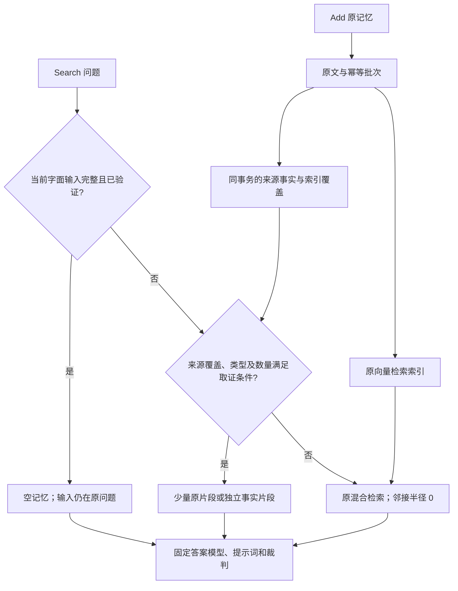

# Add/Search 六小时小样本改进记录

起点：`693d0f4`；分支：`improve/targeted-six-hours-20261005`。
执行窗口：北京时间 2026-10-05 00:08:28—06:08:28。
收尾完成：06:08:53；本轮启动的 30 个隔离 HTTP 服务已全部停止，原有服务
未发送停止信号。数据库、向量集合、逐题结果和失败记录全部保留；
停止清单为实验目录中的 `service-cleanup.json`。

用户授权只调整 Add/Search 及其内部模块，允许持久化事实索引；接口、答案模型、
答案提示词和裁判保持固定。返回原片段或有来源的事实片段，不返回最终答案、
汇总计数或汇总名单。不扩展相邻片段，不运行完整实验。

用户追加的目标执行要求（基线运行期间）：每轮先手工准备少量改进后的
原文/事实片段，在固定答案模型、提示词和裁判下做快速验证；只有收益明确、
来源可信且正向控制没有受损的方案才进入代码实现。实现后保存独立 Git 提交，
再通过真实 HTTP Search 对固定失败案例及正向控制判分，复核额外案例。
无效改动用 `git revert` 回退实现提交，实验记录独立提交并保留。
输出逐题答案、判分、片段、token 和耗时；全程不运行全量实验。

首次主题筛选候选实现尚未测效果时收到此要求，已保存到运行目录并恢复产品
代码至基线，先补手工预验证。此前通过的单元测试不作为效果证据。

实验产物：`eval/reports/runs/targeted-six-hours-20261005/`；模型与 pipeline 指纹、
案例清单和配置快照保存在该目录。分数仅代表这批诊断案例。

## 集成结果

下表比较固定诊断题集的完全正确题数。CorporateBench 与 MQuAKE 使用加入
TempReason 语料后的新鲜原 Search 基线，避免全局 BM25 IDF 改变造成虚假增益。
所有保留改动已在正常默认配置启用；事实来源上限为 12、关系跳数上限为 4，
邻接半径保持 0。没有运行任何数据集的完整评测。

| 固定诊断集合 | 原 Search | 保留版 | 逐题结论 |
| --- | --- | --- | --- |
| CorporateBench 28 题 | 10/28 | 14/28 | 新修复员工总数、三月名单、两道具体会议的次数题；旧正确题保持 |
| MQuAKE 15 题 | 6/15 | 14/15 | 八道当前关系链错例修复；缺少第二跳原事实的题仍错 |
| TempReason 15 题 | 6/15 | 15/15 | 九道明确区间题修复；额外同月并列问题仍不能确定日级先后 |
| LongMemEval 6 题 | 3/6 | 4/6 | 鱼数修复；慈善范围与跨交易收入仍错 |
| LoCoMo 多跳 17 题 | 9/17 | 12/17 | 本人活动、国家指代、交友来源各修复一题 |
| LoCoMo 时间 18 题 | 10/18 | 12/18 | 开店报告、实习录取报告各修复一题 |
| MemTrapBench CSV/字段组 6 题 | 4/6 | 5/6 | 当前字面 CSV 不再受旧布尔模板影响 |
| MemTrapBench 新增字段/列表组 6 题 | 2/6 | 4/6 | package.json 版本、metrics job 名称修复；两道控制保持 |
| MemTrapBench 独立 PKCE 题 | 0/1 | 1/1 | 新题同样不再把当前 true 改为旧模板的 1 |

MemTrapBench 前两组六题有两道控制重叠，不相加作为整体精度；独立变体与
合成诊断均未计入官方样本分母。各组旧正确题没有退化，这不等于全量无退化。
CorporateBench QA 均分由当前基线 0.4157 至 0.5347；它与二值完全匹配不同。
更多额外题的保留/失败结果见下方逐轮记录，不将挑选的失败案例分数称为模型上限。

最终产品代码的全部单元测试为 1,013 项通过；Ruff 通过，mypy 检查 51 个
源码模块通过。既有诊断的 134 个主集合/额外集合输入和 13 个 MemTrapBench
输入，在最新 HTTP 服务下与各自通过验证的版本逐字一致，因此没有对相同输入
重复调用答案/裁判。19 份冻结快照的 148 次文件指纹检查均一致，答案模型仍为
Qwen/Qwen3.5-9B、temperature=0、max_tokens=1,024，答案提示词和裁判未改。
这些 HTTP 输入检查包含已验证小样本中的重复题，不增加独立样本数。

最终主实验库中，起点的 6,237 条原记忆和 757 条幂等批次全部逐行不变；
最终克隆另加 9 条、5 批具名引用诊断原文，属于隔离合成用户，未加入主集合向量。
R03 和 R06 的无效实现分别由 `2dd0f0b`、`77eabcf` 回退；预验证失败的
排序、金额表示、缺席名单和截止日期等方案没有进入产品，记录与原始产物保留。

验收产物：`final-diagnostic-summary.json`、`final-retained-context-parity.json`、
`final-mtb-context-parity.json`、`final-pipeline-integrity.json`、
`final-raw-source-integrity.json`，均位于上述实验目录。

另将起点旧库以 SQLite backup 克隆，使用最新正常 `default.yaml` 与开发期
`local.yaml`（只把向量集合改为隔离实验集合），未经 Add 重放直接 HTTP Search。
任职人数、更新关系、时间区间、库存、个人指代、朋友归属与状态报告七个代表
案例全部与保留版模型输入逐字一致；6,237 条原文、757 条幂等批次仍全部不变。
产物为 `final-default-cold-parity.json`、`final-default-cold-raw-integrity.json`，
可复核当前默认配置和最新抽取版本对旧记忆生效，而不只是实验开关下有效。
主实验库的十一张来源/覆盖旁表也已核查：每条记录都能关联同用户原始记忆，
无缺失来源、跨用户来源或外键异常；这是引用完整性检查，不宣称语义抽取完备。
产物为 `final-fact-source-integrity.json`。

## 轮次

保留版仍使用原来的 Add/Search 接口。Add 在原文落库的同一事务内添加
可追溯的事实或原文旁索引；Search 先判断当前输入是否已完整，再按受支持的
来源关系取证。未覆盖、缺来源、冲突不能处理或超过上限时回到原检索。
完整性只表示已扫描当前用户的来源，不把未抽出的事实解释为不存在。

| 轮次 | 假设与修改 | 固定失败案例/控制结果 | 决定与 Git 记录 |
| --- | --- | --- | --- |
| 基线 | 当前答案提示词与原 Search；隔离索引 | 完全匹配 10/28；开发 1/10、控制 6/6、额外案例 3/12；QA 均分 0.4076 | 起点 `693d0f4`，配置 `e3ded34` |
| P01 原文预验证 | 手工选取明确会议标题及日期条件匹配的日历邀请/邮件，正文原样 | 同 6 题由 3/6 至 4/6，控制 3/3；单场会议 `kb_qa-12` 由 0 至 1，多场计数仍错 | 允许进入小范围条件筛选实现；不声称解决计数 |
| P02 截短预验证 | 同 P01，邮件只留头部及称呼，日历邀请原样 | 2/6；参与者列表漏组织者，组织者题拒答 | 拒绝实现这种截短；原文保留正文关系信息 |
| R01 HTTP 验证 | `0347f5b`：自然问题解析显式主题/月/季度条件，保留匹配完整原文 | 完全匹配 12/28；开发 3/10、控制 6/6、额外 3/12；QA 均分 0.4790；平均上下文 31,755→20,497 tokens | 保留；修复 `12,37`，多场计数未解决 |
| P03 员工原文预验证 | 每人一条自己的任职署名/第一人称陈述，先剔除引用回复 | 总数仍答 10；名单漏 Jennifer（F1 0.9565，原 Search 为 1） | 拒绝仅靠署名原文截取的方案 |
| P04 类型化事实预验证 | 同 P03 来源，独立的 Person/Employer/Role/Document date/Source claim 事实 | 员工总数由 10→12，名单 12 人完整；两题 2/2；会议记录类型化仍未修复多场计数 | 只实现通过验证的员工任职事实；不伪造会议发生/入职日期 |
| R02 HTTP 验证 | `83842d8`：Add 同事务保存可追溯任职事实；Search 按人去重返回独立事实 | 完全匹配 13/28；开发 4/10、控制 6/6、额外 3/12；QA 均分 0.5148；平均上下文 19,379 tokens | 保留；在 R01 基础上修复员工总数 `3`，入职日期题未修复 |
| P05 时间排序预验证 | 原文、标题及日期范围与 R01 相同，只按来源日期升序 | 仍 4/6；`51` 答 2、`88` 答 7，控制保持 3/3 | 无新增收益，不实现时间排序 |
| MQuAKE 小样本基线 | 固定 CF3k 10 道旧错例、5 道正向对照；当前 HTTP Search 与固定 pipeline | 5/15，旧错例 0/10、控制 5/5 | 与旧 `mqk-fixtest` 相同问题机制，重新验证后比较 |
| P06 关系链原文预验证 | 手工选择当前值及其直接相连原始陈述，去掉被明确替换的旧值和断开的旧链 | 同 6 题 2/6→6/6；控制 2/2 | 进入有取证上限、无邻接扩展的关系索引实验 |
| LongMemEval 小样本基线 | 三个聚合旧错例与三个计算对照；原语料 Add、当前 HTTP Search | 3/6，聚合错例 0/3、控制 3/3 | 不跑整份数据集；仅重放这六题的原记忆 |
| P07 用户原文预验证 | 手工保留相关用户陈述，删助手建议；不汇总金额或数量 | 2/6；鱼数 20、市场收入 $420；道路距离对照由对转错 | 拒绝这种用户原文截取方案，继续先验证类型化事实 |
| R03 HTTP 验证 | `2c7a941`：Add 保存单行陈述的实体/关系索引；Search 沿明确实体和相关关系取原文 | 同 15 题 5/15→14/15；控制 5/5；额外 8 题仍 3/8，但两道旧正确题退化 | 未通过额外回归，回退实现；保留收益与退化的全部记录 |
| P08 数量事实预验证 | 独立库存、交易、行程与费用事实；数量、容量、单价分字段，不给总和 | 4/6，鱼数修复为 17，对照 3/3；市场收入 $465 仍错，慈善 $8,750 仍错 | 库存表示有潜力；交易计算与慈善范围未通过，不直接实现 |
| P09 替换覆盖预验证 | 当前关系链原文加上直接提及链上实体的未解析替换原文；有上限，不猜新关系 | 7/8；两道退化题 `18,31` 恢复，三个控制全部正确；单独主席片段仍未答对 `64` | 只实现未知替换原文覆盖，不实现失败的主席特例 |
| R04 HTTP 验证 | `35903b4`：为所有明确替换原文保存文本索引；每跳检查未解析替换原文，与原关系陈述一起返回 | 固定 15 题保持 14/15、控制 5/5；额外 8 题 3/8→5/8，旧正确题均保持，`42,53` 修复 | 保留；此前 R03 已由 `2dd0f0b` 回退，此版在覆盖快测通过后重新实现 |
| P10 任职日期预验证 | 对“某日前”问题，手工选取该日前自己的任职署名事实；日期仍标来源日期 | 两道人数题 `56,211` 都将十人数成九人；总人数、名单控制 2/2 | 暂不实现按任职证据日期筛选；不把首次提及当入职日期 |
| TempReason 小样本基线 | 11 道旧错例、4 道正向控制；当前 HTTP Search 与固定答案链 | 6/15，开发 2/11、控制 4/4 | 重新验证；旧错例中两道已经正确，仍保留在冻结集合 |
| P11 时间区间原文预验证 | 显式月份区间匹配；before/after 保留参照原文及最近区间原文，月份并列全部保留 | 同 10 题 3/10→10/10；两个正向控制正确 | 允许进入区间索引实现；不推断精确日级先后，不生成继任者事实 |
| R05 HTTP 验证 | `c67fa40`：Add 保存显式区间索引；Search 选择原始区间来源，同月并列保留 | 15/15，开发 11/11、控制 4/4；平均上下文 2,235→48.1 tokens；额外八题 5/8→7/8，旧正确题均保持 | 保留；月粒度前后并列题 `test_l3-3770` 仍错，不把固定集满分当全量结果 |
| P12 任职日期措辞预验证 | 任职片段把 Document date 改为 Employment asserted as of；仍是原邮件断言日期 | `56,211` 两个截止日期计数题正确，但总数 `3` 从 12 误报 13；名单 `17` 正确 | 统一替换字段损害控制，拒绝直接修改全部任职片段 |
| P13 库存字段预验证 | 将库存标签改为中性的 Item，日期保留日粒度；单个物品数量与容器容量分开 | 鱼数为 17，三个费用/行程正向对照正确，4/4 | 可进入明确库存陈述抽取；不输出总和、不把容器容量当数量 |
| P14 会议来源身份预验证 | 独立对应原文件的编号、日期、角色字段和开头正文；不把邮件日期改成会议发生日期 | `51` 答 2、`88` 答 4，均错；参与者和组织者控制 2/2 | 没有计数收益，不实现 |
| R06 HTTP 验证 | `14f4ae2`：Add 抽取已有库存数量；Search 返回独立数量事实，按容器及事实 ID 排列 | 仍为 3/6，控制 3/3；鱼数报 27，与片段快测的 17 不同，数量事实本身为 1、10、5、1 | 无收益，由 `77eabcf` Git 回退；保留原模型答案、片段及全部记录 |
| P15 库存顺序预验证 | 保留原片段中的容量，先排最近原消息，再保留同一消息内物品顺序；另做容量省略对照 | 原顺序答 17；单独省略容量但维持 R06 排列仍答 27，说明容量省略不足以解决此例 | 只实现已通过的来源顺序方案，不实现容量省略 |
| R07 HTTP 验证 | `82b89dd`：重做库存实现，按原消息日期及原文内物品顺序返回同样的四条事实 | 同 6 题 3/6→4/6，三个计算对照 3/3，鱼数为 17；四条事实总计 197 tokens；另两种自然问法均答 17 | 保留；鱼题仍只有一个独立原始案例，不声称其他聚合题已解决 |
| P16 工作状态观察预验证 | 两条独立原文观察：自述开始任职、正在了解组织 orientation；保留报告日期和完整来源段落，不声明精确入职日 | 月份/季度三个名单题 `7,20,82` 全正确，原任职人数/名单控制 `3,17` 正确，5/5 | 可进入观察索引实现；不将 orientation 或最早署名改写成确定入职日期 |
| R08 HTTP 验证 | `f12ade1`：Add 保存自己的开始任职/组织 orientation 原文观察；Search 按组织及来源报告月份选择 | 固定 28 题 13/28→14/28，控制 6/6；额外七题 1/7→5/7，员工名单控制保持正确；固定集平均上下文 18,223 tokens | 保留；来源报告时间仍不等同于精确入职日，不将缺观察证据解释为无人入职 |
| LoCoMo 小样本基线 | 三位用户的 11 道历史多跳错例、6 道历史控制；当前 HTTP Search 与冻结答案链 | 9/17，历史错例 5/11、历史控制 4/6；当前语料下两个旧控制已经错误，仍留在固定集合 | 固定集合只作诊断，不与历史答案提示词的分数直接相减 |
| P17 LoCoMo 表示预验证 | 八题手工按官方 evidence 核对来源；分别给正确原始块和标明说话人的原文 statement | 当前基线 4/8；原始块 5/8，宠物名单反而漏一项；说话人片段 6/8；汽车问题文本没有挡风玻璃事实，交友地点问题给齐仍错 | 原文说话人表示值得继续快测；不从图像金标补造缺失文本事实，不直接实现失败题 |
| P18 市场交易字段预验证 | 四种忠实交易表示：Reported total proceeds、单位和单价字段、纯原文销售分句、每件价格明确字段 | 原总收入题分别答 $367.50、$465、$420、$362.50，全部错；第一组三个费用/行程控制仍正确 | 拒绝实现；每笔收入和数量都是原始信息，没有预计算 $150 或总额 $495 |
| P19 LoCoMo 主题筛选预验证 | 按说话人和原文主题词选相关 statement，活动 7 条、宠物 5 条、社区明确动作 11 条 | 目标三题均错，两个控制正确；引入未来活动及参考答案未列的真实社区活动，宠物漏 Bailey | 拒绝实现宽泛主题匹配，不能按金标删去真实活动 |
| P20 LoCoMo 本人动作预验证 | 活动只留明确第一人称已经参加的原话；宠物留自己拥有及原文名字陈述 | 活动题、宠物名单、两个控制全正确，4/4；活动取三条原话，没有未来舞蹈竞赛及一般课程介绍 | 先实现本人活动观察；不实现未通过的社区活动规则 |
| R09 HTTP 验证 | `801f036`：Add 保存具名说话人自己的明确已参加活动原话；Search 只接显式单人业务推广活动问题 | 固定 17 题 9/17→10/17，活动题 `conv-30#q0018` 修复；原正确题保持，历史控制仍 4/6；平均上下文 6,426.8 tokens，活动题三条片段共 195 tokens | 保留；目前只有一道独立的适用基准题，不把两种问法当独立样本 |
| LoCoMo 时间小样本基线 | 三位用户的 12 道历史时间错例与 6 个控制，当前 HTTP Search | 10/18，历史错例 4/12、控制 6/6 | 仍保留已变正确的历史错例，后续固定集合不删题 |
| P21 时间表示预验证 | 八题只给正确原消息及日期锚点，相对时间注解保留；另一组替换部分相对词为既有日期注解 | 两种表示均 5/8，当前对应基线 4/8；开店及实习录取两题修复，但申请收养的原正确题退化；周/星期金标仍有口径冲突 | 拒绝统一替换时间表示；不能只看净增益忽视原正确题退化 |
| P22 跨片段指代预验证 | 迁移原话加 home country/Sweden 原话、事业开始加 grand opening 原话；宠物/童年物品控制 | 2/4，两个控制正确；迁移仍答 home country，开店耗时题拒答，因为开业原话未绑定 studio 对象 | 两个目标未通过，不直接实现；需要保留对象绑定依据，而非改答案提示词 |
| P23 当前状态报告预验证 | 手工从全部原文提取具名说话人明确报告自己的 store is open / just got accepted for internship；仅返回原话及来源日期 | 6/6，两道原错例 `conv-30#q0012,q0017` 正确，四个保留原检索的控制正确 | 可以实现当前状态报告索引；不将报告日期改成实际事件日 |
| R10 HTTP 验证 | `5e753df`：Add 保存明确的当前状态原话；Search 针对相应对象的单人事件问题取报告 | 时间固定 18 题 10/18→12/18，控制 6/6；开店/实习两题修复，各一片段 47/43 tokens；六道额外开店及业务题保持 5/6 | 保留；不把“现在已开店”或“刚获录取”的报告日期包装成确定事件日 |
| P24 个人指代字段预验证 | Home country declaration 与完整原文 migration statement 分开，日期为来源日期 | 3/4，三个控制正确；迁移问题仍答 my home country | 未通过，不实现 |
| P25 创业时间端点预验证 | 找到明确 starting a dance studio 原块及 official opening night tomorrow 原块，均保留 QA 上下文与日期 | 2/3，两个控制正确；耗时问题仍拒答 | 不实现，不预计算五个月塞入记忆 |
| P26 个人指代表示预验证 | 字面 Subject/Relation/Object 与第三人称自然句各三题；两个列表控制 | 三元组 2/3，仍答 my home country；自然句 3/3，答 Her home country, Sweden | 自然句有潜力，先再测不引入性别假设的中性表述，未直接实施 |
| P27 中性人物绑定预验证 | 人物名字绑定的 home country 声明和 migration 原话，保留引文及来源日期；另测重复“某人 said”的归属措辞 | 中性自然句 3/3，迁移答 Sweden；归属措辞 2/3，迁移仍答 Caroline's home country；两个控制均对 | 只实现中性且有原文引文的独立陈述，不推断性别、不合成迁移地点 |
| P28 部分索引预验证 | 模拟只索引新写入记忆：总人数只给一条任职，三月名单只给 Jennifer；与已扫描完整原文的事实组比较 | 部分索引 1/3，总数答 1、三月名单漏 Andre；完整索引 3/3，总数 12、三月两人完整，会议控制保持正确 | 有必要补覆盖检查与旧记忆按需索引；不能把物理索引覆盖直接宣称为语义抽取完备 |
| P29 MemTrapBench 无关历史预验证 | 六个旧错例/控制，原历史与空记忆比较；保持当前问题、答案及裁判固定 | 官方标签 1/6→5/6；人工核对只有电路及集合结果正确，2/6：两道数字游戏的表达式实际为 64、42；矩阵认出三角性质，但 50 项列表在第七项截断；Nim 仍错 | 数字游戏和矩阵列表实质未通过，不实现；仅继续核对自包含电路问题的历史干扰，不将错误公式或不完整列表判成收益 |
| R11 HTTP 验证 | `3066764`：Add 分开保存字面 home country 声明与迁移原话，以人物名字绑定的中性自然句加原引文呈现 | 固定多跳 17 题 10/17→11/17，相对新鲜基线 9/17；迁移 `conv-26#q0011` 修复，其他题判分不变；控制仍 4/6；平均上下文 6,011.5 tokens | 保留；只返回两条独立事实，不合成迁移地点或计算迁移日期 |
| R12 旧库冷启动 HTTP 验证 | `e1b8670`：来源/用户/抽取版本扫描覆盖与有界补索引；读快照检查覆盖，再读取事实，未扫完回原检索 | 从无事实索引的旧库直接 Search，五个数据集 19 题 18/19、控制 6/6；19 个完整 Search 响应及正确/错误标签与各已验证版本一致；原记忆与批次指纹未变；平均 Search 55.7ms | 保留；无需重放 Add 才生效，修复旧来源与新 Add 混用导致部分计数/名单的风险；不声称增加已覆盖语料的分数 |
| P30 金额表示预验证 | 三条原始销售事实，分别试数量/单价的数字加英文词表示、JSON 字段表示；不预计算第三笔金额或收入总和 | 两个目标变体均错误，分别答 $570、$345；三个原检索计算控制均正确 | 拒绝实现；正确源事实和清晰单价字段仍不足以保证当前模型正确聚合 |
| R13 正常配置交付 | 默认配置启用 R01/R02/R04/R05/R07/R08/R09/R10/R11 的已保留规则，旧库自动补索引使用 R12 | 复用 R12 五数据集 19 题的组合验证；正常配置加载所有保留规则为启用，邻接半径仍为 0；配置/装配相关 60 项检查通过 | 启用配置与说明独立提交；历史实验配置保持冻结，不修改答案模型/提示词/裁判 |
| P31 具名发言归属预验证 | 单条原文包含 Alex 与 Bea 的具名发言，手工只返回 Bea 自己的活动/开店原话；一个原正确人物控制 | 3/3；两项合成诊断正确，原控制正确 | 允许修复块内具名发言边界；合成诊断不增加基准独立题数 |
| R14 HTTP 与输入回归 | `374df63`：分别保留块内具名发言者，拒绝明显引文续行；参与/状态抽取升级 v2，旧索引按 R12 自动重扫 | 两个合成诊断经过 Add 内部落库及真实 HTTP Search/原答案链，2/2；固定多跳 17 题与时间 18 题的模型记忆输入全部逐字一致；58 项相关检查通过 | 保留人物归属修复；不声称提高这 35 道固定基准的分数，不重判相同模型输入 |
| P32 当前字面数据预验证 | 当前题面完整提供输入时，CSV/配置字段提取手工返回空记忆；保留集合控制原记忆；十六进制转换单独核对 | 官方 4/6→5/6，CSV 字段大小写与 true→1 的旧模板干扰被修复；三个已正确的字段/CSV 题与控制保持；数字转换数值正确但输出格式仍错 | 仅实现通过的 CSV/单字段范围；不实现一般数字、矩阵或无输入的配置问题 |
| P33 独立 CSV 预验证 | 未参与 P32 的 PKCE 六字段 CSV 题，完整字面输入仍保留在当前问题，手工返回空记忆 | 原历史 0/1→空记忆 1/1；true 不再被旧模板改为 1 | 可以进行独立 HTTP 复核，不把同一问题的重测当新增案例 |
| R15 HTTP 验证 | `8537112`：只在当前问题具有完整字面输入的严格 CSV/单配置字段请求中返回空记忆；缺失、冲突、占位符或要求历史时回原检索 | 固定六题 4/6→5/6，控制 1/1；平均上下文 3,494.7→1,906.5 tokens；独立 PKCE 题 0/1→1/1，原四片段 2,560 tokens 变为空记忆 | 保留；正常配置由 `7ea0e19` 启用。十六进制/一般计算未接此分支，不能把数字正确但格式错误的预验证当收益 |
| P34 交友来源预验证 | 同四段真实来源分别采用完整具名原话和人物名字绑定的中性事实；志愿者朋友、志愿地点、教会朋友、健身房朋友保持独立 | 原话 2/3，目标仍只答志愿者同伴；中性事实 3/3，目标答 shelter/church/gym；宠物与童年物品控制均正确 | 仅实现通过的中性事实表示；不把加入教会/健身房当交友，不合成最终地点列表 |
| R16 HTTP 验证 | `60de7c2`：Add 保存独立朋友归属、本人志愿地点；Search 在单人交友地点问题中按字面关系去重选择来源 | 冻结 17 题 11/17→12/17，相对新鲜基线 9/17；目标 `conv-41#q0006` 修复，其他判分不变，控制仍 4/6；四片段 252 tokens，整组平均上下文 5,617.9 tokens | 保留并启用正常配置；引用及来源日期与 P34 四片段相同，实际渲染少了片段之间的空行，不声称模型输入逐字相同；仅一道独立目标案例 |
| 当前语料基线复核 | TempReason 用户向量加入后重新运行同一冻结 CorporateBench 28 题与 MQuAKE 15 题的原 Search，消除全局 BM25 IDF 漂移疑问 | CorporateBench 仍 10/28、相同十题正确，QA 均分 0.4157；MQuAKE 由初期 5/15 变为 6/15，`CF3k-12-0` 基线已正确，五个控制仍正确 | 最终比较须使用当前语料基线；MQuAKE 保留版 14/15 的当前净增为八题，不能再把该基线正确题计作新增修复 |
| P35 完整任职日期预验证 | 截止日期题保留全部十二人的独立任职来源，包括截止日后的两条；比较 Employment asserted as of 与 Source assertion date 标签，三个控制保留正常表示 | 四个目标变体均答 12、全部错误；三个控制正确，3/7 | 不实现。P12 截掉晚日期来源得到的正确标签不足以证明晚日期报告者没有更早入职，来源日期不能替代入职日期 |
| P36 市场来源顺序预验证 | 三条实际销售来源，比较原销售分句/独立收入陈述，以及来源日期升序/降序；每件 $7.50 仍为原单价，不预计算金额 | 四个目标变体均错误，分别 $420、$415、$422.50、$415；三个费用/行程控制正确，3/7 | 拒绝实现；与 P18/P30 一样，当前答案模型仍没有正确组合这三笔真实销售信息 |
| P37 个人引用边界预验证 | 旧抽取器将“虚构例子”中 Bea 的 Sweden 台词误作真人自述；手工只保留真实 New Zealand 声明与迁移原话，两个真实题控制 | 合成诊断与迁移/交友控制全部正确，3/3 | 允许修复引用边界并升级个人指代抽取版本；合成诊断不增加基准独立题数 |
| R17 引用修复 HTTP 验证 | `2578441`：个人指代抽取复用具名发言引用边界，版本升为 v2，旧版本国家声明不再用于当前 Search | 合成诊断经内部 Add 落库和真实 HTTP Search/原答案链，1/1、两片段 68 tokens；旧多跳 17 题与时间 18 题上下文均逐字相同；77 项针对性检查通过 | 保留来源归属修复；未添加合成向量或改变全局 IDF，不声称增加这 35 道基准分数；原文与批次指纹不变 |
| P38 会议标题原文预验证及修正 | 三个历史缺席名单错例、三个参与/组织控制；初次手工脚本漏掉首行 `document: Subject:` 的邀请，原目录不能作完整证据结论；在独立 v2 目录修正并用现有正常打包 | 新鲜基线 3/6；修正后精确原文仍 3/6，各题 1/5/9/5/9/1 片段；三个缺席目标仍拒答或报错，控制全部正确 | 不实现缺席模式。未按空金标删人或生成负事实，两个准备版本都保留；邀请名单本身不足以证明实际缺席情况 |
| P39 标题尾部问法预验证 | 手工从实际原检索候选中精确选择 `meeting titled …` 的 Subject 匹配原文，使用现有正常打包；答案问题保持原问法，两个其他类型控制保持原记忆 | 5/5；三个参与/组织题仍全部正确，每题 100 段变为 5/9/1 段，平均上下文 31,131.3→1,374 tokens | 可以补齐已通过的标题/参与问法；收益是成本，不声称新增答对题，不加入失败的缺席或一般主题筛选 |
| R18 标题尾部 HTTP 验证 | `e61c038`：现有精确 Subject 筛选识别显式 `meeting titled/called/named …` 尾部标题与 participated 问法；未扩大候选池 | 六题仍 3/6、三个原正确题全保持，缺席题输入与原检索不变；对应三个正向题平均 31,131.3→1,374 tokens，95.6% 减少；59 项相关检查通过 | 保留成本改进，不计作新增答对题；维持原片段与零邻接扩展 |
| P40 当前字段/列表预验证 | 四个独立当前输入题，原历史与空记忆比较；另跑两个已有 CSV/集合正向控制 | 原历史 0/4，空记忆 2/4；package.json 依赖版本与 metrics job 名称正确；订单簿有额外格式、SWIFT 金额丢小数仍错；控制 2/2 | 只实现通过的两个输入格式。首次控制准备误用不存在的 Inertia 题号，四题产物如实保留；控制在独立目录补齐后才实现 |
| R19 当前字段/列表 HTTP 验证 | `39c8931`：完整 package.json 的唯一精确依赖版本、完整 metrics job 字面标签可跳过旧记忆；不计算或返回字段答案 | 六题 2/6→4/6，控制 2/2；版本与 job 名称两题修复；平均上下文 3,014.2→2,374.2 tokens；134 项相关检查通过 | 保留；缺值、重复、版本范围、历史要求回原检索；SWIFT 与订单簿仍错，未接此分支 |
| P41 分块 metrics 完整性快测 | 两个分开的指标块，第二块含未加引号的 `$JOB`，手工保留原变量声明与空记忆对照 | 声明组正确、空记忆漏项；现有完整性判断已经拒绝分块输入 | 属于已有保护的审计，不修改产品；产物 `pilot-metrics-completeness` |
| P42 裸变量快测 | 单个完整指标块含 `job="$JOB"`，手工只返回原始 `JOB=payments` 声明，与空记忆比较 | 保留声明正确、空记忆只答 node；现有判断错误地把裸变量当完整字面值 | 允许补齐变量保护；只保留变量来源原文，不将 node/payments 汇总名单写入记忆；合成诊断不增加基准题数 |
| R20 裸变量 HTTP 验证 | `96f9269`：完整性判定拒绝 `$NAME` 与 `${…}` 变量，保留 `$12.50` 字面金额；CSV、字段、metrics 共用保护 | 真实 HTTP Add/Search 合成诊断 0/1→1/1；从空记忆变为一条 10 tokens 原始变量声明，模型答 node/payments；45 项相关检查通过 | 保留；不解析变量值、不生成最终名单，正常检索返回原文；合成题不加入官方样本分母 |

基线固定开发案例：`3,7,12,37,49,51,88,135,190,220`；控制案例：
`25,50,8,33,14,64`；额外案例：`1,56,100,141,176,211,10,53,86,124,162,196`。
所有编号均为 CorporateBench `kb_qa`。额外案例在实现前确定，仍只是小样本。

P01/P02 的来源核对发现日历邀请没有 Message-ID，Subject 位于 `document:`
前缀后的首行；忽视这种形态会漏召回。原文日期、会议计划日期和会议发生事实
不能混为一谈，预验证没有把邀请改写成“已举行”。

R02 使用与基线隔离的 SQLite 克隆；真实 HTTP Add 重放原语料 41 批，
原始幂等指纹不变、原记忆与原向量不变，落库 201 条任职事实、覆盖 12 人。
抽取只读取自己的任职署名和明确第一人称陈述，忽略引用回复及邮箱域名推断。
事务回滚、幂等重放、原文守卫、用户隔离和接口边界等针对性检查 200 项通过。
此轮同样保持全部答案流水线指纹不变。
另在原 Search 已正确的员工名单题 `17` 上做真实 HTTP 回归，12 条独立任职
事实返回完整名单，保持完全正确；该题独立记为附加对照，不修改冻结的 28 题集合。

P06 的六题为 CF3k `2,4,7,9` 与控制 `6,8` 的第 0 种问法。
固定 MQuAKE 小样本的其他错例为 `1,3,10,12,13,14`，其他控制为 `5,11,15`。
原答案提示词允许为未编辑跳补世界知识；本轮保持该提示词，Search 不补事实。
`2` 的答案同时质疑反事实，末尾给出金标国家，已有别名评分器判对；该行为
原样留档，不改成更严格的新评分口径，也不声称模型完全接受所有反事实。

LongMemEval 固定题号为 `eeda8a6d,d851d5ba,2b8f3739`，控制
`cc06de0d,9aaed6a3,6c49646a`。慈善题的原 haystack 还含一条另行筹集
“over $5,000”的音乐教育陈述；预验证保留它，模型报 $8,750，不能为追求
$3,750 金标而按答案删去来源。该题还存在事件范围/时序不可直接表达的问题。

R03 的额外题为 CF3k `18,23,31,42,53,64` 的第 0 种问法，以及 `2,9` 的
第 2 种问法。`42,53` 修复，`18,31` 退化；其余不变。退化来自未覆盖的
替换语法及语言关系映射：索引遗漏真实新值，精简后旧值/世界知识主导作答。
不能仅凭固定开发集提升就保留，后续先验证保留这些未解析替换原文的方案。

R04 真实 HTTP Add 重放 MQuAKE 原有 12 批，幂等原文、payload 与向量不变。
固定 15 题平均上下文为 43.9 tokens，额外集只在无法适用规则的题保留原检索。
只存未知句式的原文字面索引，不从未知陈述猜测新值，也不沿未知关系扩展。
来源超过 12 条时退回原检索，返回值仍为原始记忆，不产生最终答案或组合关系。
针对性事务、隔离、重放与接口检查 209 项通过，mypy 40 个模块通过。

P11 使用的题号为 `test_l2-1888,2614,3242,3709,0` 与
`test_l3-1337,1581,2934,3769,0`。参照 Jacques Brotchi 的继任区间中，
Jean-Paul Wahl 与 Sabine Laruelle 都始于 2019 年 7 月，预验证保留两条原文，
模型答 Jean-Paul Wahl；不会将月粒度数据改写成有确定日级顺序的事实。

R05 在同一原语料上重放 15 位用户的原始 Add 请求，只补区间旁索引，不重写原文
或改变批次幂等指纹。额外题包括 `test_l2-1889,202` 和
`test_l3-3351,3770,3771,3772,177,179`；修复 `177,179`，其他保持。
`3770` 的月份区间不能区分 Jacques Brotchi 与 Jean-Paul Wahl 同月结束的
日级先后，选择器保留两者，模型仍选前者；没有为了金标改成只留后者。

R06 通过 183 项针对性检查，真实 HTTP Add 重放六题的原始记忆，只有鱼题
产出四条数量事实；其他五题走原检索。抽取正确性没有保证模型会读对字段，
真实打包的顺序与手工快测不同，答案 27 与误将 20 加上 5、1、1 相符，
但这是根据输出作的推测，未读取模型内部推理。后续先复核来源排列及省略
无关容量的事实表达，不直接继续修改代码。

追加 TempReason 用户向量后，BM25 的全局 IDF 会改变，因此在 R07 前重新跑
同六题的原 Search 基线，仍为 3/6、控制 3/3；结果在 `lme-baseline-current-corpus`。
该基线与 R07 使用相同的当前语料集合，失败的慈善和市场收入仍留在冻结集合。
P15 的原顺序对照含完整原数量措辞“a small pleco catfish”，没有删除 qualifier
来凑得分，也没有在片段里加汇总 17。184 项针对性检查通过。

R07 的附加自然问法为 “How many fish do I have in total in my aquariums?” 与
“How many fish are there in my tanks?”，两题均答 17；它们是同一来源的表示检查，
不增加独立基准题数，结果保存在 `pilot-inventory-paraphrases`。

R08 只抽取 Jennifer 的自述开始任职及 Andre 的 orientation 观察两个原段落。
没有把 Andre 的初始项目角色改写为加入公司，没有用一月署名推断三月入职。
真实 HTTP Add 重放原有 41 批，原文及向量保持一致，191 项针对性检查通过。
额外题为 `20,82,188,200,212,224,17`，前四个被修复的月份/季度问题为
`20,82,188,212`，其余未变。固定集的新修复是三月名单 `7`。

LoCoMo P17 的八题为 `conv-26#q0029,q0038,q0003`、
`conv-30#q0018,q0023`、`conv-41#q0006,q0015,q0007`。
只按 evidence 手工取证仍不保证完整答案：`q0015` 的实际原文只有车辆意外及
车辆抛锚，没有挡风玻璃损坏的文本；`q0006` 有志愿活动、健身房及教会陈述，
但模型仍只答志愿者朋友。两题均未把金标列表写入返回记忆。

市场交易的拆分诊断中，同样的两种记忆表示对单笔 “20 件、每件 $7.50” 均答
$150（`pilot-market-unit-diagnostic-v2`，2/2），但面对原来的跨交易总额问题仍错。
这是局部乘法可用、跨条聚合失败的证据，不是模型无法做任何乘法。
最早的 `pilot-market-unit-diagnostic` 不小心继承了总额题的 `gold_answer`，
该诊断判分无效，原始产物保留；在独立目录修正自建诊断金标后重跑，正式题
及官方评分器均未修改。没有把这两道自建问题增加到基准分母。

截至 R08 的集成单元检查为 886 项通过；本轮未进行任何全量基准评测。

R19 首次原 Search 准备脚本把 `ServiceClient.ingest` 返回的整数误当作带
`.batches` 字段的对象，导致只投喂首题便启动了不完整语料验证。这个目录已经
另存为 `mtb-fields-baseline-incomplete-ingest`，附无效准备说明，不用于比较。
独立的有效基线 `mtb-fields-baseline-v2` 在补齐全部六个用户后才运行：
22 批、205 条原 QA 和 205 个向量逐用户核对通过；改进组使用相同原语料。
原始数据的当前问题和金标与官方加载器一致，未把准备失败的答案当收益。

R09 的真实 Add 重放为 101 批；三位用户只有 8 条明确动作观察，原记忆和幂等
payload 的联合 SHA-256 重放前后相同。新增模式及事务、隔离、溢出降级等
相关检查 142 项通过，mypy 六个变更模块通过。原文内的未来计划仍原样保留在
真源，但不会被抽取成已经参加活动的观察；Search 没有给出活动类型的聚合列表。

R09 的两个 HTTP 自然问法均保持 Networking events and a fair，原题之外的
自然问法保存在 `pilot-participation-http-paraphrases`，不增加独立样本分母。
P21 中 `conv-26#q0063` 明确给出 October 20, 2023 仍被裁判判错；一次理由是
相对时间转绝对时间，另一次理由是未同时列出金标中的相对表达和具体日期。
这些原始判断原样保留，未修改官方裁判或把等价日期误称为抽取错误。

R10 原 Add 重放同样为 101 批，原文/幂等 SHA-256 与 R09 相同；只有 Gina 的
两条原报告匹配新规则。148 项相关检查通过，mypy 六个模块通过。
额外业务题为 `conv-30#q0004,q0015,q0019,q0024,q0039,q0056`；
`q0004` 在两组均错误，其余五题保持正确。没有把历史错误问题删出分母。

R10 与 R09 的旧 17 题 HTTP Search 结果逐字相同，完整响应的 SHA-256 保存在
`status-main-context-parity.json`，因此本轮没有重复调用模型重判这批相同输入。
P29 的早期目录 `pilot-mtb-original` 被准备脚本误标，实际为空记忆；已注明不能
作原文基线，独立目录 `pilot-mtb-context` 与 `pilot-mtb-empty-v2` 重新构造并执行。
P28 的完整组准备最初遗漏，发现后在调用模型前补齐；部分组的输入及结果不变。
这两处脚本错误均未改动产品或评分器，也没有将错误目录当作有效对照。

P29 的矩阵答案第一次只看局部文本时似乎正确，复核完整答案后发现输出在第七
个特征值处达到 1,024 token 上限，漏了其余 43 项。表中已按完整输出纠正，
原裁判仍给 CORRECT 的标签照原样保存；不提高 token 上限或换裁判来弥补。
